# Agent 组合发布的持久恢复协议

承接 [统一配置权威](channel-profile-authority.md) 中已批准的强杀/重启恢复范围。前端不改，不接入 Python 历史数据，不使用真实凭据测试。本文定义最终协议，不表示当前已全部实现。

## 提交判定

```mermaid
flowchart LR
    Installation[跨重启稳定的安装 UUID] --> Stage[暂存文件与凭据恢复副本]
    Stage --> Prepared[同事务保存 prepared / staging / 文件元数据与摘要]
    Prepared --> Secret[凭据恢复账户准备完成]
    Secret --> Publishing[持久进入 publishing]
    Publishing --> Publish[发布凭据和两份 Agent 文件]
    Publish --> Commit[同一 SQLite 事务写 Channels + committed]
    Commit --> Cleaning[持久进入 cleaning]
    Cleaning --> Cleanup[删除文件和凭据副本]
    Cleanup --> Finish[同事务删除全部 SQLite 控制记录]
    Prepared --> Restart[启动前检查记录]
    Commit --> Restart
    Restart --> Decision{提交状态}
    Decision -->|prepared / 非 cleaning| Rollback[核对身份后回滚]
    Rollback --> Cleaning
    Decision -->|committed / 非 cleaning| Cleaning
    Decision -->|cleaning| Cleanup
```

安装级 SQLite 判定表保存唯一事务 UUID 与 prepared/committed 状态，关联恢复表保存非秘密文件元数据、阶段和凭据变更标记；不保存配置正文或凭据。它不是用户配置：不进入逻辑备份、Agent 复制或跨安装恢复；本地记录未处理时拒绝用备份替换本地业务表。Channels 值与提交标记必须在同一 SQLite 事务中改变，否则进程可能在两次写入之间退出，重启无法判断实际结果。没有 Channels 变化的 Profile 保存也必须留下提交判定。

另设安装级 `core_installation` 表保存稳定 UUID，`agent_publication_journal` 保存 32 字节可信摘要并外键关联本次判定。摘要与 prepared 预留同事务插入；清除对应判定时才级联删除摘要。两表均不进入逻辑备份；孤立摘要也阻止新的预留和业务表替换，不覆盖异常控制记录。

单一记录阻止第二个事务替换第一个；提交和清理按 UUID 与预期状态匹配，陈旧或重复调用不更改 Channels，也不清掉新事务。存储层只提供判定，不代替 App Server 的文件/凭据逆操作或业务准入。

## 文件、凭据与启动顺序

文件恢复元数据需要记录固定安装/Workspace 身份、两个精确目标、暂存目录与原值缺失语义，并在任何交换前可靠保存；不能只序列化当前内存布尔值。重启须根据实际文件位置和已保存身份识别在 rename 之间退出的状态，不能把外部替换当作本次恢复数据。

文件侧使用可重开的两文件事务对象：只针对 `agent.json` 和 `catalog.json` 普通文件，不改变通用备份的目录/链接规则。暂存内容、元数据和目录同步成功之前不能发布；元数据使用原生路径编码，绑定安装/事务/Agent ID，读取时核对调用方提供的可信 SHA-256 和 catalog 路径。可信摘要由上述安装级 SQLite 控制表保存，不能从同一个不可信日志旁取值。独立文件日志 API 保留用于库组件；真实 Profile 通过 SQLite 同事务保存摘要和元数据，避免两份控制日志独立删除。

文件恢复从目标、暂存原值、暂存替换值的实际组合推导中断位置；重复回滚和部分清理均需可重试。清理只删除核对过的普通文件并非递归移除空目录，未知项、链接、身份/权限/摘要不匹配则保留。此逻辑仍不能代替跨进程原子不覆盖和恶意检查/操作竞态验证。

凭据恢复副本通过凭据存储接口保存，不写普通 JSON/SQLite/日志；原值不存在也需明确编码。恢复账户绑定安装与事务，不能用可复用 Agent ID 作为唯一归属。系统适配器使用独立凭据账户，测试显式使用隔离替身；不把内存替身当作系统凭据持久性证明。

恢复凭据接口先独立落地：账户使用独立前缀和安装 UUID/事务 UUID，记录同时绑定 Agent ID，保存原值与拟发布值（各自明确区分缺失与空字符串）。读取时校验版本、绑定和完整结构；损坏或不支持的记录不能被当作不存在。预留遇到已有记录时拒绝覆盖，清理核对预期记录后再删除；宿主仍必须持有发布锁，凭据库的读写组合不宣称跨进程原子 CAS。错误和 Debug 不暴露凭据内容，测试不使用系统凭据库。该接口完成不等于文件日志、真实发布和启动恢复已接通。

prepared 分支的凭据逆操作必须先比较现值：已等于原值则不写入；等于本次拟发布值才恢复原值；两者均不匹配则拒绝覆盖。写入失败后不删除恢复账户，下一次先重新读现值，涵盖写入已生效但 API 报错的情况。恢复账户清理与逆操作分离，只有外围文件恢复/提交判定允许清理时才调用；这不改变现有业务凭据优先级或账户规则。

安装 UUID 在安装级 SQLite 可靠保存并跨重启复用，不能每次启动重新生成，也不能随逻辑备份带入另一安装；每次发布使用新的事务 UUID。真实 Profile 和恢复入口使用 Core 的安装身份接口。凭据接口由调用方显式传入身份，不根据路径或 Agent ID 猜测归属。

启动恢复必须早于 Agent catalog、模型与 Agent 设置初始化读取，避免半发布状态被初始化流程补写成新基线。prepared 回滚完成、或 committed 清理完成前，宿主不能接受普通业务。任何身份冲突、损坏记录或凭据不可用都保留数据并明确失败；不靠自动重试覆盖外部改动。

文件对象只清理已核对的暂存项，不删除 SQLite 控制记录。外围通过持久 cleaning 标记区分逆操作与清理，控制记录在同一 SQLite 删除事务中终结。文件清理和控制记录终结的隔离进程验收不能代替凭据系统强杀/断电证明；完整门禁通过前不打新的全功能 QA 包。

## 实施清单

### 宿主接入与收尾方案

真实 Profile 使用安装级 SQLite 保存完整的**非秘密恢复元数据**（路径、身份、摘要、Agent ID；不含配置正文和凭据），与判定/可信摘要同事务写入、同事务删除。此前独立文件日志 API 保留作库组件能力与对照测试，实际 Profile 不再创建第二份独立控制日志文件。这样终结时不需要跨文件和数据库删除两份控制记录。

恢复元数据增加 `staging → publishing → cleaning` 阶段和是否存在凭据变更的布尔标记。staging 时尚不能修改业务文件/凭据；私有凭据副本准备成功后才持久进入 publishing。publishing + prepared 恢复原文件和凭据，publishing + committed 保留新值。逆操作完成或已提交后，先持久进入 cleaning，再删暂存文件/凭据副本；cleaning 重启只继续清理，不再次执行逆操作，允许已删除的凭据副本缺失。最后同事务删除判定、摘要和元数据。所有阶段仍阻止普通业务准入。

启动时在 `initialization_root`、Agent 设置、模型和 catalog 初始化之前恢复。正常保存失败和关机复用同一恢复入口，不再仅依赖宿主内存持有旧值。预留以前失败只清理本次尚未发布的暂存对象；此时的进程强杀仍可能留下不影响业务值的孤立暂存，须独立验收，不能擅自递归删除未知目录。

- [x] SQLite 元数据/阶段原子接口、状态转换及失败保留测试。
- [x] 真实 Profile 保存、失败重试、启动前恢复与关机接通；原 Agents/Channels/备份页面专项通过，前端未改。
- [x] 真实宿主隔离故障/强杀覆盖凭据准备、发布、回滚、cleaning 与最终删除；凭据服务使用宿主进程外的内存替身，不代证系统凭据库断电。
  - [x] 无凭据变更的真实 Profile/启动九标记强杀矩阵；凭据准备后报错、逆操作失败、副本已删除后报错的隔离替身重开测试。见 [宿主接入验收](../testing/agent-publication-host-acceptance.md)。不以两个空凭据阶段标记当作凭据强杀覆盖。
  - [x] 带凭据的宿主实际进程中断与 prepared 回滚收尾：13 个正向、9 个逆向检查点，三种原值共 66 次强杀；见 [凭据中断验收](../testing/agent-publication-interrupt-acceptance.md)。
  - [ ] 预留前孤立暂存、系统凭据服务自身崩溃及整机断电。
- [ ] 满足完整恢复门禁之后更新制品。
  - [x] 当前源码完整 Rust 838/838、严格 Clippy/fmt、原 Agents/Channels/备份/邮件页面专项 7/7；其余 24 个显式项本轮未重跑。来源与旧制品边界见宿主接入验收。

### 凭据与逆操作进程中断验证方案

在已批准的宿主恢复范围内，新增仅用于测试的回环 TCP 凭据服务。服务运行在父测试进程，内存保存合成凭据及恢复账户；被强杀的 App Server 子进程只通过显式凭据适配器访问它。这样可以验证宿主死亡后凭据仍存在的真实跨进程边界，而不访问系统 Keychain、不将凭据写入文件、不新增生产网络服务。该替身不能代证 OS 凭据库断电持久性。

- [x] 复用真实 Profile/启动测试入口，覆盖私有副本准备完成、live 写入、文件发布、提交与清理的子进程中断；验证缺失、空字符串及已有原凭据。
- [x] 通过真实 SQLite 提交失败进入 prepared 逆操作，覆盖文件回滚、凭据回滚、cleaning、文件/凭据副本删除及最终判定删除；重启后完整状态一致且再次重开不重复写。
- [x] 完整 Profile/文件/Channels、凭据值/恢复账户/写入次数对照，普通文件和 SQLite 未发现合成凭据正文；完整 Rust 842/842、严格检查通过。成功日志无合成凭据正文，历史失败断言曾含合成值并保留，不宣称全部历史日志无正文。
- [ ] 系统凭据库断电、预留前孤立暂存、全部在途业务和跨平台发布仍是独立门禁，不能被上述替身测试关闭。

### 总体实施状态

- [x] SQLite 单记录、重开持久化、Channels/提交状态原子变化、陈旧调用保护。
- [x] 记录不进入逻辑备份；待处理记录阻止本地备份替换。
- [x] Core 显式接口遵守既有恢复操作屏障，不暴露为客户端任意 SQL/配置接口。
- [x] 文件元数据和凭据恢复账户接入真实 Profile 发布路径；完整强杀与跨平台验收仍在下项开放。
  - [x] 两文件持久日志、原生路径编码、实际位置恢复、分步清理；隔离库测试子进程在七个边界强杀并重开，完整 Rust 829/829、Clippy/fmt 通过，见 [文件日志验收](../testing/agent-publication-files-acceptance.md)。不是实际 App Server 启动恢复。
  - [x] 安装身份持久化、可信日志摘要与 SQLite prepared 原子绑定、精确判定清除时级联清理摘要；本地身份/摘要不随备份转移，Core 恢复锁受测。
  - [x] 真实 Profile/启动宿主接通，cleaning 持久标记与全部 SQLite 控制记录同事务删除已实现；凭据系统强杀/断电验证仍未关闭。
  - [x] 独立凭据恢复账户、严格记录校验、拒绝覆盖与失败保留的存储接口及隔离测试；原值逆操作比较现值，已恢复时不重复写。新增 15 项纳入 Rust 812/812，严格 Clippy/fmt 通过，见 [凭据接口验收](../testing/agent-publication-credentials-acceptance.md)。该阶段未访问系统凭据库，当时尚未接入 Profile/启动入口；当前接入见上项。
- [x] 启动恢复先于全部依赖初始化，持续失败准入与正常关机行为保持；见真实宿主接入验收，所有在途业务仍独立开放。
- [ ] 在每个持久化/交换/提交/清理边界强杀隔离子进程，重启后核对完整状态。
- [ ] 跨平台目录持久化、原子不覆盖及大型 Workspace 性能验证。
- [ ] 完整源码/原页面验收通过后更新九类 QA 制品；原生运行限制保持。

前三项提交判定基础最初以 Rust 797/797 验收，见 [提交判定验收](../testing/agent-publication-decision-acceptance.md)。当前真实宿主接入的覆盖和剩余边界以本节清单及后续验收为准；不关闭完整 goal。
