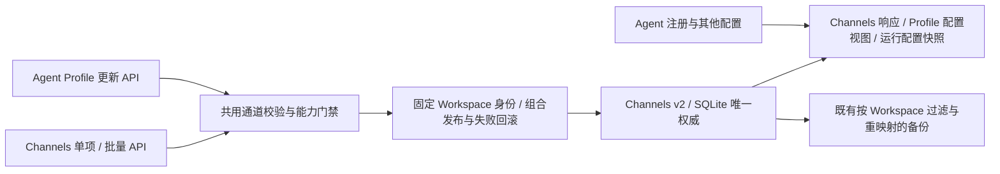

# Channels 与 Agent Profile 的单一配置权威

日期：2026-09-14。承接已批准的 [Workspace 归属方案](channel-workspace-scope.md) 和原交互等价目标。目前已实现权威读写及普通错误回滚；不可恢复回滚和异常终止恢复仍未完成。不修改原 Console，不引入外部通道运行或真实凭据。

## 实证缺口

Channels v2 已按 Workspace 隔离，但 `AgentReference.config.channels` 仍是独立字段。真实 HTTP 对照证明专用 Channels API 与通用 Agent API 可各自保存不同值，重开后继续分歧。通用保存还绕过 Console 字段验证和外部通道未实现门禁。详见 [诊断记录](../testing/channel-profile-authority-diagnostic.md)。

原 `GET /agents/{id}` 返回完整 `AgentProfileConfig`，原 Channels API 也保存同一个 Agent 配置。原页面编辑 Agent 会读取该详情；仅证明 Channels 页面保存/刷新不能覆盖这个入口。当前 Rust 复制会清空 Channels，诊断确认这一行为保持，不应改成复制凭据或连接外部通道。

## 实施方向

继续使用现有 WorkspaceDataKey 和 Channels v2，不退回可复用 Agent ID，也不引入 Python 配置迁移。Agent 配置响应和运行配置快照中的 `channels` 应来自该权威，而非独立可写的注册表影子字段；返回不增加 `isBuiltin` 等页面元数据，原 GET/PUT 形状保持。

统一校验必须先于任何文件、SQLite 或凭据写入。Console 单项和 Profile 嵌套配置共用类型、默认值、大小限制及 Console 始终启用规则。完整 Profile GET→PUT 可能携带未修改的禁用通道默认值，不能把这个正常回写当成启用外部通道；对外部通道的实际配置变更和启用仍须明确失败，不保存不可运行的配置并声称成功。新增 Profile 写入不应把凭据形字段绕过专用门禁写入普通文件。

原 Python handler 与真实 Pydantic/ASGI 对照 8 项已确认：字段缺失保留现值；`null` 保持未配置；空对象补齐默认值；部分对象替换 Channels 并补齐默认值；完整对象往返保持全结构。原单项 Channels 读取对未配置返回 404，而不是默认 Console。对照使用内存 JSON 序列化边界，不声称测试原磁盘写入或重载。原请求必须包含 `id`、`name`；Rust 诊断已另用包含这两个字段的 22 个请求复现相同问题，保留第一次部分请求的报告。

实施分两步：先抽取专用 Console 解析/限制校验，在 Profile 提交字段上调用，并阻止外部通道非默认配置进入文件和凭据路径；允许未修改的禁用默认字段完整或部分回写。该前置校验不改现有缺失/null 保存语义，也不宣称两份存储已统一。随后实现上图中的权威读写与组合发布；不以暂时的有效配置影子保存作为最终完成状态。

默认值比较按 JSON 数值语义处理整数和等值小数：浏览器会把 `1.0`/`120.0` 重编码为 `1`/`120`，不能误判为 iMessage/SIP 配置变更。实际不同数值、字符串形式数值仍拒绝，未放开外部通道配置能力。

组合 Profile 保存涉及其他字段、原文件/注册表以及 Channels SQLite 设置。必须明确发布顺序并验证失败后的完整状态：不把 SQLite 保存与旧文件保存拆成各自返回成功的操作；回滚须区分原设置缺失和显式默认值。现有 Agent 文件发布仅有局部回滚，不能未经测试便声称其已覆盖新增 SQLite 状态。若回滚失败，保留恢复证据并明确失败，不吞掉错误或继续报告一致。

本轮采用以下具体发布顺序：持有 Agent 锁后取得 Channels 锁；先解析下一份通道状态并暂存 Agent 文件/注册表，再发布凭据与文件，最后一次性提交 Channels SQLite 设置。复用既有 `RestoreFiles` 保留精确原文件，SQLite 提交失败则撤回文件和凭据；SQLite 原记录不存在时，因为尚未成功提交，无需把缺失伪装成默认设置。发布段不插入异步等待。异常终止及不可恢复的凭据回滚不能用普通失败回滚测试代证，继续保持专项未完成状态。

v2 Workspace 的 `console` 允许显式 null 表示整个 Channels 未配置；旧对象记录保持有效，缺少该字段或数组等损坏形状仍拒绝。普通新 Workspace 无记录时沿用默认配置。Profile 中的 Channels 不再写入新的注册表影子值；已有非空影子保留，若与权威配置冲突则拒绝新的 Channels 组合发布，管理读取仍显示权威数据且不改旧文件。公开运行上下文与 Profile 响应都从 SQLite 投影，内部文件/备份快照保留原始元数据，通道备份继续使用既有独立范围过滤。

已有非空影子配置不得被静默导入权威、删除或用于绕过门禁；现已用故障夹具验证保留旧文件、读取权威视图、冲突发布返回 409。无歧义的新安装/空影子路径按确定的权威读取；不以新增兼容逻辑掩盖原生旧值冲突。

### 已知恢复边界

持久提交判定、文件/凭据日志与启动恢复的顺序及实施清单见 [持久恢复协议](agent-publication-journal.md)。

最初的持续失败恢复仅保留进程内逆操作，见 [宿主恢复验收](../testing/agent-publication-recovery-acceptance.md)。2026-09-15 已进一步接入安装级 SQLite 恢复元数据、私有凭据账户及初始化前恢复，普通失败/重试/关机使用同一入口；无凭据变更的真实 Profile 隔离强杀矩阵已覆盖提交前后与 cleaning 收尾，见 [真实宿主接入验收](../testing/agent-publication-host-acceptance.md)。可观察的独立文件/目录变化仍沿用 [身份与清理保护](../testing/restore-independent-data-acceptance.md)。凭据强杀/断电、文件检查与操作之间的并发竞态及所有在途业务屏障仍未完成，不能作为恢复完备或可发布证明。

## 实施与验收清单

### 持续失败恢复的初始实施步骤（进程内阶段记录）

1. 宿主保留失败的 `RestoreFiles` 与尚未恢复的凭据旧值（仅内存，不写普通 JSON）；逐个逆操作完成后移除，避免重试已成功恢复的凭据。
2. Agent 锁内检查恢复状态；失败后新业务请求拒绝准入，健康/关闭接口可用。下一次 Agent 配置保存先重试原事务，仍失败则不执行新请求。备份恢复在进入和取得独占屏障后均检查，防止覆盖恢复目标。
3. 正常关机在工作任务排空后再重试一次，失败仍明确保留状态。测试持续凭据故障、原值不存在、并发/其他 Agent 保存、恢复重试和关机路径；不使用真实凭据。
4. 本步骤不能代证强杀后持久恢复、已在运行的所有业务隔离或页面焦点问题；这些保持开放，完成后才更新分发包。

- [x] 持续失败红测试：旧凭据保留、后续保存不能覆盖恢复目标。
- [x] 宿主持有、逐项逆操作重试及 Agent/HTTP/备份新请求准入。
- [x] 正常关机重试、持续凭据故障与缺失旧值回归。
- [x] 目标父目录暂不可达时保留文件恢复对象，三次重试不重复已完成凭据逆操作；目录恢复后取回原文件字节。
- [ ] 强杀/重启恢复与所有在途业务边界（独立后续验收）。

### 恢复目标独立变化保护

沿用上述已批准的失败恢复范围，补齐共享 `RestoreFiles` 对 Agent 组合保存及备份恢复的保护：

1. 暂存时记录原目标/替换树及父目录、恢复目录身份；使用已锁定的 cap-std/cap-fs-ext 和 SHA-256，不新增依赖，不跟随树中的链接读取外部内容。
2. 发布、回滚前核对归属；独立替换、原地编辑、目录内容变化或暂存目标被占用时拒绝继续。验证失败的事务对象继续保留，不用相同路径文本当作相同目录。
3. Drop/提交清理前核对暂存目录中的全部预期条目和内容；未知文件或改变后的树必须保留，不递归清掉外部新增内容。原目标缺失仍与显式空对象不同。
4. 红/绿测试覆盖文件、目录、原地编辑、普通目录替换父目录、暂存目录替换/污染、成功后重复回滚及正常清理；完整回归后更新验收。

本步骤针对可观察的独立替换/变化；路径检查与后续操作之间的恶意并发竞态、持久恢复和真实跨平台执行仍须独立验证，不能仅凭顺序故障测试宣称全部完成。

- [x] 四项真实红测试确认回滚/Drop 会覆盖或清理独立数据。
- [x] 原目标/替换树及父目录、暂存目录身份核对。
- [x] 失败保留、恢复重试、提交与 Drop 清理的可观察独立变化保护；不代证原子操作。
- [x] 当前源码 Rust 787/787、原页面/参考完整显式组 31/31、Clippy/fmt；详见独立数据保护验收。恶意并发、强杀和跨平台父项保持开放。

### 总体验收清单

- [x] 源码交叉核对，隔离真实 HTTP 复现双向分歧、验证绕过、重启和复制对照。
- [x] 原 Python 对照确认 Profile 缺失/null/空对象/完整 Channels 回写语义；完整合法 Rust 请求复现缺陷。
- [x] 前置校验红/绿测试：非法 Console、所有外部通道非默认配置、未知通道、完整默认回写、失败前无文件/SQLite/凭据变更。
- [x] 原版 18 个通道完整默认结构对照，修正 Slack 两个默认值；Console 数组不能被解析成默认对象。
- [x] 非空影子冲突处理、未配置状态及组合发布的持久化方案。
- [x] 承接已有缺陷诊断，新增一致性回归；覆盖 Channels→Profile、Profile→Channels、其他 Agent 不变、缺省和完整回写。
- [x] 共用校验、读取视图和运行快照；保持无效注册管理与禁用 Agent 编辑的原边界。
- [x] SQLite 失败下精确恢复文件/注册表和原设置缺失；凭据写入后报错、文件首次创建失败、目录保护与并发回归。
- [ ] 组合发布与失败回滚：SQLite/文件/注册表/凭据故障，原值缺失、并发保存、回滚失败保留和重启恢复。
- [ ] 保持复制、原目录重新注册、新目录隔离、范围备份/恢复的完整行为。
- [ ] 原页面实际编辑/保存/刷新/重开及普通、显式和严格检查。
- [ ] 生产修复后再构建新制品；当前 `eaTvv4` 未包含本节修复，不重复打包诊断代码。
