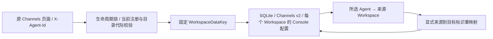

# Channels 配置的 Workspace 归属

日期：2026-09-14。落实用户已允许继续的原交互等价改造；不改 Console 源码，不导入 Python 数据，不启用外部通道或使用真实凭据。

## 已复现问题

原页面已发送 `X-Agent-Id`，Python Channels API 使用当前 Agent 配置；Rust API 忽略该请求头，读写一份全局 Console 配置。隔离真实 HTTP 诊断复现了跨 Agent 单项/批量覆盖、未知/禁用/目录被替换的 Agent 仍可保存，以及重启后覆盖保留。诊断成功不代表产品通过：证据位于仓库 `dist/qa-channel-scope-20260914-ezhatT/diagnostic.json`。

## 有界实施方案

单项和批量配置读写、冲突检查验证所选 Agent；静态类型与 schema 元数据无需注册身份。未知返回 404、禁用返回 403、目录代际失配返回 409，失败不改存储。生命周期锁串行化注册变更与配置操作；先验证身份，再在通道配置锁内读改写，不跨网络请求持锁。外部进程修改文件不受该锁保护。

内部设置升级为 v2 Workspace 条目列表，验证数据标识、重复条目、配置与总大小。已有原生 v1 全局 Console 配置只关联默认 Workspace；不能交给任意新 Agent。读取不重写，下一次正常保存写 v2；这不是 Python 数据迁移。未配置 Workspace 返回原默认字段结构。保留原目录重新注册接回该 Workspace 数据；新目录和复制得到独立默认值。现有复制流程显式清空 Channels 配置，保持这一行为。

备份将 Channels 从全局设置中分离，按所选 Workspace 过滤；恢复只替换所选身份并显式重映射，未选择数据不变。归档不再凭同名 Agent 获得归属。17 个外部通道的运行与凭据仍未实现，原有 501 门禁不解除。本轮仅修复 Channels API 的配置归属，不宣称通道运行或全产品功能完成。

## 验收清单

- [x] 原前后端契约核对与真实 HTTP 缺陷复现。
- [x] 加入预期正确行为的红测试，确认旧实现失败。
- [x] 实现请求范围、版本化存储及范围备份/恢复。
- [x] 默认/两个 Agent、单项/批量、重启、未知/禁用/目录替换、排队后重新校验测试。
- [x] 重新注册、复制、旧原生数据、损坏数据与范围备份/恢复回归。
- [x] 完整 Rust 普通回归 757 通过；随后补充的全局恢复测试与原页面专项进入 11/11 专项。workspace/all-targets 严格 Clippy 通过。
- [x] 原 Channels 页面通过侧栏切换、抽屉保存、刷新和 Core 重开验收；原前端源码不变，见 [验收记录](../testing/channel-workspace-scope-acceptance.md)。
- [x] 完整原页面/参考显式组 30/30、前端 2453/2453；新 source Core `7dbb3b3...` 与九类 `eaTvv4` QA 制品完成来源核对和 SDK/客户端隔离测试，见 [制品验收](../testing/qa-channel-packages-20260914.md)。旧 `wADUE9` 不包含本修复且保留。
- [ ] 包内 Core、原生激活、跨平台实机与外部通道等父项仍独立开放。
