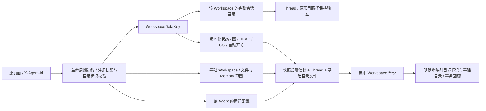
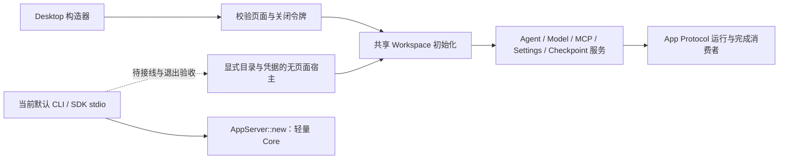

# 检查点的基础 Workspace 归属

日期：2026-09-09；计划 §14.2.24.53，承接已批准的统一 Workspace 消费者改造。目标仍为所有原功能和原前端交互等价，不将本节等同于产品已完成。

## 原实现依据与当前差异

原 `app/routers/checkpoints.py::_service` 通过 `get_agent_for_request` 选取请求的 Agent；`checkpoints/runtime.py` 按 `workspace.workspace_dir` 获取服务，`CheckpointRepository` 将影子仓库放在基础 Workspace 的 `checkpoints/` 内。它不调用 Files API 的项目目录解析器。原图中的会话来自该 Agent 的完整 ChatManager，包含没有检查点的会话和归档会话，不按 Thread 的项目路径删减。

本机在 conda qwenpaw 中使用独立 `CheckpointRuntime`、临时 Workspace 和模拟请求选定 Agent，对原路由/服务做完整 status 结构比较，确认：

1. 设置外部项目时，status 仍返回基础 Workspace。
2. 两个 Agent 共享项目目录，其自动检查点配置互不影响。
3. 修改项目目录不切换检查点服务或丢失配置。
4. 原基础 Workspace 换 Agent ID，清空运行时缓存再重开，配置仍在。
5. 原 Agent ID 用于另一个基础目录，不继承旧配置。

原 `tests/unit/app/routers/test_checkpoints_router.py` 与 `tests/unit/checkpoints`：**91 passed, 1 skipped，13.28 秒**。跳过项是非 Windows 平台不执行的 Windows junction 回归；不能记作 Windows 验收。参考实验不使用日常目录、邮箱或真实 key。

实施前 Rust 源码核查发现（下方 Checklist 记录后续修复）：

- `selected_context` 使用全局 `desktop_workspace.selected`；各检查点 handler 没有解析 `X-Agent-Id`。
- `graph`、手工快照和恢复会话解析写死 `default`；自动快照虽解析 Agent，却按 Thread 项目路径选择状态目录。
- `context_for_root` 和 Backup 恢复 staging 都只以规范路径哈希选取目录，没有 Workspace 数据代际。
- `checkpoint_sessions` 同时按数据标识和 Thread 项目路径过滤，不等价于原完整会话目录。
- 嵌套 ZIP 验证把 Thread 项目根与文件快照根视为同一值；Memory 目录解析使用全局配置。

这些是实施前源码证据；后续已执行的失败回归和修复列在下方。§8 旧单 Workspace 页面验收不能证明上述多 Agent/项目目录场景正确。

当前 Rust 定向基线 `cargo test --locked -p qwenpaw-app-server checkpoint -- --nocapture`：**10/10** 通过（9 个库测试 0.54 秒，1 个 HTTP 测试 0.29 秒）。它覆盖既有嵌套归档重写、共享项目的备份过滤、恢复/GC 与失败回滚，不覆盖本节发现的请求头身份、基础/项目分离和目录代际，不能据其通过否认上述差异。

## 设计与边界

### 请求与会话

所有 11 个原调用使用统一的检查点上下文，固定公开 Agent ID、WorkspaceDataKey、基础根目录、Core 控制目录和所需配置；使用现有 Agent 校验，未知/禁用/目录失配的请求不能落回默认 Agent。原请求与成功响应保持，内部身份不开放给客户端指定。

图、HEAD、设置、GC 和 reset 都以基础 Workspace 为范围。会话按 ChatCatalog 数据归属选择，不能因为项目不同而消失。Thread 的项目路径保留原值；文件/Memory 快照与恢复基于基础目录，不能通过修正检查点范围改变聊天工具的工作目录。

### 版本化存储与归档

新状态按类型化 WorkspaceDataKey 定位，使用新的版本与强制归属字段，拒绝旧读取器、错误绑定和格式混用。快照 ZIP 必须记录独立的基础目录/归属信封，与 Thread 身份及状态一致；不能再把 `thread.workspace_root == snapshot_root` 当作授权。原摘要、条目/解压预算、相对路径/链接/控制目录排除仍保留。

旧原生路径哈希目录不能凭当前同路径或同名新注册自动认领；原文件先保留，不扫描或导入 Python 影子 Git 仓库。能证明基础 Workspace、Thread 归属和原始文件范围一致的旧原生内容，才允许按明确绑定接回。旧试验版以外部项目为快照根或混有多 Agent 的目录，不能悄悄搬入基础 Workspace、扩大恢复授权或删除；其兼容处理必须先列出可证明的来源与独立历史范围，无法证明时明确拒绝，不能伪装为空数据完成迁移。实现前针对这种旧格式补充回归，禁止以当前聊天标签猜测历史代际。

Backup 导出从同一归档快照/来源绑定选择状态和所有引用 ZIP；恢复使用 AgentRestorePlan 的来源/目标数据标识。只在独立 staging 中重写信封、确实属于来源基础目录的路径、摘要、父节点和 HEAD。Thread 的外部项目原引用不能被擅自改成目标基础根。未选中 Workspace、来源存储和保留的 recovery 数据不变；错误归属在 live 文件交换前拒绝。

### 运行和锁

普通 Console 入场已经有经过校验的 AgentContext；自动快照应随运行保存该身份，而不是在结束时按名字重新绑定或根据 Thread 项目路径反推。关闭/删除正在等待运行排空时，结束钩子不能重新请求同一生命周期锁造成死锁。按既有取消边界测试：取消的运行不新增自动快照，已进入的快照不写入同名新注册。

手工操作在生命周期边界内解析身份，再持有检查点锁执行；锁顺序与原会话、恢复协调器核查后固定。恢复必须继续先生成 safety checkpoint，保持既有文件/Core 回滚；需要等待的运行/自动任务不能依赖当前持有的锁。删除会话、自动防抖/周期 GC 及恢复静默期与原实现的差异也需要单独列证据，不能仅完成目录改名就宣布完整检查点等价。

## 执行 Checklist

- [x] 核查原路由、运行时、影子仓库与项目目录解析；临时目录完整结构实验与原测试基线。
- [x] 核查 Rust handler、会话过滤、自动结束钩子、嵌套 ZIP 及 Backup staging 的同一路径假设。
- [x] 现有 Rust 检查点定向基线 **10/10**；保持已存在的归档/回滚测试，后续补充缺失的多 Agent 请求与目录代际覆盖。
- [x] 添加并复现非默认设置串入默认范围、未知 Agent 被接受的失败回归；扩展共享项目配置、修改项目、禁用与目录失配的完整请求矩阵，不削减已有默认/恢复测试。
- [x] 固定请求/自动快照上下文，完整会话范围、Agent Memory 配置与 Thread 项目路径分离；运行防抖及恢复协调仍属于下方独立未完成项。
  - [x] 会话目录已按固定 WorkspaceDataKey 选择，不再按项目过滤；共享项目/归档/重开、保留目录改名与同名新建、SDK 默认归属回归通过。第三步已将请求与自动钩子整体接入固定上下文。
  - [x] 过渡期曾保留旧 ZIP 的手工写入范围；第三步已移除临时 404，替换为跨项目成功快照、重开和独立范围恢复回归。
  - [x] 全部 11 个手工调用解析 X-Agent-Id，在生命周期锁内固定 AgentContext 与基础根目录，再获取检查点锁；图、快照/恢复使用固定会话归属，恢复的 Memory 分类使用该 Agent 的 running 配置（缺省与原配置页面一致）。自动钩子使用运行入场保存的上下文。
  - [x] 4 个请求专项通过：设置隔离与项目配置切换、33 次未知/禁用/标识失配拒绝且默认状态字节不变、非默认文件/Memory/HEAD/GC/重置全链路、手工写入/删除/同名新目录竞争。没有据此验证同路径新代际。
- [ ] 新状态/ZIP 归属信封、旧原生有依据的兼容和无依据数据保留；原目录换名/路径代际/同名重建与重开验证。
- [ ] 所有状态/图/HEAD/快照/恢复/GC/reset 共用归属；跨 Agent 与共享项目互不影响。
- [ ] 范围 Backup 来源/目标重映射、嵌套摘要/图同步、未选择状态保留和真实 HTTP 失败回滚。
- [ ] 自动快照与关闭/删除竞争、取消、会话删除关联清理、原防抖/GC/恢复静默期逐项核对，明确完成与缺口。
- [ ] 原 Checkpoints 页面切换两个 Agent，在不同与共享项目场景下完成完整操作、刷新和重开；`console/src` 零 diff。
  - [x] 新原页面专项首次 **1/1，15.42 秒**：已有基础目录 Thread、两个 Agent 的项目配置指向共享目录，实际切换、自动设置、快照、保留设置、刷新、GC 和仅重置 writer，默认图完整结构不变。未覆盖外部项目 Thread 的文件快照或 RestoreModal，父项保持未完成。
  - [x] 第三步扩展专项 **1/1，15.89 秒**：writer Thread 位于共享外部项目；实际 RestoreModal 预览、文件选择/确认、safety 与 HEAD、关闭详情、GC/reset。重开后直接检查只恢复所选基础文件，未选文件/外部项目/默认图不变；未覆盖完整运行中的恢复静默期。
- [ ] 完整普通/显式测试、严格检查、release 与客户端顺序复验；必要时更新新制品，不把源码成功替代安装态。

### 第三步实施中（2026-09-10）

- [x] v2 state 与 ZIP 强制保存 WorkspaceDataKey / 基础根目录；新命名空间按类型化 key 定位。手工快照已移除临时 404，HTTP 回归证明基础文件恢复、外部项目文件不变、Thread 项目保持原值并支持重开。
- [x] Console 运行保存入场 AgentContext；自动结束钩子不重新解析公开名称或获取生命周期锁。等待 checkpoint 锁后检查取消与目录 marker，目录替换不写入旧状态。
- [x] Backup 显式来源/目标 key、信封与摘要/父节点/HEAD 重写；外部 Thread 项目保持，settings-only 状态也重绑定。原负例改为拒绝信封的错误根目录/key，不再错误拒绝合法的外部 Thread 项目。
- [x] 第三步定向 **26/26** 普通回归通过（0.74 秒），1 项浏览器用例待显式执行；包括旧路径哈希数据明确拒绝且字节保留。严格检查首先发现归档重写函数 101 行，已提取信封重映射步骤，待重新验证。
- [x] 更新后的完整普通 **572/572**、严格 Clippy **13.32 秒**通过；扩展原页面 RestoreModal **1/1，15.89 秒**通过，fmt/diff 与 `console/src` 零 diff。
- [x] 完整 19 项显式组 **19/19，305.21 秒**；release **50.48 秒**，随后 TS **4/4**、Python **5/5**、VS Code **57/57** 顺序通过，均无跳过。具体 SHA-256 和分发边界见验收记录；这些结果不代表安装态通过。
- [ ] 有依据旧原生归档接回仍未实现；当前不自动认领任何无绑定 v1 数据。自动防抖、周期 GC、会话删除关联与恢复静默期仍需完成，不能勾选上面的父项。

此前 **563/563** 和原页面专项是第二步基线，不替代本次验证；新结果见 [实施记录](../testing/checkpoint-workspace-ownership-acceptance.md)。§52 包的串行启动 SIGKILL 仍需要终端防护管理员核查，不重试/改签失败文件、不改系统策略；该安装态依赖不妨碍本节隔离测试和实现。

### 接下来的原运行时差异（源码核对，不是完成声明）

原 `runtime.py` 的自动快照按 Workspace/session 取消并重排尚未触发的计时器；`policy.py` 缺省延迟为 1.5 秒。已启动任务单独跟踪，关闭取消 pending 并等待 active；执行前重查自动开关与运行时代际。原自动 GC 不是独立后台定时循环，而是在自动快照后、该 Workspace 距上次 GC 至少 15 分钟时触发。删除会话先取消对应 pending、等待 active，再删除该会话 refs 与 HEAD。原 `restore.py::_run_restore` 对所有非 dry-run 恢复（包括仅会话恢复）使用 `WorkspaceMutationGuard` 暂停该 Workspace Cron 并等待活跃任务，缺省超时 30 秒，失败也执行恢复调度回调；不能仅实现文件/Memory 恢复的静默期。

- [ ] 以固定 key/session 管理 pending/active，使用可控时钟证明同会话合并、不同会话不合并、关闭/禁用/删除后不回写；不能仅在当前同步结束钩子 sleep 1.5 秒冒充原防抖。
- [ ] 按原触发语义验证 15 分钟 GC 窗口及会话删除关联清理，保留其他 Workspace 与会话的完整图。
- [ ] 恢复协调只暂停目标 Workspace 的写入者；验证活跃运行排空、超时零修改、成功/失败均恢复此前调度状态，以及锁顺序不互相等待。现有 idle 恢复浏览器通过不覆盖这些场景。
  - [ ] 范围包含仅会话、Memory、选择性文件三类真实恢复；dry-run 不暂停调度、不创建 safety。原实现还使用 maintenance lock/query gate 阻止恢复期查询入场，Rust 必须核对所有相关入场路径，不能只等待当前目标 Thread。

### 第四步执行清单（2026-09-10，进行中）

沿用已确认方案，不改变 HTTP 成功结构或前端组件。后台快照登记固定 Workspace key 和会话，pending 可被同会话后续完成事件取代；active 不强制 abort，保留任务直到 blocking 写入结束。执行阶段另持 Core operation guard，备份恢复取消 pending 并排空 active，防止旧任务在恢复后回写。Agent 停用/删除与应用关闭同时取消并等待这些任务，完成钩子仍不重新获取生命周期锁。

- [x] 先复现删除聊天后检查点 refs/HEAD 残留；单个和批量删除只清理实际删除且归属已固定的会话，不触碰未选会话或其他 Workspace。实际删除项的 pending/refs/HEAD/ZIP 清理及重开、损坏状态预检均有回归。
- [x] 实现 pending/active 跟踪与默认 1.5 秒防抖，接入 Console 完成、Agent 生命周期、关闭与备份恢复；虚拟时钟和 active 锁等待取消验证通过。当前没有据 Core barrier 单测声明完整 HTTP 备份恢复竞争矩阵通过。
- [x] reset/禁用后重新开启不执行旧 pending；关闭后任务计数归零并拒绝新任务，Agent 停用响应是取消完成边界。
- [x] 原 15 分钟自动快照后 GC 触发及当前会话范围通过；自动与手动共用回收规则，手工快照/ZIP 保留、auto 独立配额及 compact 忽略非零 auto 保留规则有回归。恢复静默期仍独立验收，不用后台任务接入冒充完成。
- [ ] 普通/严格检查、原页面、release 与客户端逐项复验，维护失败记录与安装态边界。
  - [x] 完整普通 **583/583**，严格 Clippy **13.50 秒**，fmt/diff 与前端源码零 diff；完整显式组 **19/19，299.91 秒**，release 与 TS **4/4**、Python **5/5**、VS Code **57/57** 通过。
  - [x] 第三、四步修复进入新的九类 macOS QA 制品，校验和 **9/9**，2,842 个构建输入逐文件相符；原 Console 的 1,311 个文件在四种分发中相同。新 SDK 安装测试、旧 wheel CLI 及 VSIX 隔离安装详见 [本批制品验收](../testing/qa-checkpoint-packages-20260910.md)。
  - [ ] 分发 Core 实际启动、原生窗口和跨平台完整验收；保留旧失败样本及终端防护侧核查依赖，不以静态检查或源码成功代替安装态，不换路径/签名绕过拦截。

第四步生产代码已接入，失败回归及阶段结果见验收记录。另核查并修复手动 GC 原有差异：原 `service.py::_gc_sync` 从不回收 refs/snap，`kept_refs` 也不包含它们；compact 只忽略 auto 的保留策略，safety 仍使用独立保留时间。Rust 的原手动清理此前把手工快照纳入候选、把手工/safety 算入 auto 配额，并没有实现 compact 的该语义。新统一选择函数与 ZIP live 集合已修复这些差异，不能用旧成功测试保留错误行为。恢复静默期、所有生产入口的自动钩子覆盖和旧原生格式接回仍需独立完成。

### 第五步恢复静默期：分层实施清单

不能用当前 Thread 的 `status != active` 代替排空：Core 在发送完成事件前还会持久化最终状态，事件消费者断开也不代表生产任务已退出。先提供原生执行屏障，再接 App Server 的 Workspace 入场/调度协调；两层缺一不可。

- [x] Core 每个 Thread 的运行租约覆盖输入准备、整个后台 Turn 和最终写入；按明确 Thread 集合请求排空，先验证完整集合，去重并按稳定顺序获取独占租约，不取消现有 Turn。
- [x] 排空超时/请求取消释放已取得的租约，原任务继续；未选 Thread 仍可运行，恢复替换 ThreadRecord 不丢失原屏障，全局 Backup 不能在屏障持有期间换掉运行状态。6 项原生专项 **6/6，0.19 秒**；严格 Clippy **18.41 秒**，完整回归另行记录。
- [ ] App Server 固定 WorkspaceDataKey，暂停该范围新入场及 Cron，排空 Console/Cron/自动任务和其完整 Thread 集合；不得在等待期间持有全局生命周期或 checkpoint 锁。
- [ ] 覆盖 SDK/CLI、Console、Cron、会话创建/删除与 Agent 改名/停用、Backup 交叉入场；不能仅以已登记 Console 任务证明所有写入者静默。
- [ ] 仅会话、Memory、选择性文件恢复均使用该边界；成功/失败/超时/客户端断开均释放，预览不暂停、不创建 safety。原页面与跨 Workspace 并行专项通过后才勾选完整恢复项。

本步不改变协议字段、原页面或非默认 Cron 的既有门禁；Core 屏障的独立测试不等于 HTTP 恢复协调已经完成。

执行屏障 API 为 `Core::quiesce_threads` / `CoreThreadQuiescenceGuard`。它只冻结已验证的 Thread 执行集合，不承担 Workspace 归属、新会话入场、Cron/自动任务或其他文件写入者的协调。Core 基础阶段尚未接入 `restore_impl`；下节 App Server 接入已在释放生命周期/Cron/checkpoint 锁后调用，不能将原生单测当作整套 Workspace 协调的验收。测试还覆盖事件消费者断开后生产任务仍被跟踪、反序重叠集合按稳定锁顺序排空。

第五步基础复验：完整普通 **589/589**、显式组 **19/19，299.35 秒**、严格 Clippy、release 与 TS **4/4** / Python **5/5** / VS Code **57/57** 均通过，前端源码零 diff。最新源 Core 摘要及各阶段失败记录见验收文档；本轮没有重打包，第四步九类制品仍保持原字节与边界。

### 第五步 App Server 接入中

沿用上述范围，新增临时 Workspace 暂停注册表，不改写 Cron 的 `enabled` 或时间游标。普通 Console、HTTP 会话创建/删除、检查点操作与 SDK Thread/Turn 入场，在暂停时释放全局生命周期锁再等待；Agent 删除/停用同样等待，保留恢复使用的注册归属。Cron scheduler 跳过暂停范围，手动请求仍立即返回原 `{"started":true}`，后台任务在不持有 Cron 锁的情况下等待恢复，再校验任务存在与 Workspace 归属后执行；初稿的 409 拒绝已修正，不能用拒绝或延迟 HTTP 响应替代原交互。既有已登记运行不取消，等待其完整完成信号。Heartbeat 另有原子登记和完成租约，覆盖最终记录，不会漏掉尚未创建 Thread 的后台生产者。自动快照取消 pending，等待 active，暂停期禁止新登记及自动 GC，避免回收正在选择恢复的历史；pending 处理与原运行时的完整等价性仍需独立核对。

- [ ] 真实 restore 在生命周期/Cron/checkpoint 边界内固定上下文与待排空集合，然后释放全部三个锁再等待；排空后取回检查点锁，重新校验根目录 marker，才准备文件 diff、创建 safety 和提交/回滚。
- [ ] 30 秒共享超时覆盖 Console/Cron/自动任务及 Core Turn，返回原 CheckpointError 对应的 400/detail，不取消正在等待审批的用户任务；所有退出路径释放暂停状态与原生执行屏障。
- [ ] 仅会话/Memory/文件三类超时、成功、失败、预览无暂停、非目标 Workspace 并行、SDK/新聊天入场、Cron 游标保持、生命周期竞争逐项验证。
- [ ] 完整普通/显式原页面、严格检查、release/客户端和新的分发验收；现有 589/589 与 QA 包仅为本次接入前基线。

生产接入初稿已通过编译及原检查点定向组（库 37 项与 HTTP 1 项，另 1 原页面项需显式执行）；修正手动 Cron 后新竞争组 **8/8，0.62 秒**，严格 Clippy **13.66 秒**通过。新增 HTTP 等待方断开的回归正在复验：路由原有后台事务租约保证客户端断开不提前释放恢复屏障，不应把断开当作事务已经取消。完整结果见验收记录。还需审计所有协作写入者，不能据当前用例宣称全功能恢复完成。

本次接入复验已结束：含新增断开专项的普通工作区 **598/598**、严格 Clippy **12.60 秒**、完整显式组 **19/19，298.92 秒**、release 与 TS **4/4** / Python **5/5** / VS Code **57/57** 均通过，前端源码零 diff。仍未勾选完整恢复项：原 pending 定时器在恢复期间保留并于锁释放后继续，Rust 初稿取消 pending/丢弃暂停期完成钩子的行为需要修正；运行中原弹窗、完整失败交叉矩阵及最新分发还没有完整证据。具体下一步 checklist 已写入验收记录。

### 第五步自动任务保留修正（2026-09-10）

更新接入初稿的自动任务策略：恢复不取消 pending，也不丢弃暂停期间的 Console 完成钩子。自动写入先获取 checkpoint 锁并核查暂停，若暂停则释放锁后等待，不获取生命周期锁；取消/关闭可终止这个等待，但不会 abort 已开始的文件写入。恢复在持有同一 checkpoint 锁时登记暂停，之前已入场的快照写入此时已经结束，无需等待那些正在等待恢复门禁的任务。这样保留原防抖时间和恢复后的快照，不引入双向等待。

- [x] 先复现 3 项 pending 丢失失败，修正后检查点组 **41/41** 通过；成功、超时、预检失败后的 pending 保留，及暂停期 Console 完成钩子有回归。
- [x] 运行中原 RestoreModal 新专项 **1/1，15.98 秒**：原控件 loading/禁用返回/选择保留的观察握手，再放开本地原生模型任务；确认恢复、重开、文件/会话及默认 Workspace 保持。旧 idle 专项保留，未改动 `console/src`。
- [x] 自动任务关闭/Backup 排空入口可取消正在等待恢复的快照，专项和完整普通 **601/601**、严格 Clippy **10.81 秒**通过；这不是完整 Backup HTTP 交叉矩阵。
- [x] 完整显式组 **20/20，320.11 秒**，release **52.76 秒**，随后 TS **4/4**、Python **5/5**、VS Code 编译及 **57/57**依次通过。源 Core 摘要、失败记录与分发边界见验收记录；不等于旧 QA 包或跨平台已通过。
- [x] 活跃会话手工快照的 busy 差异已在下一节原生边界修正，并有真实 HTTP 回归；原页面与最新发布复验单独记录，不能将此前夹具时序调整称为产品修复。

全部生产入口自动钩子、可配置策略和完整 Backup/失败竞争仍留在总计划；本节不关闭全功能及分发验收。

### 下一项：活跃会话快照的一致性边界

原 `SessionSaveHook` 在 POST_RESPONSE 保存会话，手工快照从工作区已保存文件生成树，不导出进行中 Agent 的内存状态。Rust 当前 `export_thread_checkpoint` 仅允许 idle；同时 native Store 在 Turn 开始及每个阶段都更新，所以简单改成读取 SQLite 当前记录，或只删掉 `InProgress` Turn，都不能保证 messages/turn_metadata 与历史匹配。原生运行还会刷新首条 system message，不能仅按消息尾部长度截断。

- [x] 原 session 保存边界临时实验验证活跃任务不阻止手工快照，Git blob 完整保存原 session 字节，原任务仍可正常完成；随后原生 **0/2** 与 HTTP **0/1** 失败回归复现 busy，不放宽暂停/权限/Workspace 归属。
- [x] 原生 Turn 入场修改会话之前保存上一个完成边界，仅放在活跃 ActiveTurn 中；导出复制完整结构，不截断或拼接 messages。每个活跃任务多一份会话副本，结束释放，idle 不常驻额外缓存、不修改持久化格式。取消、失败、恢复后下一轮及图片/无效输入均有回归。
- [x] HTTP 运行中快照成功，原活跃会话/审批完全不变；正常结束后恢复，Turns/messages/metadata 与旧边界完整相等，保留 safety。普通工作区 **606/606**、严格 Clippy **8.67 秒**、fmt/diff 与前端源码零 diff 通过。
- [x] 原手工快照控件运行中成功、完整显式组 **20/20，314.09 秒**、release 与源码 TS/Python/VS Code 客户端顺序复验通过；浏览器用例在点击 Snapshot 之前已有活跃任务，真实验证修复。
- [x] 最新九类 macOS ARM64 QA 制品构建与静态核验通过，来源绑定本次活跃快照修复；实际安装后的分层结果见 [本批制品验收](../testing/qa-active-checkpoint-packages-20260910.md)。
- [ ] 分发 Core 首次启动、完整原生交互、跨平台及全部原功能验收；静态检查和源 Core 控制组不关闭这些项。

源 release 与 QA 包能力以该版本的实际构建/验收记录为准，不能把上述源码实现追记到旧文件中。所有生产入口钩子、原可配置策略及其他未完成功能继续保留在总计划。

### 第六步：完成钩子的生产入口（2026-09-10）

原 `bootstrap_factory.py` 将 CheckpointAutoSnapshotHook 装入每个 Workspace Runtime，原 Cron executor 与 Heartbeat 都经过 Workspace 查询；该钩子在成功 session_save 后运行，不按来源排除任务。异常/取消不经过正常 POST_RESPONSE，斜杠输入由最后一条输入消息的文本左去空白后判断。Rust 只有 Console 完成消费者调用自动钩子，Cron/Heartbeat 缺失，Console 也未过滤斜杠；直接 SDK 的 App Protocol 消费链同样未接入。

沿用统一 Core/App Server 的已批准方案，按入口分层实施；不增加前端字段，不把后台 job/inbox 写入成功误作会话保存成功，不改现有取消或任务追踪边界。

- [x] 原钩子隔离参考 **6/6**；Rust Cron/Heartbeat 成功入口先复现 **0/2**，修复后专项覆盖成功快照、三入口 slash 过滤、完成状态矩阵、Cron 取消/超时与 Heartbeat 超时。存储失败的真实回执不包含在这些结果中，仍列于下方。
- [x] 共用完成 Turn 的钩子判断；Console/Cron/Heartbeat 使用运行开始时捕获的 AgentContext，不在完成时重新绑定公开名称，不获取生命周期锁。Cron 保留运行租约直到钩子登记完成，Heartbeat 保留现有租约。正常存储下的工作区回归 **614/614**通过。
- [x] 保留触发自动任务时的完整查询文本：原 runtime 防抖闭包捕获 query_text，后续 slash 不取消旧 pending，也不能把旧 pending 的查询说明替换为较新的命令。会话/文件仍按实际快照写入时的保存边界取得；查询缺省时保持原 fallback。失败回归曾取得 `/help` 错误替换及末尾空白被裁剪，修复后新增专项 **8/8**通过，原请求归一化实验确认空白保留。
- [ ] 跨 Workspace/共享项目、关闭/停用、恢复暂停期完成、无会话的纯文本 Cron 及默认自动关闭逐项验证；不丢弃已有成功快照或修改手工快照契约。
- [ ] SDK/App Protocol 的完成观察、真实客户端及断连/关闭追踪单独接入；不能只在 HTTP/stdio 转发器发送成功时触发，也不能因消费者断开丢失已经完成的会话。
- [ ] 原生持久化回执边界：核查发现 `Core::finish_turn` 在 Store upsert 失败时仍发送 Completed，仅日志告警。当前完成状态不能证明 session_save 成功，必须补存储失败回归和内部成功回执，再接全部自动钩子；不能把正常存储下的 8 项专项称为覆盖了这一异常边界。另核查释放状态锁后最终 upsert 与下一 Turn 入场的写入顺序。
  - [x] 使用隔离 SQLite 的触发器定点拒绝入场或完成快照，初始 **0/2** 复现后修复。模型选择、输入、Turn、metadata 和完整旧状态不在写入失败时泄漏，不留下没有生产任务的 ActiveTurn；失败后再次入场保持旧边界并可正常重试。
  - [x] 完成写入失败保持已显示回复但不导出为已保存检查点，下一轮活跃期仍用旧边界；内部成功回执不改变 JSON。Console/Cron/Heartbeat 均检查本次回执，失败不新增快照、也不替换旧 pending 查询。Core 六项保存边界测试和上层两项新增回归纳入普通工作区 **622/622**，严格 Clippy **17.11 秒**通过；SDK 入口尚未接入，不勾选父项。
  - 实施边界：入场先在候选快照上追加模型/输入/Turn/metadata，SQLite 成功后才发布内存状态；最终保存与释放 active 在同一个状态锁内按序完成。失败不改写已产生回复或把它伪装成模型失败，为检查点保留上一完整边界。普通 idle 不增设常驻会话副本；活跃或最终保存失败期间保留一份边界，后续完整成功保存/明确恢复后释放。内部只登记本运行时实际观察到的成功最终写入 Turn ID，`turn_was_persisted` 不推断失败、运行中、重开或恢复导入的历史回执；较晚一次保存不能追补旧失败 Turn 的回执。恢复成功才清空回执集合，恢复失败保留；回执不序列化，不改变 App Protocol/前端 JSON，也不把 Store 成功称为抗断电保证。既有崩溃后中间日志恢复行为保持，重开仍从已保存的进行中日志恢复为 Interrupted，不冒称未写入的 Completed 已持久化。
- [ ] 全套普通/严格检查、原页面、release/SDK 客户端和新制品逐项复验；可配置策略及其他未完成原功能继续保留。

当前保存竞争测试用独立 SQLite `BEGIN IMMEDIATE` 阻塞直接 finalization 阶段，验证状态读取与下一 Turn 入场在最终写入完成前不放行，写入后才出现完成事件/成功回执和完整持久化快照。此为原生 finalization 边界，不代替全 Backup/Workspace 交叉写入矩阵。后续 SDK 接入应位于 `dispatch(turn/start)` 的固定身份/生命周期内持有受跟踪消费者；当前 `dispatch_post_response` 在成功响应之后直接 spawn 转发，输出阻塞/断开和暂停排空需单独覆盖，不能只在通知发送成功时追加钩子。

本次保存失败修复已完成显式组 **20/20，322.24 秒**、source release **53.89 秒**及顺序 TS **4/4** / Python **5/5** / VS Code 编译与 **57/57**复验；fmt/diff 和前端源码零改动检查通过。新源 Core 摘要见验收记录，旧九类 QA 制品未更新，SDK 完成观察及完整分发要求仍未关闭。

版本边界：本步源代码改动不在 `qa-runtime-20260909-EWMbMd` 九类制品中；该批已经完成的静态和安装后控制组结果保持原有范围，不改写其来源清单。

### 第六步 SDK/App Protocol：受跟踪的完成消费者

沿用已批准的统一宿主方案，先完成现有宿主的真实入口，不修改前端和 JSON 协议。当前 `process_line` 在发送响应后才 spawn 裸事件转发；`turn/start` 的调用返回时并未登记完成消费者。此处需要在入场锁内立即登记，响应后仅启动传输。新增有界事件队列，保留健康客户端的背压，不无限缓存或静默丢弃正常事件。客户端断开沿用原 SDK 行为：继续排空 Core，而非隐式取消任务；成功保存后快照不依赖通知发送成功。显式 Agent 停用/应用关闭则中断并排空，取消可打断正在等待输出队列的消费者。

- [x] 真实 `process_line` 两项失败 **0/2，0.21 秒**：正常完成和响应前断连均无 auto/HEAD，完整图 summary 不符。模型/工具真实执行且不需要外部密钥；恢复屏障另由下面成功回归覆盖，不将它记成已经取得独立红测。
- [x] 独立 `protocol_runs` 在 `turn/start` 入场锁内捕获可选 AgentContext、原文本查询和 Core operation lease；注册先于发送响应，后响应阶段只转发受跟踪队列。接入 Workspace 恢复、Agent 停用/删除和 HTTP/WSS 关闭；终态写入/钩子及审批清理完成后释放状态租约，剩余终态传输不阻止数据恢复。
- [x] 正常 256 个增量完整且响应在前；响应尚未发送时断连继续完成/快照，真实 WebSocket 断连与应用关闭分别为 Completed/Interrupted。输出队列已满时停用/删除非默认 Agent 仍排空，默认任务完整状态不变；取消可以打断等待输出，而健康客户端背压仍保留。共八项新专项 **8/8，10.81 秒**，严格 Clippy **13.48 秒**。
- [x] 自动关闭、slash、SQLite 最终写入失败无快照；完整图重开保持。共享项目不决定任务控制归属；完成钩子等待 checkpoint 锁时 Core 恢复屏障不能越过，真正 HTTP 恢复暂停 SDK 后阻止新入场，排空后恢复完整会话和文件，同时保留暂停期快照。这不是完整 Full Backup HTTP 交叉矩阵。
- [ ] 原生 stdio/WS 客户端与全套回归、原页面/release/SDK、分发按现有门禁复验。
  - [x] 本步源码普通 **630/630**、严格 Clippy、完整显式 **20/20，318.65 秒**、release 与 TS **4/4** / Python **5/5** / VS Code 编译及 **57/57**依次通过，前端零改动。真实 WS 场景属于上面的八项专项；最新源 Core 摘要和未更新的旧制品边界见验收记录。
- [ ] 独立缺口：CLI 未带 `--desktop` 时仍构造 `AppServer::new`，没有 Workspace 检查点服务；默认 SDK 的 stdio 启动因此不能靠本次有条件钩子自动具备全部 Workspace 功能。需后续分离 Workspace 服务初始化与静态页面/桌面凭据初始化，不把连接 Desktop 宿主的通过结果当作此项完成。

stdio EOF 暂时保留原有排空输出语义，不在本步改成隐式取消；显式宿主 shutdown 则取消受追踪生产者。所有 headless 服务初始化与 stdio 退出时后台任务策略还需独立验收；本节不把已有默认 SDK 测试成功视为这些服务已初始化。

### SDK 已绑定 Agent 的配置一致性

当前 App Protocol 使用 `Core::start_turn`，只取全局 provider/runtime 且不传 usage owner；这与已经固定的完成消费者 AgentContext 不一致。不能直接替换为 `start_turn_with_owner`：它会把 Thread.model 改成所选 runtime 的 default_model，从而破坏 SDK 既有 Thread 模型选择。

- [x] 真实 SDK 请求初始 **0/2，0.22 秒**：非默认 Agent 的一步限制未生效，用量错误归到 default/无 DataKey；全局配置和 Thread 显式模型基线保留。
- [x] Core 增加保留 Thread.model 的受信宿主入口；共用 provider/runtime/owner 校验，provider 配置及其请求选项成对捕获，不通过分别读取公开配置和私有 key 拼装快照。已有 Console/Cron/Heartbeat API 选用默认模型的语义不变。
- [x] App Protocol 在已有 AgentContext 上解析该 Agent runtime 和 provider，传固定 usage owner；没有 Workspace 服务的 plain Core 路径保持原逻辑。每轮内部调用保持同一配置，不修改全局 default/runtime。Thread.model 继续优先于 Agent 默认模型，模型级参数按 Thread 实际模型解析。
- [x] 原生两项 **2/2，0.14 秒**覆盖显式/fallback 配置原子快照、配置校验失败后完整备份和检查点不变。上层五项整理辅助函数后 **5/5，0.33 秒**：限制、用量、双 provider 并发及热更、完整用量重开、无效配置不写入、伪造 wire 字段不能覆盖严格审批或 Thread 模型。全量及严格检查收尾另记，不据定向组提前宣称通过。
- [ ] 全套普通/严格检查、原页面/release/客户端及分发依既有门禁；此项不替代 headless 服务初始化或全功能验收。
  - [x] 普通 **637/637**、补强后 App Server **395/395**、严格 Clippy **14.83 秒**、显式 **20/20，320.09 秒**、release 与 TS/Python/VS Code 顺序复验通过。新九类 QA 构建及静态核验完成，实际安装后的控制组和失败记录见 [本批制品验收](../testing/qa-sdk-config-packages-20260910.md)；不勾选完整分发或 headless 父项。

### Headless Workspace 初始化：分离宿主与桌面外壳

沿用统一 Core/App Server 的批准架构，先提取真正共用的初始化边界。当前 `new_desktop_with_options` 把 Workspace/Agent/model/MCP/settings 初始化与静态页面、关闭令牌混在一起；不能给 stdio 提供伪造 index.html 或忽略关闭令牌校验来复用它。

- [x] 新增显式传入 Core、凭据 store、数据目录、基础 Workspace 的无页面构造器；不自动选择系统钥匙串、不新建网络监听器、不启动调度任务。Desktop 构造器在原页面/token 校验之后调用同一初始化实现，字段默认值与初始化顺序不变。
- [x] 临时目录和假凭据下，无 index.html/关闭令牌也可初始化 Workspace；真实 App Protocol 完成与快照通过，headless/桌面反复重开保留完整会话、用量和图。新构造器未接默认 CLI，因此这些是嵌入宿主验证，不是默认 SDK 已有全部 Workspace 服务的证明。
- [x] 非默认 Agent 的模型、步数限制、归属；严格审批拒绝后文件不生成且记录可重开；无效目录保持原文件/空目录。损坏 marker 在实际请求入场拒绝、不写入/修复，其他 Agent 可继续运行。Desktop 页面/token 校验先于凭据读取和共享初始化；headless 桌面 HTTP 路由均 404。
- [ ] 继续完成默认 CLI/SDK 启动接线：数据目录与项目目录分离，不能因 stdio 默认 cwd 而向调用者项目写入模板/marker；保持客户端显式模型与环境凭据来源，不能静默丢弃已保存 provider/MCP 凭据。该接线不由新增构造器自动完成。
- [ ] stdio EOF/输出断开与后台生产者收尾、HTTP/WSS 调度一致性、多进程共享数据目录边界独立验收；不先启动 Cron/Heartbeat 后任由进程退出丢弃任务。
- [ ] 普通/严格检查与原页面回归、release/各客户端和新分发继续按既有门禁；当前九类 QA 来源为前一配置修复版本，不能追记为本节通过。
  - [x] 本步源码复验：完整工作区 **643/643** 后再新增一项审批专项，最新 App Server 全库 **402/402**；严格 Clippy **12.79 秒**、完整显式 **20/20，319.04 秒**、release 与 TS **4/4** / Python **5/5** / VS Code **57/57**顺序通过。源 Core 摘要及旧分发边界见验收记录。

本步不改变 plain `AppServer::new` 的嵌入契约，默认 CLI 接线及凭据来源仍是上面未勾选项；新增共享构造器是实现前提，不缩减全客户端功能目标。

当前接线（虚线是仍未完成的默认 CLI 切换，不是已实现路径）：

后续接线审计还需覆盖现有 `read_preferred_workspace`：共享初始化暂时保留 Desktop 先选项目、再初始化模板的旧顺序。默认 stdio 不能直接复制该顺序而污染调用者项目；已有 Agent 基础目录应从注册绑定恢复，初次目录选择需独立验证。另 `checkpoint_runtime::shutdown` 会取消 pending、等待 active 写入；简单在 EOF 添加这个调用不等于“保留成功回复的自动快照”，必须明确区分正常 EOF 排空与显式宿主取消。

客户端退出也在该验收范围内：TS `QwenPaw.close()` 直接 kill 子进程；Python `AppServerClient.close()` 关闭 stdin 后立即 terminate，再超时 kill；VS Code `CoreClient.dispose()` 也会 kill。仅修改服务端 EOF 不能证明正常 SDK close 已等待成功回复之后的 1.5 秒 pending 快照。后续需要真实客户端 close/重开测试，覆盖正常排空、有界强制退出、审批/模型挂起和 Windows 行为，不把 Unix 信号处理当作所有平台都已完成。

### 共享宿主的基础目录选择

沿用上面的目录隔离要求。初稿只修正无页面入口；进一步核查原 Python `services/project_directory.py` 明确内部存储始终基于 workspace_dir，`app/routers/agents.py::_initialize_agent_workspace` 的模板目标同样为基础目录，`workspace/service_factories.py` 补种模板也传 ws.workspace_dir。Rust Desktop 先前按 preferred project 初始化模板属于同一差异，不能作为要保留的原产品行为。现为两种宿主分别复现和修正，前端项目选择/持久化字段及静态页面/token 前置校验不变。

- [x] 先复现首次有 preferred project 时把它误注册成基础 Workspace、以及重开时向项目/传入 fallback 目录复制模板的问题。无页面入口初始 **0/3**、Desktop 初始 **0/3**，均为目录被写入模板或 marker；没有修改前端来规避。
- [x] 首次无注册表时用显式基础目录；已有注册时按 default 的固定注册绑定选择初始化目录。选中的项目仅保留为项目选择，不作为基础目录或凭据/模板写入授权。
- [x] 已注册但失效的默认根或 marker 不自动修复、不向替代目录写模板；保持服务可打开、请求入场拒绝无效身份的既有边界，其他 Agent 不被连带停用。损坏注册表仍拒绝初始化，不当作首次启动重建。两种宿主分别覆盖根丢失、marker 丢失、有效但属于其他 Agent 的 marker；比较原文件、注册表与拒绝请求前后的完整 Core 备份，再执行健康 writer 任务。新增目录组九项与既有宿主七项合计 **16/16，2.12 秒**。
- [ ] Desktop 校验顺序不变，模板初始化目标对齐原基础 Workspace；两种宿主、持久化重开、无效绑定和前端回归逐项验证。默认 CLI/SDK、凭据和退出接线仍未完成，不能以此目录修复关闭父项。
- [x] 全套 HTTP 回归发现 Git 面板落到基础目录：此前首次注册通过把 selected 当作基础目录间接保留选择，目录拆分后首次 default config 尚未记录 project_dir。首次注册时将独立的已选项目存到现有 project_dir 字段；已有注册仍完全按其配置，不以全局 preferred 覆盖各 Agent。保留 Git 原断言与原 project/session/config 的优先级，不修改前端或 Git 路由来隐藏差异。修复后完整工作区 **653/653**，HTTP **36/36**；首次选择的完整 AgentContext 重开保持相等。
- [ ] 修复后普通工作区 **653/653**、严格 Clippy **13.65 秒**通过，但原页面/参考组 **19/20，433.45 秒**：备份往返达到既有 180 秒期限。先在隔离夹具中保留超时前 stdout/stderr 和无凭据的导航/浏览器收尾阶段日志，保持原期限与全部断言，再诊断；不自动重跑或继续 release/打包，不以之后独立成功关闭此次失败。

诊断代码补充后，独立备份用例 **1/1，67.03 秒**，24 页和真实恢复断言通过，未复现原超时，故上述整组门禁仍不关闭。仅恢复安全的 source release/客户端控制组：严格 Clippy **11.00 秒**、诊断单测 **3/3**、API inventory 检查通过（370 个调用点中仍有 38 个未注册 Rust 路由）；source release 与 TS **4/4**、Python **5/5**、VS Code **57/57**通过。未重打安装包，不将这些结果当作默认 SDK Workspace 接线或全功能等价。来源摘要见 [源码验收](../testing/checkpoint-workspace-ownership-acceptance.md)。

### 浏览器验收传输与退出

上次超时尚无阶段证据，不能推断原因。改造前脚本的 DevToolsClient 只监听 message，连接 close/error 后已有请求不会结束；Browser.close 也只等协议回复，不观察浏览器实际退出。本步限于验收脚本，前端、产品协议和原 180 秒测试期限不变。

- [x] 原样提取 DevTools 客户端，五项单测 **1 通过、4 失败**：正常乱序响应/协议错误/事件基线通过，连接关闭、错误、显式关闭均仍 pending，同步 send 失败残留记录。
- [x] 终止连接时拒绝并释放所有 pending；保留请求对应及正常协议错误，不重试或忽略业务失败。同步 send 失败也不泄漏 pending。
- [x] Browser.close 的协议成功或连接先关闭都必须随后确认测试浏览器正常退出；异常退出、协议错误、进程仍存活不能当作成功。等待实际退出限 2 秒，不增加原页面期限。覆盖先退出/后退出、非零退出/信号、协议错误、连接错误、进程仍存活及 listener 清理；传输/退出 13 项与原诊断 3 项共 **16/16**通过。
- [ ] 验收工具单测、原页面完整组及构建/客户端依原门禁逐项验证；之前的偶发超时保留，不能将确定性传输缺陷直接等同于已定位其根因。
  - [x] 本机工具 **16/16**、完整页面/参考 **20/20，277.89 秒**、最新普通 Rust **653/653**、原前端 **2453/2453**通过。九类新 QA 制品构建、静态核验、SDK 隔离安装/源码 Core 控制组、两种 VSIX 安装和保留版 CLI **855+36**通过；各层证据与失败边界见 [本批制品验收](../testing/qa-workspace-host-packages-20260910.md)。不关闭包内执行、默认 SDK 接线及完整功能父项。
