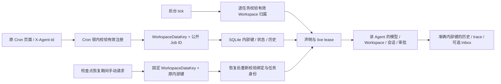

# Cron 公开多 Agent 接入

日期：2026-09-14。承接已批准的 [Cron 运行时方案](cron-runtime.md)，不新增前端
模式，不改原请求/回包形状，不修改默认宿主生命周期或外部 Channel 门禁。

实施前底层已有 WorkspaceDataKey、公开 Job ID、真实 scoped Agent executor、
取消/排空、重启/重新注册/范围恢复；但公开 Job HTTP 仍只允许 default，tick
跳过全部非默认任务。需要接通真实请求与这些权威边界，而不是只删 501。

## 实施 checklist

- [x] 原 Cron API/Agent 解析和当前底层前置条件核对，添加公开多 Agent HTTP、
  同名任务以及后台调度失败回归；失败日志保留。
- [x] 每个 Job HTTP 在 Cron 锁内解析请求 Agent 的有效注册绑定；读取/修改
  按 WorkspaceDataKey + public ID 查找，metadata/body 不赋予其他归属。
  未注册/停用/损坏绑定拒绝；不能读写其他 Workspace 的任务。
- [x] 对齐原 PUT create-or-replace：目标范围不存在时新建该范围的任务，
  即使其他 Agent 有同名公开 ID，也不能操作其内部键；保持容量和输入校验。
- [x] tick 逐任务检查有效启用的注册绑定；失效/停用/已删除的归属不派发，
  不阻断健康 Agent。文本与 Agent 运行均使用同一归属，不回退 default。
- [x] 恢复暂停后的手动运行保留固定 WorkspaceDataKey 并重新校验；同 ID
  重绑定不得把旧排队请求转到新 Workspace。保留立即 started 和取消语义。
- [x] 补测暂停期间删除任务后 PUT 重建同公开 ID，旧排队请求不能执行新内部键。
- [x] 公开 HTTP 覆盖 CRUD/启停/run/state/history、并发模型/工具/审批、复制后
  定时执行、停用/删除/重开/重绑定，比较完整作用域状态；复验原底层回归。
- [x] 原 Cron 页面切换 writer、CRUD、真实工具运行、历史/刷新；默认任务
  完整结构和工作区文件不受影响，候选目标、trace/Inbox 归属一致。
- [x] 原页面审批与 Agent 生命周期整组回归；原 Console 源码零变更。
- [x] 最终全套 Rust/严格检查/release/客户端回归，见 [验收记录](../testing/cron-public-scope-acceptance.md)。
- [x] 新九类 `4v2E9d` 构建及静态/隔离安装验收，见 [本批记录](../testing/qa-cron-packages-20260914.md)；此前 `737ANs` 不含本轮改动。
- [ ] 包内 Core 运行及原生/跨平台验收，不能用静态核验代替。

锁顺序沿用 Cron → Agent；生命周期变更仍走已有 Lifecycle → Cron → Agent，
不能持有 Agent 锁等待 Cron finish。plain AppServer 嵌入的 default 测试契约保留，
但无注册表时绝不凭空接受非默认 Agent。当前全局 256 个任务/运行资源上限不扩张。

本轮用本地模型、假凭据和临时目录；不访问真实 key/钥匙串，不运行包内 Core。
外部渠道、全客户端默认 Workspace、原生/跨平台验收仍是独立未完成项。

## 整组回归发现：项目目录列表截断

首轮显式整组 26/27，Cron 场景全部通过；项目目录原页面在系统临时父目录中
找不到 fixture。只读核对发现 Rust `browse_directories` 在排序前 `.take(500)`，
而原 Python 遍历全部目录。原页面无分页/截断提示，不能靠清空本机临时目录
或换 fixture 路径规避这个真实功能差异。沿用原页面等价要求作最小修复：

- [x] 临时 fixture 创建超过 500 个目录，用真实 HTTP 比较完整排序/隐藏过滤
  与两个 Agent 的响应，先保留旧实现失败。
- [x] 仅移除该入口的静默 500 项截断，不改前端、不改变其他目录/文件 API。
- [x] 定向与完整 Rust/Clippy、原页面整组、release 和客户端对新 Core 再验证。
  最终 743 项普通 Rust、28 项显式契约/原页面均通过；失败日志保持独立。
