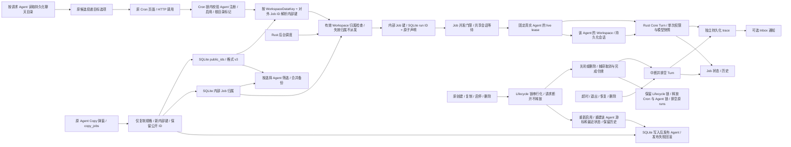

# Cron 原生运行时

日期：2026-09-09。承接已批准的全部原功能等价目标和计划 §38，不是将目标缩减为文本提醒。前端、CLI/TUI 的原功能范围保持不变；新数据仅由 Rust Core 存储拥有，不运行 Python 调度代理。

## 原契约与差距

依据产品 `src/qwenpaw/app/crons/{models,manager,executor,api}.py` 和原 Console CronJobs 页面：保存计划、启停、手动触发、next/last 状态与历史、时区 Cron/一次性/按天重复、Agent 会话与工具安全、结果 Inbox/trace、渠道投递都是已有功能。首轮核查时 Rust 只有持久化配置和手动文本推送，Agent 返回 501，next_run_at 恒空。现已接通 Console 文本与 Agent 执行、持久化候选目标、Workspace 归属及范围备份。2026-09-14 开放有效注册 Agent 的公开 Job HTTP 和后台调度，详见 [本轮实现及验收清单](cron-public-agent-scope.md)；外部渠道、全部旧控制语义和新制品仍未完成。

时间语义还依据 [APScheduler 3 CronTrigger](https://apscheduler.readthedocs.io/en/3.x/modules/triggers/cron.html) 和 [3.x 用户指南](https://apscheduler.readthedocs.io/en/3.x/userguide.html)。原实现使用各 Cron 字段同时满足，而不是常见 crontab 的“日或星期”；数值星期先按 crontab 转成名称，步长仍需按 APScheduler 的周一到周日顺序解释。DST 需独立差分检查，不能仅证明 UTC。

## 执行设计

1. **时间计算**：独立 Rust 模块解析原允许的标准字段、范围/列表/步长、月/星期名称及月末；使用现有 chrono/chrono-tz。一次性含偏移时间按绝对时刻；无偏移时间按配置时区解析。按天重复沿用原 IntervalTrigger 固定时长，次数含第一次，截止时间包含边界。非法表达式/时区/溢出在写入前拒绝，不静默改成 UTC。
2. **调度权威**：Core SQLite 的现有 Cron 数据中保存下一时间槽和初始化标记；推进时间槽必须先于派发并在同一 cron 锁下持久化，避免轮询/手动触发/编辑同时派发同一槽。进程崩溃后的未完成执行记录为中断，不盲目重放外部副作用；不声称跨进程与第三方投递 exactly-once。
3. **生命周期**：App Server 启动一个后台调度任务，独立于 HTTP 流量定期检查；使用弱引用、shutdown token 和有界等待。执行与备份恢复共享 Core operation guard，恢复时不派发；Core 恢复会取消并排空活动/排队 Agent 执行，再取得独占 lease，退出中不产生新任务。变更/重启重新读取存储，不维持另一套文件权威。
4. **到期规则**：暂停无 next；恢复/替换从当前时间重新计算。一次性已过期的槽按 grace 判断；循环任务合并积压到最新槽，超出 grace 记录 skipped 并推进，不能无限补发。手动执行不消耗自动计划次数，也允许运行已暂停任务。删除后旧任务不得重新生成该 Job 的状态/历史。
5. **执行器**：文本保留原 Console 推送与可选 Inbox。Agent 经原 Agent/Provider/Workspace 解析后调用 Rust Turn；共享目标会话或稳定的 Job 独立会话，不能每次创建新上下文。安全开关只对当前 Turn 生效，不修改全局工具策略；超时/退出中断 Turn 并清理审批。成功/失败/取消、trace/Inbox、silent 与 stream/final 按原契约实现。外部渠道在对应真实运行时完成后接入，缺失不可伪造成功。

## 逐步验证

- 先以固定日期测试时间引擎，包含时区/DST、闰年、月末、星期 AND/步长、无解表达式、次数/截止、边界和非法值；用本机 qwenpaw conda 的原 APScheduler 作差分对照。
- 再测试后台到期、零流量触发、错过执行、持久化/重开、暂停/恢复/编辑/删除、手动与定时不互相吞掉、恢复互斥和退出。
- 隔离模型 fixture 做 Agent 真实工具往返、并发/超时/安全/会话/trace 与错误测试，不使用生产 key。
- 原页面浏览器验收与全回归、客户端 release 和各制品安装态分别记录。时间引擎、文本调度、Agent 和外部渠道可分步落地，但只有全部覆盖才可勾选 Cron 完成。

## Agent 执行切片清单

沿用上述已批准设计，先落实隔离边界，再接执行器；不修改原页面与 wire protocol。

- [x] Core 在接收 Turn 时校验并快照运行参数；可信 App Server 可提供逐 Turn 参数，普通 SDK 请求不能通过新增 JSON 字段关闭审批。
- [x] 验证任务 Off 与并行普通聊天审批隔离、进行中参数不受热更新影响、Off 不启用已关闭的内置工具或绕过 MCP Deny、非法参数无历史/全局副作用。注意原 Python `ToolExecutionLevel.OFF` 与当前原生 Off 都会关闭 Tool Guard 求值，不能误称其仍执行 Tool Guard denied_tools；本切片不顺带改变该模式语义。
- [x] 默认 Agent 执行使用持久化聊天目录恢复会话；独立会话沿用 `{session}:cron:{job_id}`，不是每次新建；继承默认 Agent Provider/Workspace。
- [ ] 运行声明在异步执行前持久化；实时运行与重启孤立声明分开恢复，不能被下一次 tick 误判中断。并发/队列、超时/取消、退出和恢复必须闭环。
- [ ] Console Agent 不产生额外文本推送气泡；silent 保留历史与 trace，Inbox 关闭时也保留原执行 trace，非 Console 渠道缺失不能返回成功。
- [ ] 原页面 Agent 模型/工具往返及全回归通过后，才更新功能矩阵和安装包验收状态。

### 当前执行器落地顺序

- [x] 持久化聊天目录按 Agent/channel/user/session 精确复用，原共享聊天名称/分组不改，新任务进入 Cron 分组；重启后不依赖内存 alias。
- [x] 默认 Console Agent 通过后台任务启动，手动请求立即返回 started；每个 Job 的 semaphore 控制并发，进程内有界任务登记与 durable run ID 一一对应。
- [x] 任务持有完整 operation lease，准备/排队阶段响应退出与应用恢复；Turn 超时/取消后继续消费终止事件再落最终状态；删除清理声明并取消运行，旧完成不重建 Job。
- [x] Cron trace 与 Inbox 通知独立，运行前建 trace、完成更新；独立 trace 有界保留，原通知删除行为不变。恢复将孤立声明记 cancelled，不重放模型或工具。
- [x] 用隔离本地模型验证默认 Console Agent 的立即返回、真实工具、安全审批、稳定会话/重启、定时/手动、队列/超时/取消/删除和 trace；外部渠道与多 Agent Job 归属仍单独跟踪，不据默认 Console 宣称全部完成。

当前多 Agent Console 路径如下；队列是内部执行阶段，不新增公共 API 状态值。下文旧切片清单保留其当时验收范围；公开入口最新状态以 2026-09-14 清单为准：

活动与排队执行总数有 256 个的资源上限，手动排队、到期超出 Job 并发数记 skipped。共享会话遇到现有 Turn 会在任务 deadline 内等待，不因正常并发直接报 ThreadBusy。每个 Job 的当前 semaphore 在这一批活动任务排空后按新设置重建；运行中修改 max_concurrency 的全部旧语义仍需专项验收。

Cron trace 标记明确的 `source=cron` 和 `agent_id`，即使没有 Inbox 事件，范围备份也保留明确归属的 trace；无归属或跨 Agent 引用的记录仍不得导出。格式 v4 的 `workspace_owners` 是持久化归属权威，无归属的既有原生 Job 仅属 default，业务 `meta.agent_id` 不改变归属。恢复按范围合并 Job 与关联状态，重启处理只中断相同归属的 trace。2026-09-14 起，Job HTTP 在 Cron 锁内验证请求 Agent 的注册绑定并解析内部键；后台逐任务验证有效绑定，停用/删除/损坏的归属不派发且不阻断健康 Agent。PUT 沿用原 create-or-replace，目标命名空间不存在时只在本范围新建，不操作其他 Agent 的同名任务。恢复期间排队的手动请求固定 Workspace 数据身份和原内部键，恢复后重新校验；旧请求不因公开名称复用而执行新任务。外部 Channel 仍未实现，不返回伪成功。

### 下一切片：移除非默认 Agent 限制

只读对照确认：原 `app/crons/api.py::get_cron_manager` 按请求选择 Workspace，各 Workspace 有独立 CronManager；原候选投递目标来自该 Workspace 的持久化聊天，而非运行时 alias。首轮 Rust 的 `dispatch_targets` 直接遍历 alias，会带入内部限定键且重启后缺失，备份也把整个 Cron 当作默认 Agent 数据；这两处已在前置切片修复。余下执行、审批和生命周期必须一起收口，不能只移除 HTTP 的 501 检查。

- [ ] 内部持久化 Job 归属：由服务端请求范围赋值，不信任 `meta.agent_id` 或额外 JSON 字段；保持原页面 Job 回包形状。已有本地原生无归属记录仅属 default，不导入 legacy Python 数据。
  - [x] 内部 owners、读取结构验证、范围备份/恢复与默认访问隔离；不将恢复得到的非默认 Job 当作默认任务执行。
  - [x] 含 owners 的持久化使用格式 v2，旧仅支持 v1 的 Core 拒绝读取；v1 中无归属数据继续仅属 default。归属恢复后即使筛选只剩 default，也不向旧格式降级。
  - [ ] 非默认 HTTP 创建/更新入口按真实请求范围赋值，取消临时 Job 路由门禁。
- [ ] 所有 Job CRUD/启停/run/state/history 校验 Agent 存在、启用和 Job 归属；跨 Agent ID 查找统一不暴露，伪造 meta 无法改归属；持久化作业容量与运行并发边界明确。
- [ ] 后台执行沿用声明中的实际 Agent；Provider、Workspace、运行配置、会话、trace 与 Inbox 使用同一归属。关闭/删除 Agent 后不得继续启动其排队任务或使用默认配置兜底；与 Agent 生命周期锁顺序一并测试。
- [x] 候选投递目标改读请求 Agent 的聊天目录，以 `(channel, user_id, session_id)` 元组去重；保留原 keyword/channel/limit 和 console 兜底，内部 alias 键不对外展示；重开后仍返回相同结果。已注册外部渠道的候选不等于该渠道运行时已实现。
- [x] Cron 的范围备份/恢复同时筛选 Job、状态、历史、游标和声明；未选择的 Agent 数据不变，run ID 冲突在任何写入前失败，Job 内部键碰撞可重分配但不改公开身份；无 Job 的关联记录不导出，不能因全局配置恢复越过范围。
- [x] Console 待审批记录使用实际 Agent 归属，审批响应绑定真实请求与根会话；保留原全局 Inbox 跨 Agent 审批入口，不按当前所选 Agent 过滤全部审批。Cron 内部 scoped 执行器的安全模式也已通过真实工具/审批验证；普通 push 保留原全局、按 session 消费且不附 Agent 字段的契约。
- [ ] Agent Copy 的 `copy_jobs` 对齐原复制语义，不能继续只复制已非权威的 `jobs.json` 文件；核对 Job 标识、启用状态与历史的复制规则，再接入 SQLite 归属和生命周期。
  - [x] 已核对原 `_copy_selected_workspace_files` 原样复制 jobs.json；JobsFile 只有版本与任务规格，历史另存 jobs_history 且未复制。原生 Copy 已通过 v3 public_ids 保留任务 ID/启用状态、分配独立内部键，不复制历史/活动声明；普通失败回滚和原弹窗已验收。非默认调度/关闭删除仍未接通，因此总生命周期项未勾选。
  - [ ] 将存储查找、状态/历史/游标、live 并发键、声明归属、备份冲突判断一起按 Agent 命名空间处理；读取既有原生 v1/v2 并保留所有关联数据，新格式要有旧 Core 拒绝读取的版本门禁。不是导入 legacy Python 数据。
- [ ] 两个 Agent 同时执行真实工具，断言各自模型请求、文件路径、同名会话与通知隔离；覆盖默认/非默认、恶意跨范围、关闭/删除、重启恢复和范围备份完整结构。
- [ ] 原页面切换 Agent 后的 Cron CRUD/执行/历史/刷新通过，再移除临时 501 门禁并更新功能矩阵；最后重建新制品，现有默认 Agent QA 包不被描述为已包含此切片。

### 当前回归诊断清单

持久化归属前置切片的两次浏览器整组均为 10/11。第一次备份创建失败；修正测试驱动等待原 Modal 初始化后，独立两项备份通过，第二次整组备份操作全部通过但导航 Inbox 时 Agent 列表 fetch 失败。尚不能把两次失败归为同一原因，也不能用独立通过关闭问题。

- [x] 为浏览器报告记录 API 请求的页面/loader、失败/取消和 JavaScript 上下文来源；不记录正文/请求头，不删除或放宽既有错误判定。
- [x] 独立诊断单测 3/3；原备份 roundtrip 1/1 通过（66.43 秒），含 24 页导航与真实备份操作；此次未复现，根因仍未定位。
- [x] 将当前源码、SDK、浏览器失败与旧 QA 制品范围分别写入验收记录；不把旧 DMG 视为包含新归属代码。
- [ ] 捕获原间歇性错误的实际请求/上下文证据并据此修复，再验证整组稳定性；本次独立通过不关闭问题。

### 审批归属切片

只读核对 `app/routers/console.py::get_push_messages`、`routers/approval.py`、原 `ConsolePollService` 与 Inbox：所有待审批跨 Agent/会话汇总，批准/拒绝只提交 request ID 与 root session ID，并不切换 Agent。必须保持此原交互；Agent header 是当前界面选择，不是审批请求的归属凭据，不能用它拦截全局 Inbox 的合法操作。

- [x] 新增原实现失败回归：两个 Agent 同名会话的真实工具审批，其归属、根会话和响应互不混淆；重开无 alias 仍正确。
- [x] 从持久化聊天目录解析审批 Agent/session/root，移除默认 Agent 与 alias 假设；目录损坏时拒绝该工具，不将未知归属冒充 default。
- [x] 保留全局 push 审批列表和根会话响应契约；根会话不匹配不得消费请求，响应只解除准确审批 ID。当前仅一次性批准，similar 持久规则仍独立待完成。
- [x] 启动 Console 聊天前检查已有线程归属，直接 ID/alias 不得绕过归属检查并修改其他 Agent 的 Workspace；未编目 SDK 线程仅属 default。
- [x] 新增 `/api/approval/list` 原契约及根会话过滤，复用同一待审批权威；原 Inbox 浏览器审批、普通工作区/严格 Clippy/release 客户端回归。
- [x] 更新本切片功能矩阵和验收，保留原全局 Inbox 行为。
- [ ] 原生非默认 Cron 执行、关闭/删除生命周期、跨 Agent 子任务委派及新制品仍需后续完整接通。

此审批切片验证的是现有 Console 原生 Turn 的真实归属及全局 Inbox 行为，详见 [审批验收](../testing/console-approval-acceptance.md)。不代表非默认 Cron 已调用这些入口，也不代表不同用户间授权模型或子 Agent 委派已完成。

### 任务命名空间实现清单

保留当前单一 SQLite 调度权威。把对外 `(Agent, Job ID)` 与内部存储键分开：现有内部 ID/状态/游标/run claim 继续作为唯一键，新增内部 public_ids 映射仅在逻辑 Job ID 与存储键不同时保存。这样复制可保留原对外 ID，又不让同名任务共享 semaphore、历史或删除路径。含映射的数据用格式 v3，旧 Core 必须拒绝读取；既有原生 v1/v2 保持可读。原 Job API JSON 不增加内部字段。

- [x] 版本与命名空间回归：不同 Agent 可有同一对外 ID，同一 Agent 不可重复；映射必须引用存在的内部键，输入字段不能伪造映射；旧原生数据无损读取。
- [x] 默认 Job API 在边界解析逻辑 ID、回包只用逻辑 ID，状态/历史/删除/取消仍用准确内部键；运行 trace、Inbox 和独立 session 使用对外 ID。
- [x] 范围备份保留选择范围的映射及所有关联数据；恢复时可重分配碰撞的内部键但保留对外 ID/归属，run ID 冲突仍拒绝，不能修改未选中数据。
- [x] 复制任务原语保留 ID、规格和 enabled，分配新存储键，不复制状态、历史、游标或活动声明，交由首次调度初始化；Agent Copy 已接入普通失败回滚，不继续复制非权威 jobs.json。非默认首次调度仍受后述门禁限制。
- [x] 两个 Agent 同名任务的默认 HTTP/范围恢复/原页面控制回归，操作 default 后其他归属记录保持不变。
- [ ] 原非默认 HTTP/执行/生命周期与其原页面回归；该路径完成后才能移除临时门禁。
- [x] 本切片普通测试、release/客户端与文档更新。
- [ ] 新九类制品安装态独立验收。

### Agent Copy 接入清单

原复制入口只复制 JobsFile 的规格，返回后异步启动 Agent；不在复制时生成游标。当前切片遵循该边界，不提前开放尚缺执行隔离的非默认 Job HTTP。

- [x] 先添加实际 Agent Copy HTTP 回归，证明旧入口没有复制 SQLite 任务。
- [x] 复制前验证名称、源路径及任务容量；保持原 copy_jobs 默认值和其他复制选项。
- [x] 以 Cron → Agent 顺序持锁；为复制任务生成新的内部键，保留对外 ID 和所有规格，不复制运行状态。
- [x] 文件与凭据准备失败清理本次新目录；Cron 写入失败不发布 Agent；目录索引发布失败回滚 Cron 原始数据。回滚失败明确报错并保留可恢复资源，不声称跨文件/SQLite/凭据存储具备崩溃原子性。
- [x] 覆盖启用/停用、复制的再次复制、未勾选、空任务、容量/损坏/写入失败、重开与其他 Agent 数据不变。
- [x] 原复制弹窗、工作区 468/468、整组显式 14/14 及 release/客户端构建通过，已更新 [复制验收](../testing/agent-copy-acceptance.md)；非默认执行及新安装包仍单独验收。

### 非默认执行与生命周期接入顺序

原 `CronExecutor` 使用当前 Workspace 执行；原删除 Agent 先 stop_agent，再删除注册引用，保留 Workspace 文件（含任务文件）。原关闭后重新启用会重新启动调度器。不能把删除等价实现为无条件抹掉中央任务数据，也不能让同一个 Agent ID 重新绑定其他 Workspace 后继承旧任务。

- [x] 从持久化 Job owners 解析并固定 live lease 的真实 Agent，prepare 的配置/模型/Workspace/会话、trace、Inbox 共用该身份；不信任 job.meta。运行与完成检查仍归属同一内部 Job。
  - [x] 模型从同一 Agent 配置快照解析；明确配置但 Provider 不存在时必须报错，不静默落到默认模型。原 model_factory/Provider 构造器不会因模型从目录移除就改用全局模型：保留显式 model ID 向原 Provider 请求，由其响应判断是否可用。与 Console 共用解析；未指定模型或空 slot 保留全局选择语义。显示的已选模型也保留，未列出模型的窗口元数据按原静态规则/Ollama opt-out 解析；这不表示完整运行期上下文管理已对齐。
- [x] 两个实际注册 Agent、同名 Job/session、不同模型和 Workspace 的真实工具并行回归；安全模式待审批经原全局 Inbox 操作，跨 Agent 不混用。各自运行步数限制和未注册/已关闭归属也已验证。
- [x] 新增按 Agent 取消与排空原语，覆盖正在执行、同 Job 排队、共享会话等待及其他 Agent 不受影响；不得在持有 Cron/Agent 锁时等待需要相同锁的 finish。等待捕获的完成令牌，不追逐随后启动的新 run。
- [ ] 将取消/排空接入关闭和删除，重新启用按原调度器语义初始化游标；联合写入失败、并发关闭/重新启用/删除与运行代际隔离验收。
  - [x] 原关闭/删除 HTTP 在注册表写入成功后、仍持 Cron 锁时捕获取消集合；释放两把锁后排空。原页面选择切换、禁用、删除、刷新及其他 Agent 审批保留已验收。
- [ ] 删除保留原 Workspace 数据语义，同时验证重新注册同 ID/同 Workspace 与同 ID/不同 Workspace 的任务归属，不能默默删除或串用原任务。
- [ ] 所有 Job HTTP 按真实请求 Agent/公开 ID 查找并校验存在/启用；后台检查注册状态与准确归属。上述执行/生命周期全部完成后移除 501 门禁。
- [ ] 原页面跨 Agent 切换、CRUD、执行/审批/历史、复制后的定时执行及启停/删除验收，再做完整构建和各端制品验收。

### 重新启用调度的实现清单

核对原 `CronManager.__init__/start/_register_or_update`：每次新建管理器的 `_states` 为空，历史另存且保留；重新注册任务由新 trigger 计算 next_run_time。Cron/interval 从当前时间取下一槽，一次性 DateTrigger 保留原 run_at（包括已过去的时间），由原 misfire 逻辑判定，不统一改成未来。无效 schedule 启动时自动禁用，原启动不为此额外写一条执行历史。

- [x] 固定时间的完整数据回归覆盖 Cron、interval、过去的一次性任务、停用任务、无效 schedule、历史保留及其他 Agent（含活动声明）不变。无效零间隔与未知类型也必须禁用，不能在游标计算时 panic。
- [x] 仅 false → true 重建该 Agent 的运行状态与游标；重复启用为调度 no-op，无任务不创建空 Cron 设置。尚未收束的 claim 返回 409，不能被重置抹掉；后台原有恢复流程负责收束中断声明。
- [x] Cron 新状态与 Agent enabled 联合发布；SQLite 失败不改注册表，注册表失败回滚原 Cron 字节（含非规范空白），回滚失败明确暴露恢复需要。此处仅承诺普通错误回滚，不承诺跨文件/SQLite 的崩溃原子性。
- [x] 生命周期锁按 Lifecycle → Cron → Agent 排列；创建/复制与启停/删除共用串行边界，排空阶段只保留 Lifecycle 锁，使旧 finish 能取得 Cron/Agent 锁。复用已有 HTTP 中间件的独立任务和 Core operation guard，不重复 spawn；真实执行被 Inbox 锁暂缓完成时，验证调用方取消后边界仍保留。
- [x] 实际 HTTP 覆盖重复启用、关闭后重开再启用、写入/发布失败、并发启停和调用方取消；原按钮启用/刷新验收。
- [x] 普通 488/488、显式整组 15/15、严格 Clippy、release 和客户端检查通过，详见 [重新启用验收](../testing/agent-restart-acceptance.md)。这不是新安装包验收。
- [ ] 同 ID/不同 Workspace 的删除重绑定与非默认公开调度仍按完整目标继续实现。

### 删除后重新注册的接入清单

只读对照原 `routers/agents.py::create_agent/delete_agent/_persist_created_agent`：删除只移除配置引用，不删 Workspace；创建允许复用未注册的现有目录，并重新写 Agent 配置。因此相同目录的任务/会话持久化可再使用，不同目录不能继承旧目录数据。此清单建立时 Rust Cron owners 与 ChatMetadata 都只记录可复用的 Agent ID；§48 已将 Cron 改为持久化 Workspace 归属，原聊天、审批及相关备份读取仍必须共享真实绑定。

- [x] 修复创建失败的目录清理所有权：自动路径已存在（含保留目录/符号链接）时不授予清理所有权；仅原子 create_dir 成功的新自动目录可清理。实际 HTTP 注入凭据失败，原目录与链接目标两项先真实失败，修复后新自动目录、删除后的原目录、自定义目录与链接目标 4/4 通过。
- [ ] 明确统一 Workspace 数据身份与 Agent 注册身份的映射，覆盖 Cron、聊天/分组/alias、审批、设置和范围备份；不能只换 Cron owner、永久禁止 ID 复用或删除旧数据来绕过问题。
- [ ] 固定原数据语义：同 ID/同目录恢复，原目录换新 ID、同 ID/新目录隔离，返回旧目录恢复原数据；重启、备份/恢复及普通失败保持未选择目录数据。
- [ ] 在创建/删除的生命周期边界内联合发布绑定，旧运行不能写入新一代数据；原页面创建/删除/切换/刷新验收后再开放非默认 Job 路由与后台调度。

进一步核对 `workspace/service_factories.py::create_chat_service`，聊天来自 Workspace 内的 chats.json；但 `app/inbox_store.py` 的 Inbox 文件位于全局 WORKING_DIR，历史记录携带当时的 Agent ID。故新绑定必须区分工作区数据、当前运行实例和全局历史，不能在重建时无差别重写全部历史 Agent ID。`agent_stats` 路由又按 Workspace 选择统计范围，需独立核对，不能因当前 Rust usage 表含 Agent ID 就推断原统计也按可复用 ID 隔离。统一方案已落实注册层、目录代际、运行入口和 Cron 消费者，见 [Workspace 数据身份](workspace-data-identity.md)；聊天等其余消费者继续接入，不把 Cron 阶段完成当成全链路解决。
