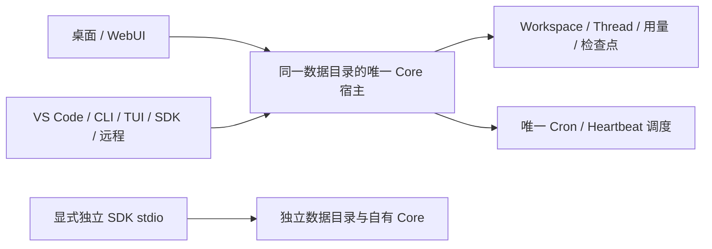
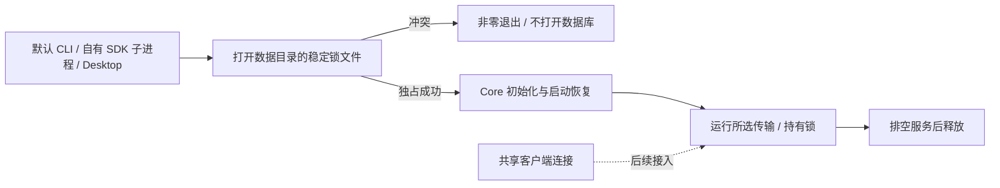

# 默认 CLI/SDK Workspace 接入：进程归属设计

日期：2026-09-10。承接总计划 §14.2.24.53，不更改原前端，不迁移旧数据。
这是默认入口切换前的设计审计。用户随后要求“沿着 goal 继续”，先修复
默认启动互斥，再完成共享连接；不把临时拒绝冲突当作最终跨端体验。
前置 SDK close、宿主
EOF 收尾及最终保存失败传播已完成，不能替代本页的多进程一致性要求。

## 当前证据与需要解决的问题

- CLI 非 Desktop 分支仍调用 `AppServer::new(core)`；三语言 SDK 默认各自
  启动 `qwenpaw-core app-server --stdio`，没有 Workspace 服务。
- `Core::persistent` 在 `from_store` 中加载所有 Thread、调用
  `recover_interrupted_turns` 并逐个 upsert，没有核验另一个 Core 是否存活。
  因此仅给 Cron/Heartbeat 加跨进程锁不足以保证同一数据库的安全。
- Workspace 构造器已分离基础目录与 preferred project 的模板初始化。
  默认 CLI 仍需明确基础目录，不能把调用者 cwd 当作模板写入授权。
- Core 存储中的 base URL/model 已优先于传入 `ModelConfig`；Workspace
  模型注册表随后又选择 provider 并载入密钥。直接替换构造器可能改变
  环境变量密钥的有效性，不能默认为每个 SDK 的环境配置都可覆盖共享宿主。
- HTTP 宿主启动 Cron/Heartbeat，而 stdio 目前没有启动相同调度器。
  服务功能应完整接入，但不能让同一安装中的每个客户端各调度一遍。

## 审计清单

- [x] 核对 CLI、三语言 SDK、Core 启动恢复及 Workspace 模型初始化实码。
- [x] 在临时数据目录中，由第一个真实 source Core 保持活跃轮次，再用
  第二个默认 SDK 启动同目录 Core；分别检查两进程的完整 Thread/Turn 和
  只读数据库快照。另以独立数据目录作对照。不使用真实密钥或分发 Core。
- [ ] 根据实测记录风险，确认下述共享宿主归属方案，再修改默认启动行为。
- [ ] 确定模型/provider/密钥的完整优先级矩阵，以及 SDK 显式模型兼容性。
- [ ] 实现并测试启动互斥、真实崩溃恢复、客户端连接/关闭和调度单实例。
- [ ] 默认 CLI/三语言 SDK/VS Code/桌面/远程逐项测试，原页面全量回归；
  再更新制品，不以显式构造器或单一客户端成功代表全端完成。

## 真实默认 SDK 复现

输出：产品仓库 `dist/qa-shared-core-open-20260910-gwu8id`，
`diagnostic.json` 与 `executed-probe.cjs` 保留完整快照、执行代码及阶段时间。
2026-09-10 06:16:09 UTC，使用 source release Core SHA-256
`19e4548ad6401da74e13490d25a3995c3332da3a1e2542cbf193a1dde5b11092`，
由真实 TS SDK 默认 `start` 启动，不修改 Core 或协议行为。

1. 第一个 Core 进入本地模型流，保持请求未完成。协议读取与只读 SQLite
   的完整 Thread/Turn 相同：Thread 为 `active`，Turn 为 `inProgress`。
2. 在独立数据目录启动另一 SDK，Thread 列表为空；第一个 Core 的协议
   和完整磁盘快照不变。对照进程正常 close 后才继续同目录验证。
3. 第二个同目录 SDK 成功 initialize，但 Thread 变为 `idle`、Turn 变为
   `interrupted`，且已写回磁盘。除恢复字段外，完整快照（含 messages /
   turn_metadata）与初始值相同。第一个 Core 仍能响应协议读取，返回完整
   原 `active/inProgress` 状态；loopback 模型只收到一个尚未完成的请求。
4. 先关闭第二个、再关闭第一个，均通过 SDK graceful close 正常退出。
   独立对照也正常关闭；本地模型监听关闭，临时数据和日志保留。

诊断程序退出 0 表示准确复现并收尾，不表示产品通过。该历史报告明确记录
`productInvariantPassed=false`、`reproduced=true`，当时尚未修复此缺陷。
2026-09-14 的 CLI 入口防护见文末；不修改这份修复前报告。
新 QA 批次 `2qPEew` 使用相同源码 Core；此前逐项隔离安装通过没有覆盖
同目录多宿主，不能据此声称已具备安全的跨客户端共享。

当前桌面默认路径是 Tauri App 数据目录的 `rust-core-v1`，CLI 默认路径是
系统 local data 目录的 `qwenpaw/core`；本测试不声称这两种默认目录已经
相同。风险适用于两个默认 SDK 共用路径，或客户端显式设置相同
`QWENPAW_HOME`。后续统一路径必须显式设计，不自动搬移已有数据。

## 建议方案（待确认）

2026-09-14 完成启动锁制品后，继续核对真实客户端入口。后续详细切换方案、
关闭语义差异、模型优先级及逐端验收见
[共享宿主接入方案](shared-host-client-attachment.md)。新增方案仍需确认宿主
退出规则；本轮不据此自动改成常驻后台进程。

同一安装的数据目录只能有一个拥有写入和启动恢复职责的 Core 宿主。
桌面、WebUI、VS Code、CLI/TUI 和语言 SDK 作为客户端共享该宿主。
已有宿主运行时，新客户端连接它，不再打开同一 SQLite 建立独立内存副本。
SDK 的独立 stdio 模式仍保留，但使用独立数据目录；不能默默重定向用户
显式指定的路径或复制共享数据。

需要区分自有与连接模式的关闭：自有 stdio 仍 EOF 排空并检查子进程退出；
共享连接关闭只断开该客户端，不能终止其他客户端或后台任务。普通 WS
断开后已接收任务继续完成的既有契约保持。共享宿主的空闲退出/应用退出
规则、认证后的本地发现及启动竞争必须一起设计，不能仅引入永久守护进程。

所有写入宿主必须在 `Core::persistent` 的启动恢复之前取得相同的安装级
归属；不能等到开启调度器时再争抢。正常退出需排空任务后释放，真正崩溃后
才允许新宿主恢复；只读诊断不构造会触发恢复的第二个 Core。仅锁 PID 文件
或复用一个未认证的端口记录都不能作为完整实现。

不能用 SQLite busy timeout 替代宿主归属：它只协调数据库写事务，不能
判定另一进程的活跃任务是否已经死亡，也不能刷新独立 Core 的内存副本。
不能静默给每个 SDK 随机数据目录，那会丢失原有会话、配置和跨端共享语义。

所有实测限于新临时目录和 loopback 模型，保留日志，不清理用户目录、旧
安装包或缓存，不调用系统凭据，不执行分发 Core，不 commit/push/发布。

## 首步实施清单：默认进程启动互斥

1. CLI 各传输和 Desktop 共用启动入口，在凭据读取和 `Core::persistent`
   之前取得数据目录的跨平台非阻塞独占文件锁；持有到服务排空退出。
   锁文件不记录 PID、不删除、不截断，退出/崩溃由 OS 释放持有的锁。
2. 冲突在恢复写入前明确失败；不启动监听器、不输出 ready、不改已有
   数据库。不改变目录选择、模型优先级或轻量嵌入 API。
3. 目录别名共用同一个锁文件，不同目录独立。锁是协作进程约束，旧版
   二进制及绕过 CLI 的嵌入调用不受保护，后续共享宿主仍须独立完成。
   使用 [fs2 文件锁](https://docs.rs/fs2/0.4.3/fs2/trait.FileExt.html)，
   不提升工作区 Rust 1.88 最低版本，不自行实现平台系统调用。

- [x] 真实 source CLI 活跃轮次冲突启动的失败回归与独立目录对照。
- [x] 数据目录独占锁；正常收尾、崩溃和初始化失败后可重新取得。
- [x] 原锁文件内容保留，空格/非 ASCII/目录别名和不同传输冲突测试。
- [x] CLI 全套、严格 Clippy、完整 Rust 回归；前端源码保持零变更。
- [ ] 共享连接、客户端关闭与调度归属完成后再确认全端默认接入。

2026-09-14 用户明确允许清理此前指定的 `qwenpaw-core/target/debug`。
只删除该可重建目录以解除磁盘满阻塞，保留 release、制品、报告及所有源码；
该授权不扩展到其他缓存或旧安装包。

首步已实现 CLI 启动锁（仅此入口），新增 4 项单元和 3 项真实进程回归。
严格 Clippy 通过，最终普通工作区 **715/715**；首次 Node PATH 缺失导致
SDK 假子进程启动失败已保留并修正运行环境。共享连接与嵌入 API 尚未接线。
详细矩阵及后续客户端/原页面门禁见 [启动互斥验收](../testing/instance-lock-acceptance.md)。

后续原前端 **2453/2453**、显式浏览器/参考 **27/27**、新 release 集成
**6/6**、TS **10/10**、Python **17/17**、VS Code **57/57**顺序通过。
当前 source Core 为 `143799...`，旧 `2qPEew` 制品不包含入口锁。后续九类
QA 批次 `g6i9VJ` 已包含此修复，静态核验和安装后 SDK/保留版 CLI 回归
通过，两种 VSIX 隔离安装未激活，见 [制品验收](../testing/qa-instance-lock-packages-20260914.md)。
包内 Core 启动、原生交互及共享宿主接入仍未完成。

