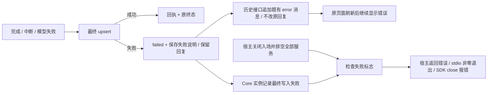

# 最终 Turn 保存失败的客户端与宿主边界

承接总计划 §14.2.24.53 和 stdio 生命周期 checklist 的既有保存失败待办。
保持 App Protocol v3 字段及原前端，不引入新协议事件、自动写盘重试或数据迁移。

## 方案

1. 当前 `finish_turn` 在 upsert 失败后仅 warning，仍发送原 completed 或
   interrupted 状态。改为沿用 `TurnStatus::Failed` 和 `Turn.error.message`，
   标明最终状态未保存；Thread 为 error，保留已显示的 items、原模型错误
   （若存在）及旧成功检查点。SQL 原始错误不进入新客户端提示。
2. 最终 upsert 成功才产生既有 `turn_was_persisted` 回执。失败不额外尝试
   “保存 failed 状态”，不因触发器只拒绝 completed 就绕过真正失败。
3. Core 实例保留一个不可自动清除的最终写入失败标志。宿主在关闭所有
   入场并排空任务后检查它，返回错误；stdio 因而非零退出，三语言 SDK
   已有异常退出路径可以传播失败，即使通知接收者已断开。HTTP/WSS 的
   服务运行结果也检查该标志，正常客户端断开仍不关闭宿主。
4. 该标志表示本实例曾丢失最终写入确认，不表示当前磁盘永久损坏。
   后续成功、Thread 删除或恢复不能追认此前失败；新 Core 实例仍沿用既有
   interrupted 启动恢复。服务不停机、不拒绝正常后续任务，不自动覆盖旧数据。
5. 入场失败已有同步错误，不设置最终写入失败标志；该检查不是所有存储
   操作的通用事务确认，也不替代进程/任务收尾。已有传输错误优先保留。

## Checklist

- [x] 核对最终写入、旧检查点/回执、三宿主和 SDK 异常退出路径。
- [x] 先复现保存失败仍 completed；保留回复、旧检查点及入场回滚断言。
- [x] 完成/中断/原模型失败的最终写入故障、无原始 SQL 错误泄漏、完整
  内存/磁盘状态和后续成功不清除失败记录。
- [x] stdio/HTTP/WSS 收尾后检查；正常退出、普通断开语义不变。
- [x] 真实 source Core 子进程故障注入，Rust SDK 确认异常退出而非保存成功；
  重开前检查磁盘仍为旧 inProgress，移除测试触发器后才验证既有启动恢复。
- [x] TypeScript/Python 各自的真实保存故障源码专项；完整 Thread/Turn 的
  重启前只读检查与退出码 1 已验证，既有假子进程测试不替代这两项。
- [x] 前端错误场景真实浏览器检查；补齐历史接口遗漏的 Turn.error，
  原回复和错误刷新后仍可见，故障解除后原输入框可继续发送。
- [x] 首阶段 Core 错误传播的全库、严格检查、原前端及客户端顺序复验；
  历史刷新修复后的最新门禁另见下方，保留首阶段首次失败。
  全库再次遇到既有 Rust SDK 非零退出 5 秒超时，诊断中 EOF 标记尚未出现。
  先补充测试阶段信息检查通信 worker 与子进程，不放宽原时限，不把单例
  通过当作全库成功；本次失败日志位于 `qa-final-persistence-20260910-78QvFt`。
  最终顺序门禁为 Rust 707、前端 2453、浏览器/参考 26、release SDK 3、
  TypeScript 9、Python 16、VS Code 57 全部通过，见验收记录；不追认超时根因。
- [x] 新九类 macOS ARM64 QA 制品及 SDK/保留版 CLI 安装态复验完成；
  `2qPEew` 包含最终保存与历史刷新修复，`WXFYc3` 不包含这些后续改动。
  两类 VSIX 仅验证隔离安装，分发 Core 启动和原生交互仍未通过，见
  [本批制品验收](../testing/qa-final-persistence-packages-20260910.md)。

只使用临时目录、SQLite 测试触发器和 loopback 模型夹具；不读取真实 key、
不操作日常数据、不执行分发 Core、不清理或发布。

## TS/Python 实际 Core 故障专项执行清单

沿用以上已确认方案和现有正常 EOF 测试夹具，不改 SDK 生产行为。新增独立
失败用例，持有 loopback 模型请求，在临时数据库安装拒绝最终写入的触发器。

- [x] 两语言均确认 close 返回准确的退出码 1 错误，重复 close 保留失败。
- [x] 重开前完整比较磁盘 Thread/Turn 与原 inProgress 快照；不以启动恢复
  替代退出持久化。移除测试触发器后重开，比较完整 interrupted 恢复结果。
- [x] 两语言源码全套分别顺序通过，并更新安装态检查的测试数量断言：
  最终 TS 10/10（32.508 秒），Python 17/17（33.419 秒），均无跳过。
- [x] 重新构建、离线隔离安装两种 SDK，各自重复全套测试；始终连接 source
  release Core，记录其哈希，不执行打包 Core。
  `qa-sdk-final-persistence-20260910-TJWoJ3` 中 TS 安装态 10/10（32.495 秒）、
  Python 安装态 17/17（33.422 秒），包哈希、载荷、导入位置、顺序时间戳
  和 source Core 哈希均通过核验。SDK 生产代码未改，新增真实故障验收。
- [x] 原前端保存错误的真实浏览器专项独立通过，不由 SDK 测试追认。

## 原前端保存失败浏览器执行清单

继续沿用原 Console 的输入框、错误组件和会话加载路径，不改前端源码。
实施前历史适配只遍历 Turn.items，刷新时丢失 Turn.error；真实浏览器已
复现后，仅在 Rust 历史适配中沿用原组件支持的 error 消息修复。

- [x] 临时 Workspace / loopback 模型 / SQLite 最终写入触发器；通过原输入
  框发送，看到原回复与完整保存失败提示，提交按钮可再次使用。
- [x] 浏览器通过测试进程管道暂停，Rust 只读核查旧 journal 为 inProgress、
  无最终失败记录；中间步骤可能已保存回复，不能据此确认最终状态已保存。
  刷新同一宿主后回复和错误仍可见，磁盘快照完全不变。
- [x] 只在上述检查后解除临时触发器，再由原输入框发送下一条；回复正常、
  最新 Turn 真正保存、自动检查点仅来自成功轮次，宿主收尾仍报告此前失败。
- [x] 修复历史适配前保留浏览器失败证据（刷新仅剩回复），再补准确 JSON
  合约回归；仅追加原组件支持的稳定 id / error / message，不得
  改协议版本、伪装成功、改前端状态或用 mock HTTP 响应代替 Rust 宿主。
- [x] 专项、普通全库、严格检查、显式浏览器和客户端按顺序验收：Rust
  708/708、前端 2453/2453、显式 27/27、release SDK 3/3、TS 10/10、
  Python 17/17、VS Code 57/57 全通过；最新 source release 哈希和失败
  记录见验收文档，未宣称此前 Rust SDK 偶发超时根因已解决。
- [x] 最新九类制品 `2qPEew` 静态核验通过；安装后的 TS 10/10、Python
  17/17、保留版 CLI 855/855 + 36/36 顺序通过，两类 VSIX 安装但未激活。
- [ ] 分发 Core 启动、原生交互与跨平台仍需独立完成；不以静态/源码对照
  证明包内运行，不清理或发布。
