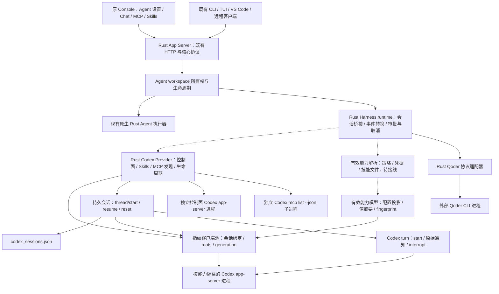

# Harness 原功能等价：Rust 实现方案

状态：原 handler 契约、Rust Codex 通信、控制面、发现、生命周期、能力投影、客户端池及持久会话恢复已完成本地替身验证；会话驱动的 turn/start、原始通知流与 interrupt 也已实现。完整 HarnessEvent/Chat 转换、审批上下文、Agent/HTTP 接线和 Qoder 未完成；原生启动及 SDK 偶发关闭超时未解决。2026-09-17。延续已批准的完整原功能、原前端不改及 D3 无 Python 产品 fallback 约束。这里的 Harness 是产品原有的外部编码代理功能，不是未来新增客户端，也不是 Rust 测试 harness。

## 当前缺口与架构

原 `src/qwenpaw/harnesses/registry.py` 的顺序为 Codex、Claude Code、Qoder；Codex 与 Qoder 可用，Claude 为 coming-soon。原七个 `/api/harnesses` 接口未接入 Rust；`desktop_agents.rs::validate_backend` 只允许 `qwenpaw`，明确以 409 拒绝外部 backend。因此现有页面单测通过不能证明这项原功能可用，也不能只注册七个接口就关闭本门禁。

图中 Harness 分支为目标架构：Codex Provider 内部控制链路、持久会话和原始 turn 协议链路已经组合，但上游 Harness/Agent/API、标准聊天事件转换、审批上下文与 Qoder 分支仍待实现。目标中 Rust Core 持有 Agent、客户端协议、会话映射及审批所有权；外部工具持有自身执行状态与账号。Python 原实现仅用于测试参考，不能作为新产品执行链路。不得将外部 backend 悄悄改用原生 Agent，也不得返回虚构的 installed/authenticated/loaded 状态。

配置投影已由 Provider 的池实际消费，经隔离测试子进程验证 overrides/env、roots 请求、会话复用与 generation 恢复；控制面与按能力隔离的进程仍分开。虚线标出的 resolver/上游 Harness 接线尚未完成，不能把这一内部链路当作原聊天页面已经可用。

## 必须保留的契约

| 原入口 | 关键行为 | 主要实现依据 |
| --- | --- | --- |
| GET `/api/harnesses` | 固定目录顺序、完整 capabilities、实时状态；只有当前 backend 使用已保存 settings | `routers/harnesses.py`、`harnesses/runtime.py::providers` |
| GET `/{id}/models` | 当前 backend 的 settings；未安装时返回空集合和原提示；模型默认项及 reasoning efforts | 原 router、各 adapter `models` |
| GET `/{id}/mcp`、`/{id}/skills` | Provider 只读发现；工作目录取当前 workspace；不支持 MCP 的 Qoder 直接返回空数组且不构造 adapter | 原 router、discovery、capabilities resolver |
| POST `/{id}/status` | 使用本次未保存 settings，而非替换成已保存配置；用 registry 覆盖能力字段 | 原 router `post_harness_status` |
| POST `/{id}/login` | 原设备码/浏览器/命令模式和响应字段；不隐式保存 backend 配置 | 原 router、adapter `start_login` |
| POST `/{id}/logout` | 真正执行注销；原 Qoder 不支持非交互注销时为 409，detail 含 `logout_not_supported` | 原 router、Qoder `logout` |
| Agent 创建/设置/列表 | backend、backend_settings、backend_capabilities、模型及推理强度；多 workspace 隔离 | 原 Agent 路由、当前 Rust `desktop_agents.rs` |
| Chat/命令/附件 | 原 response/message 序列、推理和工具事件、审批、取消、失败、附件、`/new`、`/clear` 及 provider 命令 | `harnesses/runtime.py`、streaming、session、各 adapter |
| 停止/重启/切换配置 | 同 workspace 的 adapter 锁、binary 改变时停止旧 adapter；恢复 thread/session 映射，不串 Agent | 原 `HarnessRuntime.adapter`、各 adapter 状态文件与 stop |

未知 provider 应先返回原 404；coming-soon 返回 409，不能混写为缺失 runtime。目录中的 `available` 不是 `installed` 或 `authenticated` 的同义词。完整模型默认值来自 `harnesses/events.py`；前端 `HarnessModelSelector`、`AgentBackendFields` 和 MCP/Skills hooks 会依赖这些差异。

## 实现与验收顺序

1. 固化原路由、完整响应及 adapter 调用参数：用原 Python handler + 显式测试替身生成参考记录；仅验证 handler 契约，不把替身算作外部 runtime 已执行。
2. 实现 Rust 进程协议：逐个请求 ID、并发通知、服务端审批请求、初始化、超时/EOF、退出及清理。先用隔离本地协议进程，禁止读取日常账号。保留原 Windows/Linux/macOS 发现行为和带空格路径，不用 shell 拼接命令。
3. 实现 provider adapter 与 workspace runtime：目录/状态/发现/登录/注销、配置替换锁、线程映射和恢复。外部 CLI 的直接协议必须由本机原源码或对应协议实证确认，不能凭 Python SDK 类型猜 wire 格式；Qoder 的 Python SDK 不能成为产品依赖。
4. 接入七个接口以及 Agent 生命周期/聊天分发。放开 `validate_backend` 前，必须证明该 backend 的真实执行、取消、错误和隔离链路；不能仅放开创建。
5. 使用原前端驱动创建两类 Agent，操作 binary 配置、状态、登录/注销、模型、推理强度、审批、MCP/Skills、流式聊天、取消、刷新和重启；按原实现完整对照。
6. 执行完整回归、重建全部受影响包并逐个验收；真实账号、原生及跨平台仍单列，不从本地替身推导通过。

## Checklist

### 当前切片：Codex 双向进程协议

依据 [官方 App Server 文档](https://learn.chatgpt.com/docs/app-server) 的 JSONL、初始化及反向请求约定，并以原 `harnesses/codex/app_server.py` 为产品行为参考。现有 `qwenpaw-app-server-client` 是 QwenPaw 自身版本化协议 SDK，不支持 Codex 反向审批；不修改其版本握手或将两种协议混为一谈。

在 workspace 新增 `qwenpaw-harness` 组件，先实现 Codex 子进程通信；后续由 Agent runtime 持有它。当前不注册外部 backend 或伪造目录状态。使用现有锁定依赖、不引入 Python 运行时。审批回调与读循环分离，避免等待用户决定时阻塞其他响应；请求取消清除本地等待项，不宣称取消已发出的远端 turn，后者仍需 `turn/interrupt`。

- [x] 新组件完成初始化顺序、并发 ID、反向请求、通知与错误收发，见 [通信验收](../testing/harness-codex-transport-20260915.md)。
- [x] 隔离 Rust 测试子进程验证路径/参数、EOF、本地请求取消、超时、默认拒绝和停止清理；17/17（含 1 个子进程入口），带空格目录独立编译后的完整组也通过。复制测试二进制的启动问题未确认根因。
- [x] 工作区 888 passed / 0 failed / 42 ignored、格式及严格 Clippy；原九包仍为此前快照，不含本组件。
- [ ] Agent 层配置替换、发现、账号、完整执行及原前端接线继续按上文完成。

### 整体功能门禁

#### 当前切片：已连接 Codex 的控制面

在现有 `CodexClient` 上实现账号读取/隐私过滤、浏览器与设备码登录、注销及完整模型分页，不新增平行 transport 或伪造 runtime 状态。`installed`、运行时发现、启动失败与配置替换由后续 workspace adapter 所有者处理；原发现流程包含 Python SDK bundled candidate，纯 Rust 分发路径必须另行落实，不能把 Python import 带回产品。

- [x] 控制面方法通过真实 Rust 测试子进程管道调用已实现的客户端，保持原请求参数和响应字段；不是执行真实 Codex。
- [x] 对照原 adapter 方法体的 13 组输入验证账号字段过滤、无账号、完整分页/默认字段、两种登录和注销；Python 参考程序另有 4/4 单测。仅比较已连接控制面，不覆盖完整 provider 状态与启动发现。
- [x] 协议错误、分页失败/重复 cursor 与全分页总超时不返回假成功或截断模型列表。
- [x] 组件 24 passed / 1 ignored，带空格构建路径同组通过；显式 Python 对照另行 1/1 通过。workspace 895 passed / 0 failed / 43 ignored，严格检查通过，见 [控制面验收](../testing/harness-codex-control-20260915.md)。原前端/九包不变，发现和完整 Agent 接线仍开放。

输入字段按已验证的原公开协议转换；非规范浮点数/容器的任意 Python `str()` 行为尚未等价，不能将 13 组案例泛化为所有输入通过。新增 `serde` 仅引用已锁定 workspace 依赖，没有升级外部依赖。

#### 当前切片：Codex 可执行文件发现

按原 `codex/discovery.py` 保留 configured → CODEX_BINARY → bundled candidate → PATH → standalone 的优先级；显式无效配置不降级。发现只读文件元数据/可执行权限并解析符号链接，不运行候选程序或读取其凭据。环境、工作目录及 home 由调用方显式给定，避免测试修改进程全局环境或不小心寻找日常 Codex。

纯 Rust 不导入 `codex_cli_bin`；分发层提供明确的 bundled candidate 和真实来源标签，已由 Python SDK 提供的路径仍可标记 `python-sdk`，不能将其他来源伪装成它。自动定位/打包该 candidate 仍需后续分发层实现，不因此关闭完整安装发现门禁。

- [x] 实现原查找优先级、无效显式路径停止、tilde/相对路径、权限、符号链接及 embedded-runtime 拒绝行为；显式主机 cwd/home/env，无全局环境修改。
- [x] 原 Python 发现函数 18 组完整 path/source 对照，参考程序 4/4 单测；覆盖默认 standalone、PATH 遮蔽、空 PATH、目录和不可执行文件，不执行真实 Codex。
- [x] Windows 默认目录/PATHEXT/当前目录策略单列逻辑测试；本机仅有 macOS ARM64 target，Windows 实机及 canonicalize/UNC/长路径等价仍开放。
- [x] 组件普通组 33 passed / 2 ignored，带空格目录同组通过；两项显式参考共 31 组案例通过。workspace 904 passed / 0 failed / 44 ignored，严格检查通过，见 [发现验收](../testing/harness-codex-discovery-20260915.md)。原前端与九包不变。

#### 当前切片：单个 Codex 客户端的启动与替换

给已有传输组件增加有界命令队列和独立进程所有者。原 `CodexAppServerClient` 的一个实例对应一个生命周期；这不是把同 workspace 下按 capability fingerprint 区分的多个客户端合并成一个。发现结果、host cwd/base env 与 runtime overrides 由上层提供，参数按原 `app-server -c ... --listen stdio://` 构造，不拼 shell。

接受后的启动/停止/配置更新在所有者任务内执行，调用方取消等待不打断已接受的操作；新进程不得越过旧进程回收。正常 stop 后可再次启动，终态 shutdown 关闭所有克隆入口；Drop 只触发清理，只有显式 shutdown 的成功返回证明清理完成。清理失败保留错误，不悄悄继续启动另一进程。审批回调在读取首条协议消息之前安装；客户端和订阅仍绑定单一 generation，上层恢复/重订阅另行接线。

- [x] 构造完整原启动 argv、显式合并环境与 host cwd；不记录参数/环境中的凭据。生产命令完整字段另有断言，进程测试使用测试专用 argv 启动当前 Rust fixture。
- [x] 12 个并发 start 共用同一 generation；相同配置不停止，不同配置先回收再生效；正常 stop/已观察的异常退出后可启动新 generation，旧客户端不自动换绑。
- [x] 取消启动/替换/shutdown 等待、旧请求与订阅关闭、Drop/终态 shutdown、首条审批处理、普通握手失败恢复与清理失败锁存，共 12/12 生命周期测试通过。
- [x] 组件 45 passed / 2 ignored，带空格目录同组通过；两项原参考共 31 组案例通过。workspace 916 passed / 0 failed / 44 ignored、严格检查通过，见 [生命周期验收](../testing/harness-codex-lifecycle-20260915.md)。完整 adapter、fingerprint/session 管理、原 UI 和各包仍开放。

清理失败不等价于普通启动失败：初始化失败且清理也失败时保留 `StartupCleanup`，所有者不自动重试；完整 adapter 的故障恢复和提示仍需实现。审批闭包不得无意强捕获其所属 owner 形成循环引用，上层接线时需单独验证。这里沿用 Rust 传输的 EOF/有界回收，不把原 Python terminate 的所有行为宣称为逐项等价。

#### 当前切片：Codex Provider 控制入口与完整元数据

将已实现的文件发现、单客户端所有者和控制方法组合为可复用 Provider；注册原 Codex/Claude/Qoder 静态目录与完整 capabilities，但不将目录声明等同于 Rust 已执行相应能力，也不提前注册 HTTP 或放开 Agent backend。状态保持完整原字段及账号隐私过滤；模型/登录/注销使用真实生命周期与协议组件。

发现放入阻塞任务，主机输入由调用方显式提供。每次状态/可用性探测重新读取文件状态；进程真正需要启动时重新发现 executable，已有活进程不因探测变化自动换绑。允许未解析的 launch target，以实际发现结果决定 installed/start，不能填造一个假 runtime 路径。二进制 settings 变化仍由上层 workspace adapter 锁持有并替换整个 Provider。

- [x] 原三项目录顺序、全部能力/命令/审批 preset 与四类 Provider 完整状态通过原 Python 结构对照；Python 参考程序 4/4 单测通过。
- [x] Codex Provider 完成缺失/未登录/已登录/远端错误状态及模型、两种登录、注销、stop/shutdown；文件发现放入阻塞任务，未增加文件系统探测总超时。
- [x] 9 项 Provider 普通测试验证动态发现、停后重新发现、缺失恢复、独立所有者、启动 I/O 错误及真实 Rust fixture 控制链路；没有执行真实 Codex 或使用真实账号。
- [x] 组件普通组及带空格目录均 54/0/3，三项显式参考全部通过，workspace 925 passed / 0 failed / 45 ignored，格式与严格 Clippy 通过，见 [Provider 验收](../testing/harness-codex-provider-20260915.md)。原前端/九包不变，完整 adapter/Agent/HTTP 门禁继续开放。

目录 capabilities 是原公开契约声明，不是各能力的执行证明。19 个独立布尔字段仅在该 DTO 上保留具名 Clippy expectation，没有全局放宽 lint。缺失 runtime 的原提示保留 `qwenpaw[codex]` 文案以对齐原响应，不代表 Rust 引入 Python 依赖；自动 bundled 分发仍未实现。Provider 的 models 缺失错误由未来 HTTP 层先做 capability precheck 转为原空列表/提示，当前没有冒充已接入路由。

#### 当前切片：Codex Provider Skills 只读发现

原 `discover_skills(cwd)` 通过已拥有的 app-server 发出 `skills/list`，参数为 `cwds: [cwd]`、`forceReload: false`；按 `(name, scope)` 保留第一次出现的项目，投影原只读 DTO，不泄露路径或其他私有字段。沿用现有 Provider 生命周期，不另建连接；请求 cwd 与进程 host cwd 分离，不做跨平台不一致的字符串路径拼接。

- [x] 实现完整公开 Skill 字段、保序去重、默认值和原协议请求；协议失败、超时/取消清理及非法数据不返回部分结果。
- [x] 6 项客户端专项及 1 项新增 Provider Rust fixture 测试通过；验证请求 cwd、stop 后再发现/终态关闭，并扩展既有缺失安装测试。不访问日常账号或执行真实 Codex。
- [x] 原控制面参考程序提取未改动的 `discover_skills` 方法，四组完整请求/响应对照通过；参考程序单测增至 5/5，既有 13 组控制面仍通过。
- [x] 组件普通组及带空格路径均 61/0/4，四项显式原参考全部通过，workspace 932/0/46、严格检查通过，见 [Skills 验收](../testing/harness-codex-skills-20260915.md)。原前端/九包不变，HTTP/Agent 门禁未关闭。

MCP 原路径是另起 `codex mcp list --json`，不是 app-server RPC。其后续实现与边界见下一切片；不能把 Skills 完成当作 MCP 或 HTTP/Agent 已接线。

#### 当前切片：Codex MCP 独立 CLI 发现与所有权

按原方法运行已解析 binary 的 `mcp list --json`，cwd 使用请求 workspace，显式继承 Provider host environment，不启动 app-server，也不把上游配置/地址/凭据带入只读 DTO。没有安装时保持原 adapter 空集合行为；未来 HTTP 层仍需原 capability precheck/提示。

短命进程由 Provider 内独立有界所有者管理，可并发但限制数量。请求取消/超时/输出超限时关闭读取并 kill/wait；stop/shutdown 取消所有发现任务并等待回收，不只停止 app-server。清理失败锁存，禁止继续发起新进程。stdout/stderr 分别限长；这些限制是明确错误，不是截断后返回假成功。

- [x] 原命令完整 program/argv/cwd/environment、缺失安装及只读 DTO/错误文案完成结构断言；七组原方法完整对照通过，MCP/控制 Python 单测合计 9/9。
- [x] 请求取消、超时、输出超限、非零退出、无效 JSON、并发及 stop/shutdown/Drop 所有权测试通过；清理故障锁存为注入测试，不宣称真实 OS 回收失败已复现。
- [x] 新增 10 个 MCP 模块普通测试及 2 个 Provider 测试，验证独立链路、挂起发现期间仍能查询账号，以及 shutdown 同时回收两类进程；使用测试替身，不运行真实 Codex。
- [x] 组件及带空格目录各 73/0/5、五项显式原参考、workspace 944/0/47 和严格检查通过，见 [MCP 验收](../testing/harness-codex-mcp-20260915.md)。原前端/旧包保持，真实 MCP、原生启动、Agent/HTTP 门禁仍开放。

本机新编译的独立 Rust fixture 在 `_dyld_start` 处未进入 main，直接启动同样复现；签名静态校验通过但根因未确认，不改安全策略。MCP 管道测试暂使用 conda qwenpaw 中的独立 Python 标准库脚本作为子进程替身，`-I` 隔离且不导入产品/SDK；这不是 Rust 产品的 Python fallback。普通组件进程测试因此需要该测试环境。新原生 executable 启动和真实 Codex 验收仍开放，不用替身通过掩盖。

#### 当前切片：有效能力模型、Codex 配置投影与指纹

依据原 `capabilities/models.py`、`capabilities/resolver.py::_runtime_revision` 和 `codex/projection.py`，实现已解析能力的纯 Rust 内存模型、有效值版本摘要与确定性 fingerprint，再生成原 app-server overrides/environment/skill_roots。env/header 值不写入配置参数中的明文映射，不为含凭据的整体对象提供 Debug/Serialize；但原 command/args/url 本身可能含敏感数据，不把指纹 payload 宣称为任意配置脱敏器。

- [x] 原 stdio/HTTP/SSE、工具白名单/审批策略、键名散列和 ASCII 字符串配置投影完整对照；不把字符串等价当作真实 Codex 接受配置的证明。
- [x] 共享 stdio 环境冲突保持原首个错误顺序；凭据值通过内存环境映射传递，摘要依赖给定 revisions；新增值摘要刷新方法，未自动连接 resolver。
- [x] 原 JSON 排序/紧凑 ASCII 编码及摘要验证列表顺序、非 BMP Unicode、显示字段、值刷新规则与环境插入顺序差异。
- [x] 新增 10 项普通测试，24 组原方法完整投影/摘要或错误对照、Python 4/4 通过；组件及带空格目录 83/0/6、六项显式参考、workspace 954/0/48 及严格检查通过，见 [投影验收](../testing/harness-codex-projection-20260915.md)。旧 UI/九包不变，完整运行时门禁继续开放。

本切片不访问凭据库、不解析真实 workspace 文件、不启动外部程序。完整 resolver 的策略求值/凭据版本、skill 文件 revision、按 fingerprint 的客户端池与会话绑定、`skills/extraRoots/set` 及 Agent/HTTP 接线仍需后续完成。摘要不是自动发现凭据变化：resolver 必须在值解析后更新 runtime revision，不能依赖旧摘要复用客户端。哈希使用已锁定 sha2；stdio env 使用已锁定 indexmap 保留多个冲突时的原首个错误顺序，指纹/env_vars 仍单独排序。不升级依赖。

#### 当前切片：投影驱动的客户端池与会话准备

继续已批准的运行时接线：Provider 保留独立控制连接，新增按能力 fingerprint 隔离的客户端池。调用方传入已解析且 revision 已刷新的能力，不读取账号或技能文件。池串行处理 prepare/forget/stop/shutdown；已接受操作不因等待方取消而失去进程所有权。不同配置保留各自进程直到 stop，不擅自加入会驱逐活跃会话的 LRU 或实例上限。

- [x] 原同会话/同指纹快速复用、跨会话同指纹共用、配置切换隔离及切回复用；投影 overrides/environment 接入实际生命周期，成功设置 `skills/extraRoots/set` 后才更新会话绑定。
- [x] 进程 generation 改变时重新设置 roots（显式修补原早返回会跳过初始化的恢复缺口）；失败不覆盖旧绑定，forget 仅解除内存绑定，不冒充删除持久 thread。
- [x] stop/shutdown 尝试回收池内所有进程，错误锁存；Provider 停止同时覆盖控制连接、独立 MCP 发现和池。验证并发、取消等待、Drop、终态关闭。
- [x] 新增 13 项普通测试（池 12、Provider 1）；组件/带空格目录各 96/0/6、既有六项显式参考、workspace 967/0/48、格式及严格 Clippy 全部通过。原前端、2940 来源、61 脚本、旧九包和 source release 核对不变，见 [客户端池验收](../testing/harness-codex-pool-20260915.md)。

本切片不移植原测试注入客户端兼容分支，不实现 thread/start/resume、持久化或 Agent/HTTP。生命周期 stop 仍沿用有界 EOF/回收；池串行队列不会抢占已经接受的 prepare，超时分别约束握手和 roots RPC，不声称包含排队/文件发现的总截止时间。审批回调不得强捕获其所属 Provider/池形成循环。

原 stop 在首个错误处退出；这里按指纹排序尝试所有池内所有者后保留首个错误并禁止重启，避免其他进程失去回收路径。此故障行为、串行 prepare 和重启补 roots 是明确的强化，不宣称与原并发/故障时序逐项相同。本轮六项 Python 参考是既有算法/控制/发现回归；池的新增 13 项按原源码契约做 Rust fixture 断言，没有新增执行原 `_prepare_runtime` 的跨语言参考测试。

#### 当前切片：持久 thread 映射与会话恢复

沿用已批准的完整会话方案，增加由 Provider 客户端池驱动的 session owner，串行 prepare/reset/stop/shutdown。每个 workspace 由上层唯一持有该 owner；本切片不实现跨进程并发写入仲裁，不同时打开同一状态目录的多个 owner。

- [x] 使用原 `codex_sessions.json` 映射格式；文件 I/O 放入阻塞任务，以同目录临时文件原子替换；成功发布后才提交内存映射，写失败不能返回假成功。Unix 新文件 0600/保留既有权限已测试，Windows ACL 未验证。
- [x] prepare 连接池、thread/resume、thread/start；保持 cwd/sandbox/approvalPolicy/model 请求参数，进程 generation 改变重新 resume，远端 resume 协议拒绝后新建。
- [x] reset 删除映射并清除该 thread 的 loaded 标记/池内会话绑定；stop 保留磁盘映射供重启恢复，接受后取消等待仍完成持久化和清理。
- [x] 新增 12 项普通测试，原会话方法六组完整请求/映射对照及 Python 2/2 通过；组件及带空格目录 108/0/7、七项显式参考、workspace 979/0/49、严格检查通过。9 月 15 日测试完成，9 月 17 日补充核验当前来源，见 [会话验收](../testing/harness-codex-sessions-20260917.md)。

该 session owner 由 `Provider.open_sessions` 显式创建，状态目录由上层提供，不在状态探测中自动读写文件。它终态关闭时停止池中进程但不关闭 Provider 控制入口；最终 Provider shutdown 负责其全部资源。缺失/非法 JSON 保留原空映射规则，权限与非普通文件错误不伪装成空文件；拒绝符号链接状态文件。仅支持规范 string thread IDs，非规范 Python 任意容器字符串化不作为兼容承诺。resume 的传输断连/超时不新建以避免不确定状态下重复线程；这些与原宽泛错误处理的区别单列。原子替换不是跨文件事务或断电持久性证明；本切片不实现聊天/审批上下文或 HTTP。

#### 当前切片：会话驱动的 Codex turn 协议执行

继续已批准的聊天链路：在 session owner 之上连接原 turn/start、通知订阅与 turn/interrupt。先保持完整原始通知，不在传输层丢弃工具/推理字段；上层原 HarnessEvent/Chat 响应转换、审批上下文和 HTTP 后续接入，不把原始协议流称为已完成原页面交互。

- [x] 原 prompt/图片/文件输入、模型/推理强度/summary/审批与 sandbox 参数；先订阅再发 turn/start，校验返回 turn ID。
- [x] 按 thread/turn 过滤，保留 turn/start 回复之前收到的通知；远端终态返回原完整通知，不把 failed 状态改成成功；EOF/订阅落后返回错误，落后先尝试 interrupt。
- [x] 取消和 Drop 请求 interrupt；取消发生在 start 回复之前时仍由所有者收集 ID 后中断。`finish` 验证应答，Drop 本身不证明回收完成，start 超时的不确定状态仍开放。
- [x] 新增 10 项普通测试、组件/带空格目录各 118/0/7、七项既有参考与严格检查通过。首次 workspace SDK 关闭超时失败；两项定点诊断后，原参数完整复跑 989/0/49 通过，失败和未确认根因保留，见 [turn 协议验收](../testing/harness-codex-turn-20260917.md)。原 UI/旧九包不变。

这一层不强制远端执行总超时；RPC 使用显式 timeout，消费者可取消。每个会话的并发 turn 仲裁和与 reset/provider replacement 的整体互斥，仍需由完整 adapter 接线保证。start 超时导致远端是否已接受未知，不能宣称完全消除孤儿 turn；没有响应的服务需显式暴露错误。

#### 完整功能进度

- [x] 核对原七个 handler、provider 目录/能力与 Rust backend 拒绝逻辑；确认不是只缺静态目录。
- [x] 建立原路由参考程序及完整响应断言：7/7 测试、29 次 HTTP 请求通过，覆盖测试 workspace 选择/未保存 settings/错误优先级，见 [基线记录](../testing/harness-handler-reference-20260915.md)。原 workspace resolver、adapter/runtime 为显式替身，真实隔离与执行另测。
- [ ] Codex 通信已完成本地替身验收；Qoder 协议及两者真实 CLI 验收仍待完成。
- [ ] 两类 adapter 的目录/状态/发现/认证及配置替换生命周期。
- [ ] Agent 创建与聊天、命令、附件、取消、审批、会话恢复完整接线。
- [ ] 原页面完整浏览器对照及所有既有回归。
- [ ] 新九包、安装后测试、真实账号、原生与跨平台分别验收。

这一切片不涉及 Python 插件兼容路线选择，不据此改变 [插件运行时决策](plugin-runtime-decision.md)。当前 NvQ0h0 九包仍不具备 Harness 完整功能。
