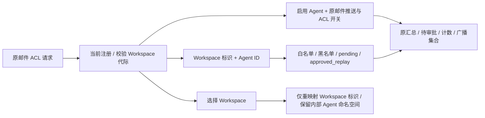

# 邮件访问控制：保留原权限命名空间

日期：2026-09-09。承接计划 §14.2.24.51 后的 ACL 消费者，但不能机械复用聊天的换名继承语义。目标仍是原前端不改、已有功能不失效，不导入旧 Python 数据。

## 原实现证据

`src/qwenpaw/app/routers/mail_access_control.py`：

- 汇总、Agent 列表、待审批和计数，只包含当前启用且 `mail.push.mode != off`、`access_control_enabled` 为真的 Agent。
- 白/黑名单添加的空 Agent ID 表示广播到上述集合。直接指定 Agent 的写操作只要求注册存在；禁用 Agent 或关闭邮件推送不等于其持久权限数据被删除。
- 未知 Agent 的批量项跳过，备注目标不存在返回 404；添加/批准/拒绝先验证全部地址，再写存储；可空备注/显示名按空值处理。
- 每个 Agent 的注册 Workspace 确定存储文件，但 `MailAccessControlStore._acl(agent_id)` 在文件内再按 Agent ID 选择一个 ACL。

在 conda `qwenpaw` 中针对原 `MailAccessControlStore` 使用临时路径和完整结构比较，确认以下三项均成立，原路径重开亦一致：

| 变化 | 原邮件 ACL 行为 | Rust 应保留的行为 |
| --- | --- | --- |
| 原 Workspace、原 Agent ID | 原白名单仍在 | 保留原命名空间 |
| 原 Workspace、新 Agent ID | 新 Agent 白名单为空 | 不自动授予新身份原有邮件权限 |
| 新 Workspace、原 Agent ID | 白名单为空 | 不凭复用名称认领旧权限 |

聊天在保留目录换名时接回聊天历史，不意味着邮件授权也应该换名继承。该区别来自实际 Python 存储结构，不新增一个权限继承产品选项。

## 实施设计

邮件 ACL 的内部定位为 `(WorkspaceDataKey, Agent ID)`。Workspace 标识隔离目录代际，Agent ID 保留原工作区内的权限命名空间。公开 API 继续使用原 Agent ID，不暴露内部数据标识。待审批与 approved_replay 保留对应命名空间的 Agent 标签，不能在换名时改写为另一个权限主体。

内部存储采用可被旧读取器拒绝的 v2：按类型化 Workspace 标识分组，每组保留 Agent ID 到原 ACL 结构的映射。禁止重复 Workspace 分组、无效标识、格式混用和 pending/replay 的主体错配，沿用总大小、条目和批次上限。

旧原生 v1 只补足可证明的归属：default 使用不可删除的默认绑定；其他名称使用历史 `legacy_agent`，不因当前同名 UUID 自动重绑。保留未注册的历史状态，不清空或扫描 Python 文件。

写入先在注册生命周期边界内解析目标，再持有邮件 ACL 锁完成原子持久化；不能把删除/重建后的同名注册当成先前批次的目标。直接写与广播的目标解析分开，避免“只允许显示的 Agent 才允许修改”改变原行为。Inbox 标已读维持原发生时标签匹配语义，批准后耐久 replay 不伪装成已真正处理邮件。

备份/恢复选择的是 Workspace，必须保留选中 Workspace 内原有的全部 Agent 权限命名空间；恢复仅将来源 Workspace 标识映射到本机目标，不能将来源内部主体名称替换为目标注册名称。未选中 Workspace 的 ACL 完整保持，冲突或非法归属在文件交换前拒绝。

## 执行 Checklist

- [x] 阅读原路由与存储，临时目录运行原实现并用完整结构确认三种身份变化；未读取日常邮箱或真实凭据。
- [x] conda `qwenpaw` 中原邮件路由及存储单测 **39/39**（0.86 秒）通过：`tests/unit/routers/test_mail_access_control_router.py` 与 `tests/unit/app/mail/test_mail_access_control_store.py`。这是 Python 参考基线，不是 Rust 已通过。
- [x] 固化原路由开关/广播/直接写/未知 Agent/空值契约；新增定向回归，时间戳相同的原顺序差异先复现失败再修复。
- [x] v2 命名空间与旧原生兼容；注册快照与生命周期锁接入。
- [x] 全局可见集合、直接批量操作、pending/replay 和备注的 API 响应/计数回归通过；未知目标不创建/升级存储。真实监听和 replay 消费不在该勾选范围。
- [x] 按完整 Workspace 导出/恢复全部内部权限命名空间，未选中状态与失败回滚验证。
  - [x] 纯存储与跨 Core HTTP 恢复验证全 Workspace 主体保留、来源/未选中数据不变、仅 Workspace 重映射与 SQLite 重开；补充包含白名单和 replay 的双主体恢复失败完整回滚断言通过。
- [x] 原目录换名、名称复用、禁用/恢复、并发管理、重开和跨 Core HTTP 恢复回归；目录标识替换批量预检及写入/删除确定性锁竞争通过。
- [ ] 完整 Rust、原页面、SDK、插件与最新制品逐项验证，失败记录不覆盖。
  - [x] 邮件抽屉专项：隔离的 writer/reader/off 夹具，原控件执行批准/拒绝/忽略、添加广播白名单、Agent 筛选和删除、刷新；完整存储断言确认关闭邮件的主体不变、replay 保留且不伪称已消费。驱动只通过页面修改，API 仅观察，前端源码不改。单跑 **1/1**（13.55 秒），首次超时及选择器失败保留在验收记录。
  - [x] 普通 Rust **553/553**、严格 Clippy（13.54 秒）、fmt/diff 通过，`console/src` 零 diff，见 [邮件 ACL 验收](../testing/mail-workspace-ownership-acceptance.md)。原页面及后续客户端/制品以下续验收为准。
- [ ] 邮件监听/真实入站准入、批准后的实际处理与渠道全功能仍独立验收；仅 ACL 数据与页面通过不能声明邮件功能完成。

## 桌面 GUI 验收依赖

当前发布壳使用系统 App 数据目录，并主动为 sidecar 覆盖外部 `QWENPAW_HOME`；Core 的系统凭据服务也不会因临时 Workspace 自动隔离。现有工具没有原生窗口控制接口。不能通过直接启动日常账号的 App、改用户 HOME、改包标识/签名或重置隐私权限来假装实现隔离验收。完整 GUI 需要独立测试账号/虚拟机及合适的原生窗口操作手段；这不阻止上述 Core 契约工作继续推进。
