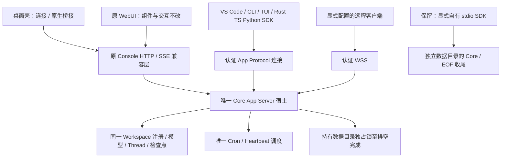

# 共享 Core 宿主与客户端接入

日期：2026-09-14。承接 [默认进程归属设计](default-workspace-host.md) 和主计划
§14.2.24.53。状态：**接入方案待确认，不是已实现架构**。

九类 QA 批次 `g6i9VJ` 已包含启动互斥，但同目录第二个客户端仍然被拒绝。
目标是让桌面、原 WebUI、VS Code、CLI/TUI 和三语言 SDK 使用同一个 Core
及 Workspace 服务；不把“第二个客户端报错”当作共享完成。

## 实码审计与不能直接切换的原因

| 边界 | 当前代码行为 | 接入要求 |
| --- | --- | --- |
| CLI / SDK | CLI 非 Desktop 分支使用 `AppServer::new`；TS、Python、Rust SDK 默认各启动 stdio Core | 添加连接已有宿主的路径，不能只更换 Workspace 构造器 |
| 启动互斥 | CLI 在初始化数据库前持有 `.core-instance.lock` | 所有生产写入入口共用锁；已有宿主由连接复用，不构造第二份 Core |
| VS Code | `CoreClient.start` 设置模型环境，握手后立即 `config/write`；`dispose` kill 子进程 | 连接本身不能覆盖共享模型；断开不能 kill 共享宿主 |
| 桌面 | Tauri 拥有子进程，退出/重启调用 shutdown，失败时终止该进程 | 区分客户端关闭、显式宿主退出及全局重启，保留原启动失败/重试反馈 |
| 数据目录 | 桌面 `app_data_dir/rust-core-v1`；CLI `data_local_dir/qwenpaw/core` | 统一新安装归属，不静默移动或混合两份已有 Rust 数据，更不迁移 Python 数据 |
| WS | 每连接独立 initialize；没有启用 token 配置时不要求 bearer，Origin 不是本地用户认证 | 不能直接把现有无认证 loopback WS 发布为共享发现服务 |
| Console SSE | 对端断开会取消对应聊天请求 | 原聊天交互保持，不改成一律后台继续 |
| 协议 WS | 已接收轮次在连接关闭后继续；宿主 shutdown 会中断并排空 | 连接关闭不替代 `turn/interrupt`，不改变现有轮次/检查点语义 |
| 调度 | Workspace HTTP 宿主启动 Cron/Heartbeat；轻量 stdio 不启动 | 唯一宿主启动一次，客户端只发请求 |

依据：`crates/qwenpaw-cli/src/main.rs`、`crates/qwenpaw-app-server/src/lib.rs`、
`sdk/typescript/src/qwenpaw.ts`、`sdk/python/src/qwenpaw_sdk/client.py`、
`crates/qwenpaw-app-server-client/src/lib.rs`，以及产品仓库
`extensions/vscode/src/coreClient.ts`、`console/src-tauri/src/backend.rs` 和
`console/src-tauri/src/backend/command.rs`。本轮未改这些生产入口。

后续独立完成了扩展**自有 stdio** 收尾修复：VS Code dispose/deactivate 和
重启现在等待 EOF 排空/进程退出，不再正常路径直接 kill。完整源码 73 项及
两种新 VSIX 安装后各 24 项通过，见 [验收](../testing/vscode-owned-core-shutdown-acceptance.md)。
上表描述的是接入前审计时的行为；自动全局配置写入、桌面进程归属与共享
宿主仍未改变，不能把扩展自有进程收尾当作共享生命周期已完成。

## 目标结构

SDK 层负责传输、协议类型、请求/通知与连接生命周期，不重新实现 Agent
运行时。远程连接不能要求 Python 后端，也不能把本机的环境密钥自动发送
给远程宿主。原页面继续使用已有 HTTP/SSE 契约，认证由宿主与桌面桥接层
接入，不要求修改 React 业务组件。

## 待确认的产品决策：谁负责退出宿主

推荐共享模式下，关闭某个客户端只断开它；Core 不随最后一个客户端退出，
以便已接收的协议任务及定时任务继续执行。只有明确的“退出 Core”操作才
停止接收新请求、取消/排空现有服务、检查最终保存失败，再释放实例锁。
这不是开机自启或安装系统服务的授权，首次仍由用户启动客户端/Core 触发。

备选：最后一个客户端断开后排空并退出。这样没有常驻 Core，但客户端全部
关闭期间不会执行定时任务，不能宣称后台调度不受影响。

上述决策不改变原 Console SSE 断开取消、协议 WS 断开继续的区别，也不改变
用户显式停止聊天的行为。自有 stdio 的 close 仍需等待自有进程退出并报告
保存失败；连接态 close 只证明本连接关闭，不能声称后台任务已保存成功。

在用户确认前，不安装后台服务、不改变默认退出行为或日常数据目录。

## 模型与密钥：现状和接入约束

当前 `Core::from_store` 用 SQLite 中已有的 base URL/model 覆盖传入配置，
但保留传入的 key；CLI Desktop 分支仅在 env 未提供 key 时加载系统凭据。
Workspace 初始化若已有 provider registry，则按 registry 选择 provider，
再从 credential store 读取该 provider 的 key 并配置运行时。读取失败会记录
警告并使用无 key，而不是自动保留 env key。没有 registry 时，以当前 Core
配置创建初始 registry。不能把这些路径混称为简单的“env 优先”。

| 场景 | 共享接入的目标契约 |
| --- | --- |
| 客户端仅连接 | 不读取/写入共享模型设置，不把客户端 env、VS Code 默认值或本机 key 注入宿主 |
| 用户明确修改全局配置 | 通过宿主现有配置操作生效，所有客户端看到相同结果；保留原界面设置能力 |
| 显式 Thread 模型 | 保留 Thread.model，不能靠写全局 defaultModel 模拟单会话选择 |
| 已绑定 Agent | 使用已捕获的 Agent 配置/provider/usage owner；连接方不能覆盖审批策略或归属 |
| 自有 stdio | 保留现有 env/配置语义，不在后台偷偷转成共享连接 |
| 新共享宿主启动 | 明确区分初始化配置和已有持久配置，key 必须与选中的 provider/base URL 配套；不能在更换 endpoint 后沿用不匹配的 key |
| 重连 | 不重发 `turn/start`、配置写入或工具操作；先读 Thread/Turn 状态，避免重复副作用 |

实现前补齐空目录、已有 SQLite、已有 registry、不同 provider、缺 key、
凭据读取失败和两客户端配置冲突的完整期望矩阵。表中的目标不能冒充当前
已实现的优先级；尤其 VS Code 连接时的自动 `config/write` 尚未移除。

### 下一步只读接入诊断

在独立临时诊断程序中直接调用当前公开 Core/Workspace 构造器，不修改默认
入口。比较新目录、SQLite 保存设置后重开、registry 重开，以及假凭据存储
返回空/已配置/失败/不同 provider 的完整运行时配置；只记录假 key 的来源
标签，不记录任何真实密钥。使用 loopback 模型核对首次与重开后的实际认证
请求和轮次结果，避免只凭配置布尔值推断 SDK 可用性。

- [x] 构造器前后完整配置、模型凭据读取/写入次数与来源矩阵。
- [x] 本地模型请求对照，确认配置变化是否影响真正的轮次完成。
- [x] 保留诊断源码/日志/来源，明确复现成功不等于产品通过；回填后续修复约束。

此诊断不依赖待确认的常驻/退出决策，不接触系统凭据，不运行分发 Core。
结果见 [来源矩阵与真实请求诊断](../testing/workspace-model-precedence-diagnostic.md)：
五组、十次本地模型请求确认，空存储/读取失败会使首次有效的调用方 key 在
Workspace 重开后消失，导致请求 401。仓库锁依赖对照复验结果相同。
`productInvariantPassed=false`；问题尚未修复，不能直接替换默认构造器。

继续审计发现动态 `config/write` 及 Agent/Console/Cron 的独立凭据加载也需
一并修复。完整推荐策略、身份绑定架构图和实施清单见
[Workspace 模型凭据方案](workspace-model-credential-policy.md)。该页区分
缺失与读取失败，并保留原设置页的修复能力；尚未修改生产优先级。

## 分步实施与验收清单

- [x] 核对所有客户端当前启动/关闭入口与不同数据目录。
- [x] 核对 WS 与 Console SSE 的不同断连语义、模型启动优先级和 VS Code 自动配置写入。
- [x] 复验现有真实 WS 断连/宿主关闭、Console 断连、独立握手与 remote WSS 认证测试。
- [ ] 确认宿主退出规则，并把模型/provider/key 的初始化与重开期望固化为测试。
- [ ] 实现唯一共享宿主启动/连接：OS 锁在数据库恢复前取得；启动失败不发布 ready；两个客户端并发启动只能有一个 writer。
- [ ] 安全发现：原子发布每次启动的新实例身份/协议版本/端点；验证文件所有权及权限、端点身份后才发送凭据。拒绝旧记录、伪造端点、跨用户访问、版本不兼容；不能只看 PID、端口或健康检查。Windows 需实际 ACL 验证，不能把 Unix mode 检查当作跨平台认证。
- [ ] 分离前端兼容 API 与连接管理；本地认证不通过 URL/query 或日志传递密钥。远程沿用认证 WSS，不降级明文或跳过 TLS 校验。发现/认证方式选定并测试后才能启用自动连接。
- [ ] 增加三语言 SDK 的显式连接态，保留自有 stdio；断开/重连不重复副作用，不把连接关闭当作持久化确认。
- [ ] VS Code/桌面接入：连接时不覆盖模型，dispose 不停止共享宿主，显式全局退出需明确影响其他客户端；保留原错误/重试反馈。
- [ ] 默认 Workspace 服务与唯一调度接线；两个不同客户端同时操作时 Thread、用量、审批、检查点及 Cron/Heartbeat 归属一致。
- [ ] 原 Console、现有 CLI/TUI 和远程逐项交互回归；原 `console/src` 保持零变更，保留版 Python CLI 通过不能代替 Rust 命令功能实现。
- [ ] Windows/Linux/macOS 的同目录竞争、路径别名/空格/非 ASCII、崩溃重开、权限失败、真实安装/激活测试。
- [ ] 完成生产接入后统一重建九类制品，并逐项验收；不以源码/静态通过覆盖仍未解决的包内 Core 启动失败。

本轮审计输出目录：产品仓库 `dist/qa-shared-host-audit-20260914-FrJ1vN`。
`baseline.json` 记录四条顺序命令均正常退出，共 **5/5** 项通过，无跳过：

| 日志 | 通过数 | 覆盖与限制 |
| --- | --- | --- |
| `websocket-disconnect.log` | 1 | 真实 WS 断连后 completed，宿主 shutdown 后 interrupted；检查检查点并重开核对，不是跨客户端自动发现测试 |
| `console-disconnect.log` | 1 | 原 Console 响应流断开取消模型并释放待处理审批；不是桌面原生关闭测试 |
| `independent-initialize.log` | 1 | 每条 WS 单独 initialize；第一个连接初始化不授权第二个未初始化连接；不证明用户级认证或共享配置安全 |
| `remote-auth.log` | 2 | WSS 缺 token 拒绝、token 轮换、Unix token/TLS key 权限拒绝；不是 Windows ACL 验证 |

执行时间 **2026-09-14 09:00:41–09:01:40 UTC**，包含必要的重新编译。
没有修改生产源码；这些是接入前基线，不将它们记成共享接入已完成。

所有运行仅使用测试创建的临时目录与本地模型；不使用真实 key/keychain，
不执行打包 Core，不清理旧数据、缓存或制品，不 commit/push/发布。
