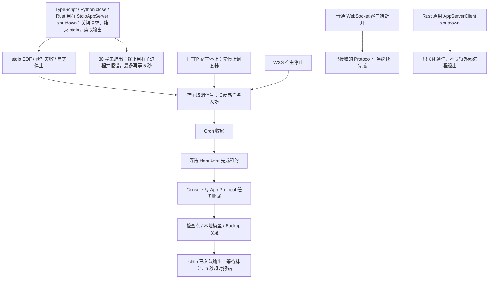

# stdio 宿主退出与默认 CLI/SDK 接入前置

本切片承接总计划 §14.2.24.53 已批准的 headless/EOF 收尾项，保持原前端、
App Protocol 字段和轻量 `AppServer::new` 嵌入契约。它是统一宿主的前置工作，
不以本切片完成代替默认 CLI/SDK 已接入全部 Workspace 服务。

## 当前实码与改动顺序

1. `run_stdio` 仅在输入 EOF 后等待 protocol tracker，不发宿主停止信号，
   也不排空检查点等 Workspace 服务；输入错误提前返回，输出失败要等输入
   结束才被观察。等待审批的 Turn 因而可使 EOF 无法正常结束。
2. 先机械抽出同一 stdio 实现的可注入 I/O 入口，以内存管道和原生 Workspace
   夹具复现 EOF、输入错误、输出失败和显式宿主停止。生产入口仍使用真实
   stdin/stdout，不引入测试协议或替代业务逻辑。
3. stdio 是其进程的唯一客户端传输；EOF/传输失败/宿主停止应关闭入场，
   取消该宿主运行并等待最终状态保存和后台写入收尾。HTTP/WebSocket 的普通
   客户端断开不是宿主停止，继续保留原断连后任务完成行为。
4. 复用 HTTP 已有收尾顺序，并补入 Heartbeat 完成租约：Cron、Heartbeat、
   Console、App Protocol、自动检查点、
   Local Model、Backup。传输读写错误不得掩盖，也不能绕过这些收尾步骤。
   正常 EOF 尽量排空已入队输出；客户端不再读取时有界结束输出 writer，
   超时明确报错，不把 abort 当作数据写入成功。
5. 使用原生等待审批/已完成自动快照等夹具证明关闭后的磁盘状态、tracker
   及其他宿主独立性；再运行 CLI/全库/原前端和语言 SDK 回归。

## 本切片的退出边界

三个宿主复用 `shutdown_services`，不是把普通客户端断连升级成整个服务退出。
Heartbeat 入场与退出等待使用既有锁协调；取消后拒绝新的 Heartbeat，已开始
的执行保留事件流，发送中断请求后等待最终完成事件，随后才释放完成租约。
“中断请求已接受”不等于最终状态已经保存。

这里只在后台服务收尾之后限制 stdio 输出 writer 的排空时间，不对保存过程
新增强杀超时。现有 Local Model/Backup 自身的退出策略仍适用；不据此宣称
整个进程被强杀、断电或所有后台写入均具有原子恢复保证。输出背压测试覆盖
已进入 EOF 收尾的队列，不证明任意无限输入和不读输出组合都能及时读取 EOF。

## 保留的后续决策和门禁

默认 CLI/SDK 仍调用 `AppServer::new`。已有 `new_workspace_with_stores` 可以
复用初始化，但不能直接把每个 SDK 子进程都变成自动任务宿主：当前各进程
的 Cron 锁是进程内锁，还需验证同一数据目录的后台任务单实例归属、凭据
优先级和持久化目录选择。TypeScript/Python `close()` 和 Rust 自有进程的
`shutdown()` 已分别接入 EOF 后等待；Python reader 回调重入的特殊语义
见下文，不能仅修改构造器就宣称所有跨客户端功能一致。

后续实测已证明风险不只在调度器：两个真实默认 SDK 打开同一数据目录时，
第二个 Core 会将第一个仍活跃的轮次恢复成 interrupted 并写回；两边内存
随后不一致。独立目录对照保持原状态。默认入口切换须先确认单写入宿主和
共享连接的生命周期设计，见 [默认 Workspace 进程归属](default-workspace-host.md)。

后续默认 CLI 已在 Core 初始化前取得数据目录独占锁，并在服务收尾后释放；
冲突进程非零退出，不再触发启动恢复。普通 Rust 715/715 与真实异常退出
恢复回归通过，见 [启动互斥验收](../testing/instance-lock-acceptance.md)。
这尚不是共享连接或默认 Workspace 接线，旧进程与直接嵌入 API 不受保护。
启动锁随后进入九类 QA 批次 `g6i9VJ`：静态检查与安装态 SDK/保留版 CLI
通过，VSIX 安装但未激活；包内启动与原生端不在通过范围，见
[本批制品验收](../testing/qa-instance-lock-packages-20260914.md)。

本轮不启用新的 stdio 调度器，不读取真实 key/keychain，不操作日常数据，
不执行分发包 Core、不改系统安全设置、不清理缓存或旧制品。

## Checklist

VS Code 自有 Core 随后也接入 EOF 等待、输出排空与明确退出结果，资源重启
在旧进程完成后才开始，deactivate 返回关闭 Promise。扩展 **73/73**，两种
新 VSIX 安装后各 **24/24** 专项通过；不是原生激活或共享宿主验收，见
[扩展自有进程收尾](../testing/vscode-owned-core-shutdown-acceptance.md)。

### SDK 接入顺序（2026-09-10）

按已有 graceful close 待办，先实现 TypeScript，再处理 Python 与 Rust，不改
协议字段或默认 Workspace 构造器。每一种 SDK 都必须以真实子进程验证，不把
另一个语言的通过当作本语言完成。

TypeScript 的 `close()` 先关闭请求入场，结束 stdin，持续读取 stdout/stderr，
等待 Core 正常退出；并发/重复 close 复用同一结果。正常等待最多 30 秒，
超时只对 SDK 自己启动的子进程发送强制终止，最多再等待 5 秒，且 close
必须报错，不能把强杀当作保存成功。非零退出/信号退出也应明确报错。
现有同步 `dispose()` 保留立即终止契约，不把不能等待的同步 API 宣称为
graceful close。启动失败清理也仍是失败清理。

- [x] TypeScript：EOF 后真实子进程写入收尾标记，排空大量 stdout/stderr，
  关闭后拒绝新请求，重复 close、非零/信号/已退出和超时均有回归。
- [x] TypeScript：连接源码 Core，在重开前只读 SQLite 验证已保存的中断状态；编译及 9/9 测试、打包/离线安装后 9/9 均通过。见 [专项验收与 SDK 包](../testing/typescript-close-acceptance.md)。
- [x] Python 与 Rust：各自实现输入关闭、输出持续读取、等待与明确失败语义；
  覆盖自身的线程/异步 worker、重复关闭和真实 Core 持久化，不能只替换 kill。
  - [x] Rust 自有进程路径、clone 入场关闭、输出与可选 stderr 排空、取消等待不丢句柄，真实 source Core 存储检查及 debug/release 集成通过，见 [Rust SDK 验收](../testing/rust-sdk-close-acceptance.md)。
  - [x] Python reader/writer、close/reader 回调重入与并发关闭、失败句柄保留及真实 Core 持久化通过；源码和离线安装后均 16/16，见 [Python SDK 验收](../testing/python-sdk-close-acceptance.md)。
- [ ] 客户端变更后的全库与 VS Code 回归、SDK 分发包构建和安装后测试。

### 服务端及总门禁

#### Python SDK 本步

沿用已有同步 API，不把关闭改成仅发信号便返回。普通线程的并发 close
共享一个完成结果；先关闭请求入场并唤醒待响应请求，再在写锁下发送 EOF。
reader 持续读取 stdout，不在另一个线程仍阻塞 read 时关闭同一 TextIO。
stderr 原本继承父进程，保持不变。

reader 回调成为首个关闭者时，将剩余输出转交专门的临时 drainer，避免
自己既执行回调又等待自己读取。若 reader 回调遇到另一个正在关闭的线程，
只维持关闭请求而不互等；普通线程调用 close 等待共享结果。close 通知
回调在关闭结果发布后执行，避免回调启动另一 close 线程并 join 造成死锁。
该回调场景的重入调用不是独立的保存确认，外部 close 才提供完整等待结果。

正常进程/管道收尾使用 30 秒总期限，超时对自有子进程强制终止，额外清理
最多等 5 秒；未确认退出或 reader 未结束必须报错，不强行跨线程关闭其流。
非零/信号退出明确失败，重复 close 保留失败结果；启动/上下文已有异常
不得被清理错误取代。真实 keychain、前端、默认 Workspace 初始化不在本步。

- [x] EOF 后延迟标记及大量 stdout、待响应请求、关闭后新请求/通知拒绝。
- [x] 并发及回调重入、reader 回调主动关闭、reader 回调遇到其他关闭者。
- [x] 异常退出、超时、reader/写锁收尾失败、重复 close 和原异常保留。
- [x] 真实 source Core 关闭后、重开前只读 SQLite，检查完整已保存状态。
- [x] conda qwenpaw 单测和风格检查、Python wheel 构建、隔离安装后复验；
  风格检查的局部规则例外和原失败记录见 Python SDK 验收，不宣称原配置全绿。
- [ ] 三语言 SDK 与整套九类制品收拢：
  下文九类 macOS QA 构建/静态及隔离安装已完成；Rust SDK 分发、包内运行及
  跨平台仍分别验收，不把单语言结果替代整个目标。

#### Rust SDK 本步

`StdioAppServer::shutdown(self)` 拥有子进程，可以结束 stdin 后等待进程退出；
`AppServerClient::shutdown(&self)` 也用于任意异步字节流，不能要求外部宿主
退出。两者共用通信 worker，但只有自有 stdio 的路径继续读取 EOF 后输出。
关闭入场对所有 clone 生效；排队/待响应请求明确结束，不能卡到请求超时。
如果 caller 配置 stderr 为 pipe，SDK 必须读取它；继承 stderr 或文件重定向
仍保留 caller 配置，不更改外部进程的标准流。

- [x] 真实子进程：EOF 后延迟写标记、超出管道容量的 stdout/stderr、非零
  退出与超时；正常等待最多 30 秒，强制终止后最多再等 5 秒，且返回失败。
- [x] clone 入场关闭、未完成请求唤醒、通信 worker 不因等待取消而失去句柄；
  普通任意字节流 shutdown 仍不要求 peer 退出。
- [x] 真实 source Core 活跃 Turn：关闭后先读取存储快照，再重开 Core，
  避免启动恢复把遗留 inProgress 修成 interrupted 造成假阳性。
- [x] Rust SDK/CLI 专项、完整 workspace/Clippy、source release 和客户端回归；
  SDK 分发源码/平台制品及全套客户端验收仍分别维护。
- [ ] 首次 workspace 的非零退出用例 5 秒超时根因：增加阶段诊断后单例与
  完整 703 项复验通过，但未据此宣称偶发原因已修复；原时限未改。

- [x] 核对真实 stdio/HTTP/WSS 入口、Workspace 构造器及三个 SDK 的关闭代码。
- [x] 可注入的同一 stdio I/O 实现与退出失败回归；首四项先复现失败。
- [x] EOF/输入错误/输出错误/显式停止均进入宿主收尾；真实 WS 断连/停止区别回归通过。
- [x] Workspace 等待审批、Heartbeat、最终保存、待执行自动快照清空与已入队输出背压回归；CLI 真实子进程只关闭 stdin 即正常退出。
- [x] 全库 697/697、显式浏览器/参考 26/26、原前端 2453/2453，严格 Clippy、source release 与 TS/Python/VS Code 顺序检查通过；见 [源码验收及制品边界](../testing/stdio-host-lifecycle-acceptance.md)。
- [ ] SDK graceful close、默认入口初始化与后台任务单实例归属继续完成。
- [ ] Core 最终保存失败的完整验收：Core、三宿主和 Rust SDK 的错误传播基础已实现；TypeScript/Python 真实保存故障及源码/安装态 10/17 项全套已通过。原前端保存错误刷新丢失已在历史适配修复，浏览器暂停查盘/恢复下一轮及完整源码门禁 708/2453/27 通过。最新九类 QA 制品 `2qPEew` 的静态及 SDK/保留版 CLI 安装态复验已完成，分发运行与原生端仍需完成，终态事件不等于无条件持久化确认。
  本步方案与执行清单见 [最终 Turn 保存失败](final-turn-persistence.md)。
- [ ] 新制品、包内运行、原生交互、跨平台与全功能验收。

### 三语言关闭后的制品收拢（2026-09-10）

沿用已批准的九类 QA 构建及逐项验收方案，在新目录构建，不覆盖此前制品。
当前 source Core 与三语言 SDK 关闭变更必须同时进入新制品；原前端构建
内容按文件核对，安装 SDK 要确认真实导入位置及与源码一致的字节。

- [x] 新建 DMG、桌面 ZIP、Core tar、WebUI tar、TS tgz、Python SDK wheel、
  两类 VSIX、保留版 Python wheel；保留每一步日志和来源/产物摘要。
- [x] 逐项静态解包、签名完整性及原前端内容核对，不执行包内 Core。
- [x] 实际离线安装 TS/Python SDK，分别运行当前 9/16 项而非旧 4/5 项；
  明确只连接 source Core，包含关闭后重开前的存储检查。
- [x] 两类 VSIX 隔离安装且不激活；保留版 wheel 的实际安装导入及 CLI 检查。
- [x] 记录最终九类文件、结果和未通过/未执行门禁；保留包内 Core 启动、
  原生 GUI/扩展激活、跨平台和全功能父项，不把静态成功当作运行通过。

本批 `WXFYc3`，TS 9/9、Python 16/16、legacy CLI 855/855 + 36/36，
详见 [制品与首次 DMG 失败记录](../testing/qa-sdk-shutdown-packages-20260910.md)。

后续 `2qPEew` 批次包含最终保存失败与历史刷新修复（source Core
`19e454...`）：九类静态及来源核对、安装后 TS 10/10、Python 17/17、
legacy CLI 855/855 + 36/36 通过，两类 VSIX 隔离安装但未激活。分发
Core/原生/跨平台父项继续开放，见 [最新制品验收](../testing/qa-final-persistence-packages-20260910.md)。
