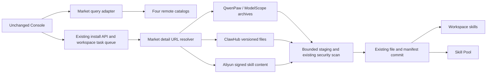
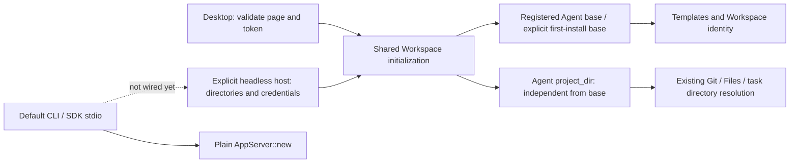

# QwenPaw Rust Core System Overview

> Status: Rust Core + VS Code MVP and Desktop sidecar foundation, 2026-09-01

## Objective

QwenPaw currently stages the reusable runtime under `qwenpaw-core/` in the
existing CoPaw repository so the product keeps its GitHub history and stars.
The directory is designed as an extraction-ready repository boundary:

- `qwenpaw-core/`: Rust workspace, App Protocol, persistence, model loop, tools, and native release artifacts;
- the CoPaw repository root: existing product, unchanged Console/Desktop frontend, retained legacy Python source, and the VS Code extension.

VS Code and Desktop now start the same Rust Core. Desktop serves the unchanged Console build, preserves the existing ready/version/shutdown lifecycle, and covers the observed bootstrap, Chat, file, model, OAuth, and navigation-read contracts. New Desktop packages contain only Rust Core and do not recognize a Python-backend switch. Rust Core always uses a new, isolated database and never imports the Python product's data.

The Desktop shell serializes Core stop/restart operations and gives application
exit priority over pending replacements. Process generations and event-driven
state changes share one lock; stale process events cannot clear a new child or
publish its port. Loss of the event stream without confirmed termination remains
an error and prevents a replacement from hiding a potentially live process.
These lifecycle checks do not constitute full WKWebView/installed-app acceptance;
see [Desktop lifecycle acceptance](../testing/desktop-lifecycle-acceptance.md).

## Runtime topology

### Original frontend plugin loading (2026-09-15)

```text
Explicit new data directory: plugins/<id>/plugin.json + UI files
    -> Rust App Server: /api/frontend_plugin + /{id}/files/{path}
       -> unchanged Console loader and window.QwenPaw SDK
          -> original App Center -> registered React application route
```

This read-only path implements the original disk-discovery fallback and serves
real frontend bundles. Records remain `loaded: false`: frontend registration is
not evidence of a running Python backend plugin. The kernel does not invoke
Python for this path; Python is used only in isolated reference tests. Backend
plugin execution, installation, market operations and native-client acceptance
remain separate gates. See [implementation and checklist](frontend-plugin-runtime.md)
and [current acceptance results](../testing/frontend-plugin-loading-acceptance.md).

The original PluginManager at `/market?tab=plugins` uses a separate
`/api/plugins` list endpoint. It now shares Rust disk discovery and file
serving, with `/{id}/status` retaining the original unloaded-state response.
Installed records, name filtering, card/list switching, refresh and reload
are covered against the unchanged Console. This does not implement plugin
installation or backend loading; see [read scope](plugin-management-reads.md)
and [acceptance](../testing/plugin-management-reads-acceptance.md).

Plugin Market search now has a native read-only proxy at
`/api/plugins/market/search`, using the fixed platform source and the existing
bounded market HTTP transport. Original query fields and response JSON are
preserved; browse, filtering, pagination and failure recovery are tested in
the unchanged Console. This is separate from official CDN catalog filtering
and plugin installation/runtime. HTTP now exposes product version `2.2.0b5`,
while SDK initialization retains Core `0.2.0` and protocol `3`; original UI
compatibility labels, warning, cancellation and reload are tested separately
in [version identity](product-version-identity.md). See [scope](plugin-market-search.md)
and [acceptance](../testing/plugin-market-search-acceptance.md).

### AgentScope replacement boundary (2026-09-08)

The Rust kernel does not link AgentScope, call a Python AgentScope worker, or
embed Codex's runtime. `crates/qwenpaw-core/src/runtime.rs::run_turn` implements
the model/tool iteration loop directly. `model.rs` handles model HTTP/SSE,
`qwenpaw-tools` executes built-in tools, `qwenpaw-mcp` supplies MCP clients, and
`qwenpaw-storage` owns durable SQLite state. The App Server and SDKs expose this
runtime to clients; they do not replace the AgentScope execution semantics by
themselves.

This is a product-specific replacement of the AgentScope responsibilities used
by QwenPaw, not an implementation of the complete AgentScope framework. API
registration, unchanged frontend source, successful navigation, and buildable
packages are separate evidence from functional equivalence. Memory/retrieval,
context summarization, execution hooks, multi-agent orchestration, and failure
recovery must each pass behavioral comparisons with the original QwenPaw before
the whole product can be called equivalent. A green build or an implemented
settings endpoint cannot close one of those gates.

The user confirmed that initial tests are followed by completion of **all
existing product functions**. Legacy executables remaining independently
runnable preserve access during development; their existence does not prove
that the new Rust-backed clients provide the same features.

### Model runtime parity boundary (2026-09-09)

Provider settings and connection checks are not the model execution engine.
The current kernel's streaming model transport supports OpenAI-compatible chat
completions, native Responses, Anthropic Messages and Gemini GenerateContent. Desktop passes the selected protocol,
authentication mode and provider identity into the same atomic runtime snapshot.
Other provider-specific parameter transformations and Agent thinking
settings still require implementation and behavioral tests. The original Console
Chat now resolves the current Agent's provider/model for each new turn.

The Responses adapter sends native input items, flattened function declarations,
`call_id`-bound function results, and immutable `input_image` snapshots. It uses
`store: false` and requests encrypted reasoning for local history replay;
provider settings cannot replace Core-owned input or select a remote conversation.
Only a valid `response.completed` releases function calls. Failed, incomplete,
cancelled, truncated, oversized or inconsistent streams do not execute pending
tools. Usage counts output tokens once, including any reasoning tokens already
in that total. Native output items stay in Core persistence and are replayed
without exposing their opaque contents in public Thread responses.
See [Responses runtime acceptance](../testing/responses-runtime-acceptance.md).
Reasoning presentation, hosted tools, additional modalities and independent
SDK/Desktop configuration coherence remain separate parity gates.

For Ollama, the Desktop provider adapter now stores the server root and derives
its `/v1` API base for connection/discovery, global model activation, startup
and detached backup hydration. Existing `/v1` suffixes are normalized without
losing reverse-proxy prefixes. The kernel uses this resolved base for its
actual streaming chat. Model checks only verify catalog membership and report
`provider_only`, matching the original provider's no-inference check. Backup
credential matching compares the resolved API base, not the displayed root.
These rules are explicit to provider identity, not guesses from hostnames, and
do not add Agent execution to any language SDK. Local fixture acceptance is
recorded in [Ollama endpoint tests](../testing/ollama-endpoint-acceptance.md);
it is not a claim that every Ollama option or provider protocol is complete.

### Model request settings

Desktop now supplies `ModelRequestOptions` alongside `ModelConfig` through
`Core::configure_model_runtime`. The same lock covers URL, API key, headers,
provider defaults and per-model overrides. Each turn freezes these settings
together and retains them across its model/tool steps. Validation and SQLite
failure leave the previous global runtime intact.
Only URL/default model enter Core SQLite; application provider settings remain
owned by the existing Desktop registry. Public Core configuration responses and
request-option debug output do not include these header values.

| Change source | Runtime effect |
| --- | --- |
| Original provider/model settings or global model selector | Atomically replace identity and all provider/model request options |
| Original Chat selector (`scope=agent`) | Persist the Agent selection; resolve a private turn snapshot without changing the global provider |
| Request for another model on that provider | Recursively merge that model's overrides with provider defaults |
| SDK `config/write` changing only the model | Retain provider options; resolve overrides for the requested model |
| SDK `config/write` changing the API base | Clear previous request options to avoid forwarding old custom headers |
| Startup, full restore or credential restore | Hydrate the selected provider through the same configuration function |
| Partial restore retaining the endpoint, or rollback | Retain or restore the corresponding volatile request options |

The compatible chat transport flattens `extra_body`, applies custom headers
after default authentication and maps OpenAI reasoning-model token limits.
Model/messages/stream/tools control fields cannot be supplied through arbitrary
generation options. These settings alone do not implement other native protocols or
make separately launched SDK processes automatically inherit Desktop provider
settings. Cross-process settings coherence remains an explicit parity gate.

See [model request settings acceptance](../testing/model-request-options-acceptance.md).

### Console Agent model routing

```text
Original Chat (X-Agent-Id)
    -> App Server: Agent active_model, provider registry, credential store
       -> valid Agent selection, otherwise current Core global runtime
          -> Core::start_turn_with_model(optional selection)
             -> one private provider/model/auth/header snapshot
                -> model -> tools -> model (same snapshot)
```

The same provider adapter builds both global and per-turn settings. The actual
selected model is stored on the thread and attributed in its usage records;
per-turn credentials and headers are not stored in Core SQLite. Concurrent Agents
do not replace one another's global configuration. Removing a model from the
catalog does not erase an explicit Agent model selection. Only an empty/null
selection falls back globally; a missing explicitly selected provider fails
instead of silently selecting another provider. Global runtime changes also cannot redirect an already active Core
turn's later tool steps. Global fallback uses the live Core snapshot, not stale
credentials or URLs reconstructed from the application registry. These guarantees
do not imply that all other Agent
settings are wired or that independently launched SDK servers share the Desktop
registry.

### Workspace identity implementation boundary (2026-09-09)

The native Agent registry now has a v3 Workspace-key index distinct from public
Agent IDs. Deleting registration retains that index; create, copy and restore
planning select local bindings without exposing keys in Console responses.
Existing native v1 registrations hydrate deterministic historical namespaces.
This is not Python data migration.

Registration now checks both the canonical path index and a Core-owned hidden
Workspace marker. Missing/replaced markers do not claim a retained namespace;
failed custom-directory creation retries cannot reattach solely by path.
Native v1/v2 startup establishes a one-time baseline, without guessing changes
that happened before upgrade. Restore stages locally planned markers through
the existing file transaction; archives cannot supply binding authority.

This is not yet an end-to-end ownership cutover: usage/ACL and checkpoint
storage still need their remaining boundaries. Ordinary Console admission now
captures Agent configuration and chat ownership under the lifecycle lock and
registers its turn before releasing that lock. Disable/delete cancels and drains
the selected Agent's turns before returning success. Approval identity remains
fixed for the admitted run; disconnect and SSE backpressure do not prevent Core
cancellation. See [Console lifecycle acceptance](../testing/console-lifecycle-acceptance.md)
for the current test and release scope; this is not an installed-client claim.
ChatCatalog v2 uses typed chat/group ownership for CRUD, durable aliases,
direct Thread IDs, stop, project/tool access and scoped restore. Uncatalogued
App Protocol Threads remain default-owned, never assigned by project paths.
Cron v4 now uses typed per-job
Workspace ownership for lookup, copy, restart, execution, completion and scoped
backup. Archive Agent snapshot v2 maps source bindings to planned local targets;
public registry references remain v1. Claims preserve the event-time Agent ID
and fixed data key, and restore protects unselected Inbox run/trace IDs too.
Runtime Workspace/config/model/project reads share
one registration snapshot and validate the live marker and canonical path
index. A missing or mismatched binding is rejected without automatic repair;
a user-selected project does not replace the base Workspace identity. This
entry-time snapshot is not a filesystem lease for subsequent tool operations.
Public Cron HTTP and scheduling now resolve these validated Workspace bindings;
see the [public Cron checklist](cron-public-agent-scope.md).
See the [identity diagram and checklist](workspace-data-identity.md).

### Native Anthropic model transport

`model_anthropic.rs` implements Messages request encoding and SSE decoding.
It does not translate an Anthropic URL into an OpenAI endpoint. The adapter
uses the root or existing `/v1` base with any proxy prefix, supports API-key
and bearer-token modes, and strips `x-api-key` in bearer mode as the original
Python provider does. Model parameters include native max-token and thinking
controls. Tool execution, approvals and cancellation stay in the common Core.

| Stored/runtime value | Anthropic wire representation |
| --- | --- |
| System instructions | Top-level `system` content blocks |
| Portable assistant tool calls | Assistant `tool_use` blocks with object input |
| Tool results and failure flag | User `tool_result` blocks with the matching call ID |
| Native content, including thinking/signature | Original content blocks replayed on subsequent steps and reopened conversations |
| Cumulative usage plus provider identity | Existing Core usage ledger, attributed to the selected provider |

The stream must terminate with `message_stop`; truncated/error streams cannot
complete a model step or trigger its pending tools. Raw event data is bounded
at 4 MiB, with at most 128 blocks and the shared 256 KiB SSE-event limit.
The parser handles text, partial tool JSON, thinking/signatures, pings and
unknown event types. Native blocks use an optional, backwards-readable
`StoredMessage.provider_content` field; OpenAI requests explicitly exclude it
and the private tool-error field. Context fitting never truncates a signature:
if the opaque newest-turn content cannot fit, it returns a context-limit error.

This follows [Anthropic's stream lifecycle](https://platform.claude.com/docs/en/build-with-claude/streaming).
Original UI reasoning presentation, documents, provider-specific advanced
features and real-account acceptance remain separate gates. Local acceptance is
recorded in [native Anthropic tests](../testing/anthropic-runtime-acceptance.md).

### Native Gemini model transport

`model_gemini.rs` implements the original provider's GenerateContent protocol,
not the newer Interactions API or an OpenAI-compatible proxy. The same turn-local
runtime snapshot selects the native encoder/decoder; SDKs remain protocol clients.

```text
Existing clients → App Server → Core turn snapshot → model/tool loop
                                                     ├─ OpenAI chat/completions
                                                     ├─ Anthropic /v1/messages
                                                     └─ Gemini /v1beta/models/{id}:streamGenerateContent
All three share: approval → tools/MCP → SQLite history → next model step
```

Gemini uses `x-goog-api-key`, preserves proxy prefixes and existing API versions,
and converts system instructions, model/user content, function declarations and
function responses to native wire fields. Provider and per-model parameters are
merged before native token-limit, thinking and tool-choice mapping. Tool schemas
resolve bounded local definitions, nullable unions and constants without renaming
user-defined property names.

Native parts, including thought signatures on function calls or empty final text,
are persisted verbatim and replayed after tool results, database reopening and
backup hydration. Synthetic local call IDs are not injected into native parts
that lacked a wire ID. Parallel calls remain together before their responses.
The common runtime executes tools only after the native stream finishes
successfully; EOF without a finish reason, blocked output and streaming errors
fail the step. Output-token truncation is accepted for text, not pending tools.
Cumulative usage includes thinking tokens and attributes cache reads to Gemini.

Limits are 4 MiB accumulated SSE data, 256 KiB per SSE event, 4096 native parts,
128 calls, and bounded schema expansion. Model discovery and connection/model
checks also use native REST paths and headers; discovery handles page tokens and
deduplication. The original frozen-URL Gemini UI remains unchanged.

Local acceptance is tracked in [Gemini runtime tests](../testing/gemini-runtime-acceptance.md).
Gemini model-page capability probes now use the original independent requests:
a red inline PNG and a video file URI asking about moving content. Image failure
does not suppress the video request, and Gemini does not use the OpenAI video
format retry. The unchanged UI's probe action, capability tag and page reload are
covered by [native probe acceptance](../testing/gemini-multimodal-probe-acceptance.md).

Document/video/audio chat inputs, reasoning presentation, advanced
provider options and real-account verification remain open parity gates; this
adapter does not by itself establish complete Gemini or product equivalence.
The latest image-runtime QA packages include this adapter; package execution
and first-launch limitations are recorded in [package acceptance](../testing/qa-image-packages-20260909.md).

### Local chat image inputs

The unchanged Console upload path now maps image blocks to explicit
`UserInput::Image { path }`; ordinary file references never read file contents.
Core, not an SDK, opens the image using workspace-rooted capability handles,
no-follow path components and File Guard checks. PNG/JPEG/GIF/WebP headers are
recognized without trusting extensions. Image bytes are snapshotted once in
`StoredMessage.user_input` alongside ordered text blocks, so tool iterations,
checkpoints and reopened conversations do not reread a modified file.

```text
Original upload / SDK image path
  → Core validation and bounded snapshot → durable Thread message
     ├─ OpenAI: text + image_url data URI
     ├─ Anthropic: text + image/base64 source
     ├─ Gemini: text + inlineData
     └─ Console history: original text/image blocks, small-image data URI
```

App Protocol v3 adds optional `UserMessage.input` path metadata; events and SDK
Thread reads do not carry base64, and legacy text messages retain their shape.
The existing 2 MiB default per-image inline cap is retained. Larger images send
an omission-size explanation to the model while Console retains the uploaded
image reference. Limits also bound count (32/turn), raw snapshots (16 MiB/turn),
and encoded context media (32 MiB independently of the existing text budget).
Media bytes are never truncated to fit context. Older complete turn groups may
be excluded by the existing context selection policy.

This closes the local image path for the three implemented transports, not all
multimodal parity: configurable provider caps, remote URLs, documents, audio,
video, advanced image options and native client image viewers remain separate
gates. Non-image uploads still become `FileReference` inputs. Local evidence is
tracked in [chat image acceptance](../testing/chat-image-input-acceptance.md).

### Client connections

```text
VS Code ── TypeScript SDK ── stdio ────────────────┐
Node integrations ── TS explicit loopback WS/WSS ─┤
Python integrations ── Python SDK ── stdio ───────┤
    └── explicit connection ── loopback WS / WSS ─┤
Rust integrations ── app-server-client ── stdio ──┤ App Protocol v3
    └── explicit connection ── loopback WS / WSS ─┤
Remote App Protocol clients ── authenticated WSS ─┘
                                                   │
Existing React WebUI ── HTTP/SSE compatibility ────┤
Tauri Desktop ── sidecar lifecycle ────────────────┤
                                                   ▼
                                       qwenpaw-core app-server
                                       transport / routing / events
                                       approval / cancellation
                                                   │
                                                   ▼
                                           qwenpaw-core crate
                                       Thread / Turn / Agent loop
                                       Model / Tools / MCP / Storage

Existing CLI / TUI / channels / hub ── current Python product paths
Legacy Python release ── HTTP/SSE ───── Python QwenPaw service
    └── both remain runnable until each replacement reaches feature parity
```

The App Server is the stable client host, not the domain kernel. SDKs own
transport lifecycle, initialization, typed request correlation, notifications,
and language-friendly Thread/Turn APIs. They do not own the agent loop or read
Core storage directly. The unchanged WebUI remains the deliberate exception at
the client edge: its legacy HTTP/SSE contract is adapted inside the same App
Server into the same Rust Core model.

Rust/TypeScript/Python `WebSocketConnection` explicitly connects to an existing host and only
owns that connection. Each client initializes independently; disconnecting does
not stop the server or admitted WS turns. Remote TLS and hostname verification
remain enabled. This does not implement automatic discovery, default Workspace
wiring, or native-client integration. The TypeScript transport adapts messages into
the existing typed client's JSON lines, without changing its stdio consumer.
Python reuses AppServerClient request/notification/Thread logic through transport
hooks, with an asyncio I/O thread behind its synchronous API; websockets is a
network dependency, not an Agent runtime. Its explicit disconnect is bounded and
reports blocked callback cleanup, while owned stdio defaults remain unchanged.
Real source-Core tests cover shared turns, WSS rejection/acceptance and mixed
Python/TypeScript clients; this is not full language/client feature parity.
App Server now flushes the queued WS Close reply before dropping its writer,
with a one-second bound; accepted turns and Console SSE behavior are unchanged.
See the
[explicit-connection design and checklist](sdk-existing-host-connection.md).

CLI, TUI, remote access, and channel integrations are existing product
capabilities. This diagram shows their target Core connection boundary; it does
not classify them as future features or authorize removing their current
implementations before equivalent Rust-backed paths pass regression tests.
The exact preservation boundary is recorded in
[Existing Client Compatibility Boundary](client-compatibility.md).

The two server paths are deliberately separate in the MVP. VS Code never calls the Python Web API. The existing Console uses a narrow HTTP/SSE adapter in Rust Desktop mode; that adapter translates at the transport edge into the same Core Thread/Turn/approval model used by App Protocol.

## OpenRouter model catalog adapter

The unchanged model manager's series, extended discovery and filter routes use
the same bounded remote catalog transport as ordinary model discovery. They
read the selected secure-store credential and capture provider settings under
the model lock, then release it before network I/O. Catalog fields determine
series, modality and price filtering; discovering/filtering does not add models
to the registry. The original Add action persists a selected model through the
existing registry transaction. An explicitly submitted discovery key uses the
existing secure provider update path and is never serialized into that registry.

OpenRouter capability probes read catalog metadata instead of sending chat
requests. Missing/unavailable catalog entries leave previously known capability
flags unchanged, and the existing revision check rejects concurrent settings
changes before persisting probe results. Provider OAuth uses the separate
transport below; neither adapter changes the common App Protocol SDK boundary.

## Provider OAuth adapter

The original provider OAuth registry supports OpenRouter only. Rust implements
its authorization-code exchange directly, with random state in the callback URL
and S256 PKCE. It does not invoke Python or treat unrelated provider CLI logins
as OpenRouter OAuth. The unchanged Chat FREE tab opens the original confirmation
modal, launches an external browser, polls status, then navigates to the original
model manager. Unconfigured providers in Settings retain their original compact
Configure entry; the backend does not fabricate a key to expose an OAuth button.

```mermaid
sequenceDiagram
    participant UI as Unchanged Console
    participant Server as Rust App Server
    participant Browser as External browser
    participant Provider as OpenRouter
    participant Store as Secure credentials + registry
    participant Core as Shared Rust Core
    UI->>Server: start OAuth
    Server-->>UI: authorize_url + state + flow_type
    UI->>Browser: Open authorization URL with PKCE challenge
    Browser->>Provider: User authorization
    Provider-->>Browser: Redirect with code to state-bound callback
    Browser->>Server: callback(state, code)
    Server->>Provider: Exchange code + verifier (bounded, no redirects)
    Provider-->>Server: API key
    Server->>Store: Validate captured revision and old-key fingerprint; save
    Server->>Core: Apply existing active-provider configuration if selected
    Server->>Provider: Discover models through existing catalog transport
    UI->>Server: Poll status
    Server-->>UI: completed (no credentials)
    UI->>UI: Open original model manager; Add selected model
```

Sessions expire after ten minutes and are capped at 32. A newer start supersedes
older uncommitted sessions. Callback state and origin must match exactly; there
is no latest-pending-session fallback. Only loopback Host or explicitly allowed
HTTPS origins form callback URLs; arbitrary forwarded/Hub headers are ignored.
Exchanges run outside model/session locks, and final commit checks both registry
revision and secure-store contents so intervening configuration is preserved.
Discovery failure does not undo a successfully saved key. Callback HTML and
status expose no key, verifier or upstream diagnostics. The model registry stores
configuration and connection flags, not keys; the credential loader restores the active key on
restart. Full Hub callback forwarding, real-account grants and native packaged
browser handoff remain separate acceptance gates.

## Skill market and installation adapter

The unchanged Console keeps its existing market and install-task HTTP contracts.
Catalog queries run concurrently per requested provider while concatenating
results in the original request order; failures remain provider-specific.
QwenPaw/ModelScope use public catalogs, ClawHub preserves keyword overfetch and
cursor browsing, and Aliyun uses native Rust ACS3 with effective application
AK/SK and optional STS credentials. No Python Agent or cloud SDK is involved.



Public detail URLs are not treated as downloadable bundles. The resolver keeps
the selected version and original source metadata; direct custom bundle URLs
retain the existing import path. Signed requests never follow redirects.
Cancellation drops in-flight resolution even before response headers arrive,
and is rechecked after acquiring the installation lock. Final workspace file/manifest
commit and task completion share the task-state write lock used by cancellation;
a cancel queued behind that commit observes completed, and a later bulk token
cancellation cannot relabel a successful import. Missing ClawHub files
fail the import instead of silently installing a partial skill. Other Hub
providers and production cloud credential chains remain separate parity work;
the local tests do not claim production-account acceptance.

## Backup restore coordination (in progress)

The production `POST /api/backups/{id}/restore` coordinator now uses the same
Core runtime for every client. Original Backups-page and full lifecycle
acceptance remain in progress:

```text
Reserve application restore gate → start application-owned worker
        ↓
Copy archive privately → validate trust, manifest, scope and detached Core
        ↓
Cancel Skill/model work, stop local model service; drain Turns/tools
        ↓
Acquire exclusive Core lease → drain OAuth callbacks/credential writes
        ↓
Read latest local state → merge selected domains → hydrate candidate
Stage Workspace/checkpoint/global/Skill files; capture credential originals
        ↓
Exchange files → write Desktop/OAuth credentials → commit Core/SQLite last
  failure: undo credentials/files; retain lease if inverse writes fail
        ↓
Synchronously commit files and clear volatile caches; release Core lease
Resume local service → notify Heartbeat → release application gate
```

HTTP/App Protocol dispatch, complete Turns, detached tool execution/output,
Heartbeat post-processing, Cron scheduling/text delivery, automatic checkpoints, Skill installs, and local
model download/file tasks retain operation leases. Nested leases are allowed
while draining; an exclusive restore rejects new protected operations. A drain
timeout does not apply the backup, but it does not undo requested task
cancellations. OAuth activity is shared across MCP configuration replacements:
Core cancels old callbacks and waits for tracked credential writes, including
blocking writes whose initiating request has been dropped. Health checks remain
available. Core application performs no await or fallible operation after the
database commit.

Protected HTTP handlers are application-owned tasks. Dropping the incoming
request future does not release their leases while a blocking write remains in
flight. Streaming producers retain their separate leases after the response is
returned. A restore request itself is exempt from the ordinary read lease and
must own the eventual application restore transaction through completion.

Archive creation now captures selected Agent metadata independently of global
configuration, including empty workspaces, and referenced checkpoint state and
ZIPs. SQLite is exported logically, never by copying the live database or WAL.
Checkpoint creation and loading exclude the actual Core data subtree, including
custom paths and canonical aliases, so nested snapshots cannot overwrite control
data during restore.

Agent-scoped SQLite data is separate from global settings: selected chat
metadata/groups, Inbox events and their unambiguous referenced traces, mail ACLs,
owned Cron records and the default Agent's Heartbeat records survive an Agent-only
backup. A global-only archive does not copy these records or runtime profiles.
It separately captures the complete Agent reference registry in
`data/config/agent-registry.json` (IDs, source workspace paths, enabled/pinned).
Full restoration of global configuration replaces that registry; custom
restoration merges only selected Agents. Neither mode deletes unselected
workspace directories. Chat ownership comes from catalog Agent IDs, not shared project paths;
uncatalogued App Protocol/SDK/CLI threads belong to the default runtime, which
has no Agent selector. Agent runtime profiles remain in `data/agents.json`.

The read-only Agent restore planner resolves local existing workspaces or a
local fallback base, never treating foreign source paths as write destinations.
It detects aliases and collisions with unselected Agents, including directories
whose registrations full mode removes. The HTTP coordinator repeats planning
under its exclusive lease using the latest local catalog.

The logical state merger replaces only selected Agents' Threads, chat metadata
and groups, Inbox events/traces, mail ACLs, and usage records. Default-Agent
restoration also includes uncatalogued SDK/CLI Threads and default Heartbeat state.
Cron jobs, state/history, cursors and claims are merged by persisted Workspace
ownership with explicit archive-to-local mapping; reusable Agent labels do not
select these records.
Global configuration replacement preserves unselected
Agent data; protected security/MCP overlays report only keys actually retained.
Identity collisions with preserved data are preflight errors, not overwrites.
Usage export is Agent-scoped even when global configuration is included.
Integration tests stage selected Workspace files and the Agent catalog from a
real ZIP, apply selected Agent credentials and the merged Core/SQLite state,
and roll these transactions back
while retaining the exclusive lease, including a separate database reopen
check. Selected Thread roots and known chat project fields now have Agent-owned
path rebasing; external projects and historical text remain references, not
permission to copy unrelated files. Staged nested checkpoints verify original
ZIP digests and bounded contents, remap roots, and update commit/parent/HEAD
references only when their contents change. Integration tests exercise the
result through real checkpoint graph/preview/restore HTTP calls. Checkpoint
export also filters ownership from the same logical Thread snapshot, preventing
shared-project Agents from including each other's checkpoints.

The production coordinator now connects these helpers, including reversible
global-file overlays and Skill Pool staging. Missing global/Skill payloads do
not authorize deletion. Global payloads cannot target the live database,
Agent/control directories, or retained recovery paths. Preferred Workspace
rebasing checks the prospective restored tree: a currently existing directory
that has no archived descendants cannot remain selected after replacement.
Unselected global state and the current Workspace selection remain unchanged.

Real HTTP tests cover full restoration and database reopen, independent custom
scopes, disconnect during credential writes, ordinary rollback, and failed
inverse writes, plus shutdown waiting for a disconnected restore to commit.
A failed inverse keeps the application gate and exclusive Core
lease; a later explicit restore request retries recovery before starting its
requested operation. Once owned workers drain, shutdown retries remaining inverse
operations once on a blocking thread. It does not reopen the application gate or
restart local models; failure retains the recovery object and lease and logs a
sanitized warning. Tests cover both successful cleanup and another inverse
failure, including an additional in-process cleanup and database reopen. Recovery
originals for credentials are retained in memory, not in a durable restart journal;
these tests do not establish crash-atomic recovery. Separate explicit browser
gates exercise original-page backup roundtrips and in-flight reload/SSE
reconnection/cancellation without modifying Console sources.
Desktop credential rollback captures all originals before writing, tracks even
failed writes that may have mutated a key, and retries only unsuccessful inverse
writes. It deliberately has no signing-key target and no implicit keyring writes
on Drop; the application-owned coordinator must retain it and its exclusive Core
lease until the entire operation commits or rolls back.

The exclusive restore lease can now build a fresh detached candidate after
draining old operations, using the latest merged state without conflicting with
its own read gate. Candidate credential reads distinguish explicit deletion
from retained local values and reject writes and signing-key access. Model
hydration shares startup selection rules but does not write registry files or
silently ignore credential read errors; normalized registry bytes are returned
for the caller's file transaction. A local HTTP model test applies the candidate
and verifies the actual restored Authorization header and model on a completed
Turn. The coordinator preserves the effective target model key only after
matching its provider URL, and explicit restored credentials override retained
values. Creation captures the validated model registry and selected credentials
under the same Desktop model lock. For the matching active provider, the effective
runtime key, including an explicit clear, overrides stale stored credentials;
inactive provider credentials are retained. A runtime URL that no longer matches
the Desktop provider registry fails export without publishing an archive. SDK
configuration and Desktop registry coherence remain open; this lock does not
make the whole filesystem or concurrent SDK configuration a point-in-time snapshot.
Hydration recomputes configured-key indicators for all providers and returns them
for the file transaction even for secrets-only restores, without replacing other
provider settings. Restart tests cover both restored keys and explicit clearing.

Local model resume shares ordinary startup fallback behavior. Production HTTP
tests use a temporary health-server process to verify restarting the archived
model, restarting the original model after credential rollback, and remote
fallback when archived model assets are absent. They verify effective Core
URL/model/key and process termination on shutdown, not real LLM inference or
native Windows process behavior. Direct foreign-archive restoration now persists
explicit trust acceptance by re-signing the validated private ZIP copy; later
restore failure does not revoke that separate trust decision.

Agent candidate loading validates all planned profiles before applying the
default profile's runtime override, with global fallback when the override is
absent. It does not copy templates or create Workspaces. Backup creation now
captures the effective MCP manager even when bootstrap configuration has never
been written to Desktop settings. Global data contains sanitized configuration
and an explicit empty client list; selected secret data includes effective
inline fields. MCP metadata and secrets are captured under the same MCP lock,
released before Workspace copying. Four scope combinations and cross-Core
loading/application/rollback are tested.

MCP candidate hydration selects explicit restored values (including clear),
otherwise effective local client values, then existing secure-store values for
newly configured client IDs. It rejects credentials smuggled through global
metadata. It returns materialized credentials for the outer transaction without
writing the keyring: preserving inline bootstrap values may require persisting
the same values, while an explicit clear persists an empty sensitive-fields
object so startup cannot revive old bootstrap credentials. Restart and joint
Core/credential rollback are tested. Default security settings and bootstrap
MCP settings count as local protected overlays even without SQLite records.
Security overlays use Core's versioned persistence encoder, not a bare runtime
settings object. A real original-Console foreign-restore flow exposed that
schema mismatch; regression checks now load the merged candidate and reopen
the persisted Core, preserving both security rules and bootstrap MCP values.

The original Backups browser gate covers local create/reload/export/import
conflict, automatic pre-restore backup, file-content restoration and deletion,
plus foreign trust acceptance and direct restoration with default local
protection. It uses temporary data and in-memory credentials; see
[execution and remaining acceptance scope](../testing/backup-browser-acceptance.md).

Environment restoration is governed by the independent secrets scope, not by
global variable-name metadata. The candidate takes either the complete selected
secret environment or the effective local runtime map. Missing payload preserves
values; an explicit empty map clears them. Candidate names and runtime values
are updated together, and returned values join the credential transaction for
restart persistence. Explicit secret export captures registered environment
credentials plus application-injected overrides (effective values win), under
the Desktop environment lock; it never enumerates the host process environment.
Real ZIP scope combinations, restart, and joint Core/credential rollback are
tested, as is actual Agent Shell execution after apply and rollback.

MCP now owns an immutable application environment context. HTTP/SSE URL and
header expansion, stdio inherited variables and client overrides, legacy OAuth
refresh fields, and interactive OAuth resource/client metadata use that context.
Missing application variables keep the legacy host fallback, but no restore or
configuration operation mutates the host environment. Environment hydration must
precede MCP candidate binding validation. Enabled bindings are checked without
network or keyring access before candidate metadata/runtime changes.

Environment changes create independent connection and tool-route caches while
old manager snapshots retain their original context; identical values preserve
the cache. Core environment and MCP reconfiguration share the MCP write lock,
preventing configuration replacement from losing a simultaneous environment
update. OAuth activity tracking remains shared, so restore still drains old
callbacks and writes. OAuth credential accounts retain their configured-URL
identity for compatibility, but a stored resource must match the expanded URL:
other-resource credentials are treated as unauthorized, not refreshed or sent.
This leaves interactive reauthorization available; Backup preflight still rejects
mismatched resource payloads. Production restore hydrates environment before MCP
and includes its materialized credentials in the joint transaction.

Workspace staging checks every selected target before preparing replacements
and rechecks each file's size and SHA-256 during extraction. Whole-tree swaps
are used only where they cannot discard Core data or retained recovery paths;
otherwise only unprotected child entries are exchanged. New parent directories
are tracked for empty-only cleanup. Explicit Workspace entry swaps may rename
local links but never follow their external targets; ordinary checkpoint/file
swaps continue to reject link targets. Existing directory permissions are
preserved. Archived `agent.json` files remap only known Workspace/project path
fields after digest verification, without replacing arbitrary text.

`desktop_restore_files` supplies same-filesystem staging and reversible swaps for
files and directories. It retains originals until the surrounding operation
commits, rolls back the current partially installed entry as well as prior
entries, and preserves recovery data if an inverse operation fails. Recovery
directories are not captured by subsequent backups/checkpoints. Existing
checkpoint restore now retains this transaction through its head and Core
Thread update; rejecting the Thread restores both files and the safety head.
The committed flag is set synchronously before asynchronous cleanup so a dropped
cleanup task cannot undo only files after the database has committed. This is
not yet crash-atomic recovery of the complete Backup application transaction.

Secret scope is independent of selected Agent Workspaces, matching the original
Console contract. Creation and import now validate the logical credential schema,
required domains, key namespaces, sizes, and nested MCP/OAuth data without writing
business credentials. A valid foreign archive can be imported before matching
local OAuth clients exist; applying it still requires client/resource binding.
Restore planning replaces known business credentials across Agents, including
explicit deletion of known keys absent from a complete snapshot. Disabled scope
or a missing payload produces no changes. An actually retained MCP protected
overlay excludes both MCP secret fields and OAuth from the write plan. Signing
keys and unrelated OS credentials are never restore targets. Production Backup
restore coordination and candidate hydration remain incomplete.

Explicit secret scope also captures configured MCP OAuth credentials, with null
entries representing unauthorized clients. Credential restore validates the
complete snapshot before writing and retains prior values for reverse-order
rollback, including a store that mutates before returning an error. Failed
rollback keys remain retryable. These helpers do not yet constitute a complete
application restore transaction; HMAC signatures do not encrypt secret archives.

This is not yet the complete Backup restore feature. The App Server must still
coordinate local processes, hydrate the detached candidate,
remap Agent paths, atomically exchange workspace files and credentials, reload
its own caches, and roll back failures even after a client disconnects. The
REST restore route remains unregistered until those boundaries are complete.

## Native Cron scheduling (in progress)

The unchanged Cron page now receives real next-run times from a Rust time
engine, with a background App Server task independent of HTTP traffic. Core
SQLite owns schedule cursors and in-flight delivery markers. Claims advance
before delivery; interrupted deliveries are recorded rather than blindly
replayed. Missed recurring slots coalesce, grace controls skipped execution,
and operation leases keep complete Console text delivery outside restore.
The scheduler stops with App Server shutdown. Registered Console Agent jobs now
use durable per-run claims, bounded background tasks, shared or stable dedicated
chat sessions, per-job concurrency and independent traces with optional Inbox.
Shutdown joins these tasks; cancellation/timeout drains the Core Turn. External
channels remain unfinished; these are not
silently treated as successful text tasks. See the [Cron design](cron-runtime.md)
and [acceptance evidence](../testing/cron-runtime-acceptance.md).

Core now snapshots Agent runtime settings when admitting a turn, before spawning
the Agent loop. A trusted embedding host can call `start_turn_with_runtime` with
validated per-turn settings alongside its resolved model selection. This never
temporarily changes global approvals, shell settings or step limits. The public
App Protocol/SDK `turn/start` payload is unchanged and cannot select this host
override. `Off` retains its existing Tool Guard semantics; disabled built-ins and
MCP access-policy denial are still enforced independently. The scoped Console
Cron executor uses this host API. Cron v4 has a typed Workspace-owner map and
binding-aware logical backup/restore. Native v1–v3 remain readable using the
default binding or an explicit historical legacy namespace, never a guessed
same-name UUID registration. The public-ID map separates logical Job IDs from
unique storage keys. Public-ID uniqueness is `(Workspace data key, Job ID)`,
while state/history/cursors, claims and live concurrency keep using the internal
key. Older readers reject unsupported versions. Job request
JSON cannot set the private identity map or ownership. Console responses, trace,
Inbox source/payload and dedicated sessions retain the public Job ID.
Job HTTP validates the selected Agent under the Cron lock and resolves public IDs
only inside its Workspace namespace. PUT retains the original create-or-replace
semantics without touching a foreign same-name job. The scheduler validates each
owner; disabled or invalid bindings do not dispatch and do not block healthy
registered Agents. Deferred manual requests retain their Workspace data key and
original internal key across checkpoint restoration, then revalidate both.

Candidate targets are independently available for each enabled, registered Agent.
They use persisted chat tuples (including archived chats), not in-memory alias
keys; deduplication includes channel, user and session. The unchanged Cron page
can select its saved candidates after a Core reopen. Candidate channels do not
imply implemented channel delivery. Recovery interrupts only same-owner Cron
traces, even when a restored claim refers to another Agent's run ID.

Scoped backups retain the selected identity mappings and runtime records. Restore
can rekey a colliding internal Job key without changing either Agent's public ID
or the unselected records; globally colliding run IDs still fail before writes.
Actual scoped ZIP/rollback tests include equal public IDs in two Agent scopes.
Agent Copy now uses this native store when copy_jobs is checked: public IDs,
specifications and enabled flags survive, with fresh internal keys and no copied
history, cursors or active claims. It no longer copies jobs.json. Cron writes
precede catalog publication; publication failure rolls back the original Cron
bytes. Failed rollback retains the new workspace/credentials and reports recovery
instead of silently discarding them. This is not crash-atomic across SQLite,
files and secure storage. Enabled copied jobs can now run when their destination
Agent has a valid enabled registration; tests also preserve the skipped source's
state when its registration is disabled or invalid.

## Component ownership

Cron's internal executor fixes the Workspace data key and actual Agent on each
live lease and persisted claim. The actual Agent selects its model/runtime,
Workspace/chat, trace and optional Inbox;
job metadata cannot replace it. Two registered Agents can execute equal public
Job/session IDs with different models, tools and approvals without mixing state.
Agent disable/delete captures only that Agent's live runs under the Cron lock,
cancels them and waits for their completion after releasing the Cron/Agent locks.
New runs are not included in an earlier cancellation fence. Workspace files and
task definitions are retained on Agent deletion, matching the original retention
boundary. A shared lifecycle lock now serializes create/copy/toggle/delete and
remains held while old runs drain; the existing request middleware retains the
operation lease if the caller disconnects. Re-enabling rebuilds only that Agent's
cursors and recent state, retaining history and the original overdue one-shot
time. Repeated enable is a scheduling no-op. Unsettled claims block restart;
ordinary publication errors roll back exact Cron bytes, with explicit recovery
errors if rollback fails. This is not cross-store crash atomicity.
Task lookup, copy, re-enable and completion now retain the Workspace data key
when a directory is registered under another Agent ID; a new directory reusing
the old ID cannot claim those tasks. Chat/group/alias and related restore now
use the same ownership boundary. Public multi-Agent Job HTTP and scheduled
execution now use those bindings; original Cron controls and lifecycle scenarios
are covered in [public Cron acceptance](../testing/cron-public-scope-acceptance.md).
This is not complete cross-client, external-channel or installed-client parity.

Model resolution keeps the explicit Provider/model pair after catalog removal;
catalog membership is not a runtime authorization gate in the original Python
factory. Missing Providers fail rather than switching credentials/endpoints.
Null/empty slots retain global selection. The original selected-model display is
preserved, including static window metadata for an unlisted model and Ollama's
local opt-out. This does not establish parity of the full context/compaction
engine or all context-metadata precedence rules.

Console approvals retain the original global Inbox contract: polling returns all
pending requests regardless of the currently selected Agent, and actions address
one approval ID plus its root session. The Agent header is not a substitute for
that identity. Agent/session/root fields now come from durable chat metadata;
corrupt metadata denies the tool rather than inventing default ownership.
`/api/approval/list` supports root-session filtering over the same pending store.
Existing Console thread IDs and aliases are ownership-checked before Workspace
changes or execution; uncatalogued App Protocol threads belong only to default.
The unchanged Inbox can reload and approve a Writer request while denying a
default request without switching Agents. Persistent/generalized approval rules,
delegated owner/executor distinctions and Agent lifecycle cancellation still
require their own completion gates; opening scoped Cron does not complete those features.

| Component | Repository | Responsibility | Current status |
| --- | --- | --- | --- |
| `qwenpaw-cli` | `qwenpaw-core/` | Native `qwenpaw-core` executable, configuration bootstrap, logging, process entrypoints | Implemented |
| `qwenpaw-app-server` | `qwenpaw-core/` | JSONL stdio, loopback HTTP/WebSocket, authenticated remote WSS, Desktop static serving/lifecycle, initialization, health probes, and Console compatibility adapter | Implemented for App Protocol plus the first Desktop bootstrap/chat/approval slice |
| `qwenpaw-protocol` | `qwenpaw-core/` | Rust protocol types, version, JSON Schema, fixtures, inventory, generated language types | Implemented, App Protocol v3 |
| `qwenpaw-app-server-client` | `qwenpaw-core/` | Reusable Rust App Server owned stdio, explicit WS/WSS connection lifecycle and typed client | Implemented; explicit connections own no host process, automatic attachment remains pending |
| `sdk/typescript` | `qwenpaw-core/` | Node/VS Code App Server client, Thread/Turn facade, and generated TypeScript protocol types | Owned stdio plus explicit Node WS/WSS; VS Code still uses stdio by default |
| `sdk/python` | `qwenpaw-core/` | Python App Server stdio client and Thread/Turn facade | Implemented for stdio |
| `qwenpaw-core` | `qwenpaw-core/` | Thread/Turn state machine, bounded context, model streaming, tool loop, approval and cancellation orchestration | Implemented for MVP |
| `qwenpaw-storage` | `qwenpaw-core/` | SQLite snapshots and non-secret effective configuration | Implemented for MVP |
| `qwenpaw-tools` | `qwenpaw-core/` | Workspace path boundary and built-in file/Shell tools | Implemented for MVP |
| `qwenpaw-mcp` | `qwenpaw-core/` | stdio, Streamable HTTP, legacy SSE, interactive OAuth/refresh, secure token storage, bounded MCP execution | Implemented for the current MCP client scope |
| `extensions/vscode` | Product | Native Chat Participant, Core process ownership, settings/secrets, protocol rendering, thread/model/workspace/MCP OAuth commands | Implemented for MVP |
| `console` | Product | Existing React WebUI and Tauri frontend | React business source unchanged; Tauri packages and starts only Rust Core |
| `src/qwenpaw` | Product | Existing Python REST/SSE service and non-migrated domains | Retained legacy source; not packaged or started by the new Desktop |
| `references/codex` | Core | Read-only architecture and implementation reference | Not linked into production artifacts |

## Why the current crate split is intentionally small

The design plan originally named conceptual `domain`, `models`, `governance`, and `platform` crates. The MVP does not create empty crates for those names:

- protocol-facing domain records live in `qwenpaw-protocol` because both transports and clients consume them;
- model transport and the agent loop remain in `qwenpaw-core` while there is only one model adapter;
- approval policy remains in the Core state machine while only one-time guarded tool approval exists;
- cross-platform path and process behavior stays next to the tool or CLI code that owns it.

A component moves into a new crate only when it has an independently testable public boundary and at least two real consumers. This avoids circular dependencies and speculative abstraction while preserving room to split later.

## Client request lifecycle

1. The VS Code extension resolves an explicit, verified bundled, or `PATH` Core executable.
2. It starts `qwenpaw-core app-server --stdio`, keeping stdout exclusively for JSONL and inheriting stderr for logs.
3. Client and server negotiate exact App Protocol version 3 through `initialize`.
4. The extension synchronizes non-secret model configuration and injects an API key from SecretStorage only into the child environment.
5. A new Thread is bound to one canonical Workspace root, or an existing persisted Thread is resumed.
6. A Chat request becomes text plus optional structured file references. Core validates and normalizes references without reading their contents.
7. Core persists the user input, calls the configured model, streams Agent deltas, and executes bounded tool-loop steps.
8. Guarded tools pause for a one-time client approval. Cancellation interrupts model, approval, Shell, and MCP waits.
9. Core persists the terminal Turn and emits `turn/completed`; the extension renders the result through native Chat APIs.

The exact method and notification set is generated in [App Protocol inventory](../api-contract/app-protocol-inventory.md). Wire semantics and security bounds are documented in [App Protocol](app-protocol.md).

## State and secret ownership

| Data | Owner | Persistence | Exposure rule |
| --- | --- | --- | --- |
| Threads, Turns, messages, tool lifecycle | Core | SQLite under `QWENPAW_HOME` | Available only through typed App Protocol methods/events |
| Effective base URL and default model | Core | SQLite | Validated, non-secret, readable through `config/read` |
| Model API key | Client/Desktop credential store | VS Code SecretStorage, inherited environment, or macOS Keychain/Windows Credential Manager/Linux Secret Service | Never persisted in SQLite, returned, or logged; Desktop reads/writes it only through the system credential store |
| Workspace files | User filesystem | Existing files | Canonical path must remain within immutable Thread Workspace root |
| MCP configuration | User-selected JSON | Existing file | Path passed at Core startup; sensitive headers are not logged |
| MCP OAuth access/refresh token | Core MCP manager | macOS Keychain, Windows Credential Manager, or Linux Secret Service | Browser grants and refreshes remain in the system credential store; protocol and Console responses expose status only |
| Remote App Protocol bearer token | Deployment operator | Permission-restricted external file | Re-read for every WSS handshake; never accepted as a CLI value or written to logs/SQLite |
| VS Code selected Thread/Workspace | VS Code extension | Chat metadata and in-memory one-shot selection | Workspace selection is restricted to open folders |
| Existing Console and Python state | Python product runtime | Existing QwenPaw storage | Kept separate and untouched; the Rust version starts with a new Core database as described in the [fresh-start notice](../release/fresh-start.md) |

## Trust boundaries

- Stdio is local and single-client; Core rejects requests before `initialize` and enforces exact protocol compatibility.
- Plain HTTP/WebSocket listens only on loopback. Remote mode exposes WSS only,
  requires a TLS certificate/private key and a permission-restricted bearer
  token file, and re-reads that file for each handshake. Browser origins still
  require an explicit allowlist; native clients may omit `Origin`.
- Model redirects are disabled. Response-header, idle-stream, event, error-body, context, and output sizes are bounded.
- Every Workspace path is canonicalized. File references must be existing regular files; discovery avoids symlink traversal.
- Read-only tools do not require approval. File mutation, Shell, and all MCP calls require a fresh one-time approval.
- Tool names, schemas, arguments, results, loop steps, subprocess duration, and MCP transport payloads are bounded.
- The extension does not display tool arguments or results in progress messages and does not store API keys in normal settings.
- A Core crash invalidates only that process generation; replacement is on demand, not an uncontrolled restart loop.

These MVP controls do not constitute a complete security parity claim with the Python product. Browser governance, sandbox policy, plugin trust, remote multi-user authorization, and tenant isolation remain outside this phase.

## Workspace host initialization and directory authority

Desktop and the explicit headless Workspace constructor share service initialization;
Desktop still validates its static assets and shutdown token first. A registered
Agent base is not the selected project: templates and identity belong to the base,
whereas Git/Files and task working directories use the existing project selection
rules. On first registration only, a distinct persisted selection is recorded in
the default Agent's existing `project_dir` field. Existing Agent configuration is
not overwritten by the global preferred selection during reopening.



An unavailable registered default binding does not authorize template writes into
a fallback directory. Admission rejects that binding without disabling healthy
Agents; malformed catalog data is not treated as a fresh installation. Default
CLI/SDK wiring, credential precedence, producer lifecycle and client shutdown
remain open in the [Workspace checklist](checkpoint-workspace-identity.md).
Source and browser controls do not prove packaged execution or complete parity.

### Shared host shutdown (2026-09-10)

stdio EOF, transport failure and explicit stop now enter the same service drain
as HTTP/WSS host shutdown. This closes admission and waits for Cron, Heartbeat,
Console runs, Protocol runs and the existing checkpoint/local-model/backup
shutdown handlers. Heartbeat retains its Core event stream after requesting
interruption so its completion lease does not end before the terminal event.
Ordinary WebSocket disconnect still lets admitted Protocol work finish; it is
not a host shutdown signal. Queued stdio output is flushed after service drain,
with an explicit error after five seconds if the pipe remains unread.
See the [lifecycle diagram and checklist](stdio-host-lifecycle.md).

The TypeScript SDK's asynchronous `close()`, Python's synchronous `close()` and Rust's owned
`StdioAppServer::shutdown()` now stop admission, send EOF, drain pipes and wait
for their Core child. Timeout and abnormal exits return errors. TypeScript
`dispose()` and Rust owner Drop remain emergency termination, not graceful save
acknowledgements. Rust's generic `AppServerClient::shutdown` remains transport-only
and does not require an external peer process to exit. The tests inspect stored
state before restart recovery can alter a saved Turn.
See [TypeScript shutdown acceptance](../testing/typescript-close-acceptance.md).
Rust debug/release integration, cancellation ownership and the retained initial
timeout failure are in [Rust SDK shutdown acceptance](../testing/rust-sdk-close-acceptance.md).
Python transfers output draining when the reader callback owns close; a reader
callback reentering another active close does not wait on itself and is not an
independent persistence acknowledgement. Ordinary concurrent callers share the
completion result. See [Python SDK shutdown acceptance](../testing/python-sdk-close-acceptance.md)
for source and installed-wheel tests, failure retention and lint exceptions.
Default CLI Workspace initialization and cross-process
ownership of background schedulers remain implementation gates. The Project
Directory QA batch `vGGX8Z` predates these source changes.

A subsequent real SDK diagnostic found that opening a second Core on the same
database recovers a still-running first Core's turn as interrupted and writes
that state to disk. The first process retains its active in-memory state.
Scheduler-only locking is therefore insufficient: ownership must be established
before startup recovery. The shared-host lifecycle proposal is not implemented
or approved yet; see [default Workspace host design](default-workspace-host.md).

The subsequent CLI entry-point fix acquires a nonblocking data-directory lock
before credentials or Core startup recovery and retains it through service
shutdown. Conflicting CLI starts now fail without rewriting the first process's
active turn. Real-process tests cover all transport entry options, independent
directories, normal shutdown, forced process exit and failed initialization.
This is not automatic shared-host attachment and does not lock direct embedded
Core instances; see [instance-lock acceptance](../testing/instance-lock-acceptance.md).

The later `WXFYc3` batch includes the stdio and SDK changes. All nine macOS QA
artifacts passed static checks; installed TS/Python SDKs and retained CLI tests
passed against the source-control boundaries described in the
[package acceptance](../testing/qa-sdk-shutdown-packages-20260910.md).
Packaged Core execution and native GUI/extension activation remain unverified.

Final Turn write failures now retain visible replies and the previous saved
checkpoint while reporting `failed` through existing protocol/SSE error fields.
A Core-instance failure record is checked after stdio/HTTP/WSS service drain,
so an owned stdio child does not exit successfully after an unacknowledged final
write. This record does not disable later work or retry storage; later writes
cannot acknowledge the earlier failure. The `WXFYc3` batch predates this later
change. See [final-write design](final-turn-persistence.md) and
[source acceptance and outstanding failure cases](../testing/final-turn-persistence-acceptance.md).
The HTTP history adapter also preserves `Turn.error` as the Console's existing
error message type, after the original turn items. Refreshing the unchanged
page therefore retains the reply and its failure notice; this does not rewrite
the journal or acknowledge a failed save. A real browser regression pauses for
read-only journal inspection before allowing storage recovery and a next turn.

The subsequent `2qPEew` macOS ARM64 QA batch includes both final-write error
propagation and the history fix (source Core SHA-256 `19e454...`). All nine
artifacts passed static/source checks; four bundled Console copies are identical.
Installed TS/Python SDK suites passed 10/17 tests against the source Core, and
the installed retained Python CLI passed 855 unit and 36 integration tests.
Both VSIX variants installed in isolated profiles without activation. These
checks do not prove packaged Core execution, native interaction, cross-platform
support, or full Rust CLI/TUI parity; see the
[that batch's package acceptance](../testing/qa-final-persistence-packages-20260910.md).

The later `g6i9VJ` batch includes the CLI startup lock (source Core `143799...`).
All nine artifacts and 2,888 source inputs passed static verification. Installed
TS/Python SDK tests passed 10/17 against that source Core; retained Python CLI
tests passed 855+36, and both VSIX variants installed without activation.
The four Console copies still contain 1,311 identical files each. This is not
shared-host attachment, packaged execution, or native/cross-platform acceptance;
see [current package acceptance](../testing/qa-instance-lock-packages-20260914.md).

The extension's owned-stdio shutdown subsequently gained EOF/output drain and
process-close waiting. Restart cannot race the previous process's cleanup, and
deactivation returns its shutdown promise. The later two VSIX files supersede
the extension artifacts in `g6i9VJ`; the other seven artifacts remain unchanged.
Extension tests passed 73/73 and installed shutdown suites passed 24/24 per VSIX
against the source Core. This is not native activation or shared-host attachment;
see [extension shutdown acceptance](../testing/vscode-owned-core-shutdown-acceptance.md).

## Build and release boundary

Core-specific `qwenpaw-core-v*` tags produce native archives for macOS arm64/x64, Linux x64, and Windows x64. The product locks one Core version, protocol version, tag, and asset name in `extensions/vscode/core-release.json`. Target-specific VSIX builds stage one matching binary and verify version and SHA-256 before packaging. macOS release artifacts fail closed unless Developer ID signing, notarization, and Gatekeeper verification succeed.

Desktop build scripts stage the release Core binary and `console/dist` under the Tauri resource directory. They do not build or package the PyInstaller backend, Python runtime, or the Node runtime that existed only for that backend. QA builds apply a final ad-hoc macOS signing pass over the app, embedded Core, and native helper Mach-O files. Production builds instead let Tauri perform Developer ID signing, notarization, and stapling, then run read-only `codesign`, `stapler`, and Gatekeeper checks; no post-notarization re-sign is allowed. Windows install/process cleanup recognizes `qwenpaw-core.exe` and the native helper. Native bundle and notarization workflows remain release gates rather than claims made from a local build.

Local development uses a thin VSIX and a Core binary from an explicit setting or `PATH`. This keeps a developer's native binary out of portable extension packages.

## Migration boundary

The Rust MVP is not yet a drop-in replacement for the Python `/api` server. App Protocol is the new stable client contract; the compatibility adapter now covers local bootstrap reads, Thread-backed chat list/history/archive, Chat SSE and cancellation, one-time approval polling/actions, and the first single-Workspace file/attachment surface. Exact route status is tracked in [Web API inventory](../api-contract/web-api-inventory.md). In Desktop mode, unknown `/api` paths deliberately return 404 instead of falling through to the SPA or silently pretending compatibility. Capability status and the conditions for retiring each Python area are in [Python to Rust migration matrix](../migration/python-to-rust-matrix.md).

The Desktop cutover keeps the React business source unchanged. The single OpenAI-compatible provider can update its base URL/model and store its API key in the OS credential store. Desktop owns a versioned default Workspace, persists local selection, Coding Mode, and the validated global UI language, accepts the Console's first-turn `session_project_dirs`, and can rebind an idle Thread between turns. Its local file surface rejects traversal and escaping symlinks, bounds text and multipart payloads, streams downloads, applies ETag preconditions to saves, emits recursive native file-change SSE, and copies opaque uploaded attachments into the current Workspace before passing a Core file reference. The selected Workspace also exposes the Console's complete current Git surface through bounded parameterized subprocesses: status, branches, checkout/create, diff, stage/unstage, commit/log, discard, commit diff, and revert. A missing or inherited repository is initialized at the exact Workspace root, but user content stays untracked until the user explicitly stages it. A headless-Chrome matrix visits all 24 built-in navigation pages and rejects API 4xx/5xx, network failures, JavaScript exceptions, and console errors; a Coding Mode variant opens Source Control and observes the Rust Git reads, while an isolated-profile check proves a persisted Rust language choice drives the existing Console localization on startup. Unsupported product domains expose truthful new-install empty or disabled read states; their mutation routes remain unavailable until implemented. Direct multimodal model input, multi-root, memory/profile resources, checkpoints, channels, schedules, backups, and settings without corresponding Rust runtime semantics are not yet feature-complete. Production cutover starts with an empty, versioned Rust Core data directory; old Python data remains untouched and is reachable only by deliberately running an old Python-based release.
