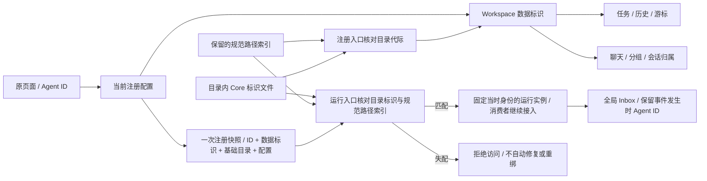
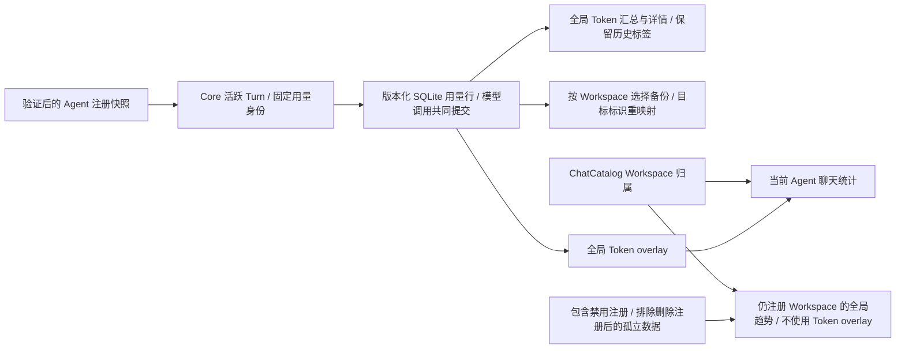
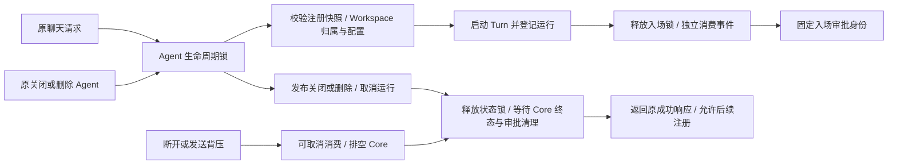
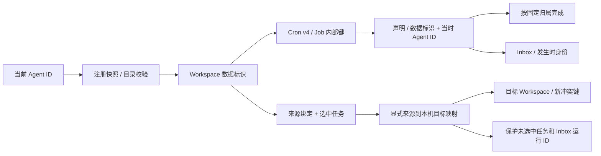
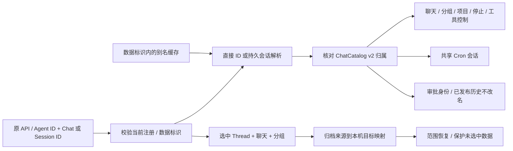

# Workspace 数据身份与 Agent 注册身份

日期：2026-09-09。落实已批准的原交互等价目标，承接 cron-runtime 的删除/重新注册清单；不是全功能完成声明。

## 身份划分

| 身份 | 用途 | 生命周期 |
| --- | --- | --- |
| 对外 Agent ID | 原页面选择、配置、当前运行与原 API | 可删除后重新使用，不能直接作为永久数据分区 |
| Workspace 数据标识 | 任务、聊天/分组及其持久化关联 | 删除注册后保留；原目录再次注册时复用，新目录另建 |
| Run/Thread 内部 ID | 执行、取消、审批和历史关联 | 由 Core 生成，运行固定自己的数据归属与当时的 Agent |
| Inbox 历史中的 Agent ID | 原全局事件筛选与发生时身份 | 保留原值，不因目录换 Agent ID 而批量重写 |

Core 仍是原生数据权威，不读取复制进目录的旧 Python jobs.json/chats.json。创建、复制和恢复负责显式选择/分配数据标识；客户端和任务 meta 无权指定内部归属。目录索引使用注册入口解析后的本机规范路径，跨平台恢复沿用已有 source/destination 重映射，不直接信任归档中的本机路径。

## 对已有原生数据的兼容

数据标识分两类：`legacy_agent` 表示已有原生格式所使用的历史 Agent 命名空间，`workspace` 表示新分配的 UUID。两类在类型上区分，不把用户提交的字符串当作内部 UUID/旧命名空间。

已有 v1 注册项可确定其旧命名空间与目录，读取时可确定性补足绑定；以后新注册无论对外 ID 是否相同，都不能凭 ID 再分配旧命名空间。只有保留目录索引明确指向旧数据时才接回。新目录使用新 UUID；删除已知目录后再次创建同一路径，也不能接回已不存在目录的上一代绑定。旧原生孤立数据若已没有任何目录依据，必须保留而不猜测归属，不能把它自动交给新注册的同名 Agent。

注册表升级为能被旧 Core 明确拒绝的新内部格式；对外创建/列表/配置响应不增加内部字段。旧绑定的补足是原生格式兼容，不导入 Python 数据，也不清空旧存储。

## 实现顺序与验收清单

### 目录代际实施方案

使用 Core 管理的 `.qwenpaw-workspace.json` 保存类型化数据标识。原目录重新注册必须同时匹配规范路径索引与目录内标识；缺失或不匹配时生成新的 Workspace 标识。新标识在注册入口初始化文件/凭据之前写入，因此新自定义目录创建失败后留下的目录不会在重试时匹配旧索引。有效旧绑定不重写标识；损坏、超限或符号链接标识拒绝处理。

原生 v1/v2 注册表首次升级以已有注册/保留目录建立一次基线，不追溯猜测升级前的外部目录替换。之后 v3 不自动补足丢失的目录标识。复制生成新标识；恢复在原有文件事务中保留/写入本机规划的标识，并排除归档标识的授权作用。此文件不进入原文件列表、检查点和用户 Workspace 备份。

标识文件表示应用的数据代际，不是 inode 身份证明或安全凭据：同权限进程把原标识复制回同一个已知目录，视为保留原代际，不声称能阻止该进程伪造文件。注册入口关闭删除注册后重新注册的路径误绑定；运行入口进度见下节。Git 原界面通过仓库自身的 `info/exclude` 保留用户原规则并添加内部文件排除项，不改全局 Git 配置。

- [x] 新旧注册表启动与标识升级、注册入口发布顺序。
- [x] 无原标识的外部替换、创建失败重试、原目录编辑/重开、复制与标识损坏回归。
- [x] 恢复事务及原文件/检查点/备份过滤；整目录交换策略保留，文件列表/下载/上传/监视与 Git 排除回归通过。
- [ ] 全工作区、原页面显式组、严格检查与客户端验证：§47 最新普通 512/512、完整显式组 15/15、严格检查、release 和客户端通过，见 [运行入口验收](../testing/workspace-runtime-binding-acceptance.md)。§46 曾有原页面整组 14/15，偶发输入失败和启动可靠性仍按 [失败记录](../testing/workspace-generation-acceptance.md) 继续；成功复验不作为根因关闭。

- [ ] 注册表维护稳定的数据标识及保留目录索引；创建、删除、复制和恢复共用规则。真实 HTTP 覆盖同 ID/原目录、同 ID/新目录、原目录/新 ID、重开、符号链接规范化及创建失败不发布绑定。
  - [x] 注册表 v2 初步接入类型化标识和保留目录索引；原生 v1 确定性补足旧命名空间，缺失/错误/冒用绑定拒绝读取，对外响应不增加内部字段。
  - [x] 创建、复制与恢复规划分配本机绑定，删除保留索引；真实 HTTP 初步覆盖重新注册矩阵、重开、复制、符号链接和目录由注册入口重新创建。
  - [x] v3 目录代际校验：规范路径索引与目录内标识同时匹配才接回；新自定义目录创建失败后重试不接回旧索引。适用边界见上面的代际方案，不声称已接通运行消费者或所有文件系统替换竞态。
- [x] Cron 的公开 ID/内部键、声明、状态/历史、复制与范围备份按数据标识选取；执行从当前注册项解析真实 Agent，并核对当前目录标识与绑定，不把历史命名空间当成当前 Agent ID。§48 普通 520/520、原页面完整组 15/15、严格检查、release 和客户端通过，见 [Cron 归属验收](../testing/cron-workspace-ownership-acceptance.md)；关联聊天与公开非默认调度仍按后续清单验收。
- [x] §49 聊天、分组、alias、直接 Thread ID 和审批解析接通数据标识；Agent 基础 Workspace 与用户会话选择的项目目录不混淆。§50 补充普通 Console 的固定运行快照、关闭/删除排空、断开与背压取消，并通过本机及原页面验证；使用量/ACL 和检查点存储代际仍另行完成。
- [ ] 备份的归档身份与本机目标身份显式重映射，默认/未选择数据保持；删除/重建与旧运行完成保持生命周期边界。
- [ ] 原页面跨 Agent 创建/删除/切换/任务执行/历史/刷新验收；全部关联消费者完成后才能解除非默认 Cron 门禁。
- [ ] 各端最新制品与安装态继续验收；当前独立 Core 首次启动的终端防护核查不由源码功能测试代证。

第一步只建立注册层身份并不表示任务或聊天已经完成重新绑定。必须逐步接通后续消费者，不能以新字段存在或局部测试通过作为完成依据。

## 下一步：统一运行消费者

§51 使用量消费者已接入，验收见 [用量归属与统计范围](../testing/usage-workspace-ownership-acceptance.md)：用量的永久归属来自 Core Turn 入场时的 Workspace 标识，公开 `agent_id` 保留当时的历史标签。Token 汇总/详情及全局 LLM/工具趋势继续跨 Agent；Agent 统计只选择当前 Workspace 的聊天，其全局 Token overlay 不变。范围恢复只重映射账本的内部数据标识，不改历史 Agent 标签。旧原生无归属记录保留其历史命名空间，不能根据当前同名注册认领。

§50 普通 Console 的入场和关闭/删除排空已按以下流程接入；本机验收范围见 [普通运行生命周期](../testing/console-lifecycle-acceptance.md)。生命周期锁只串行化入场与注册管理，不跨整个模型执行持有，普通运行仍可并发。它不锁住外部文件系统操作，也不代替安装态验收。

§47 实施第一步：`context_for_agent` 在注册锁内一次读取配置，返回内部 `AgentContext`，包含当时公开 ID、数据标识、基础 Workspace 和配置。核对规范化后的目录是否仍在该绑定索引下，以及目录标识是否匹配；缺失或失配返回 409，损坏/不可读文件保持原错误，不能自动写标识或修改注册表。Workspace/config/model/project 读取共用它，项目选择不再分两次读取注册表。

项目目录不要求 Core 标识；但即使项目可用，基础 Workspace 的绑定也必须有效。Agent 管理列表/删除仍可用于清理失效注册。该快照仅证明入口解析时一致，不是跨文件系统操作的锁或防止外部替换的持久句柄；尚未将所有任务/聊天存储改成数据标识，也不宣称既有运行后续每次工具操作已经复核绑定。

§48 将 Cron 读写消费者切换到类型化标识，聊天关联消费者仍待接通。各步骤的范围如下，门禁不提前解除：

1. 注册层提供一次解析的当前 Agent ID、固定数据标识与实际 Workspace，并核对目录内标识。任务与聊天写入归属时使用这个快照，不接收客户端自报的内部标识。
2. Cron 的存储格式显式记录 Job 内部键对应的数据标识；公开 Job ID 在该标识内唯一。调度从数据标识反查当前已启用注册项，孤立数据不能被同名新 Agent 领取。
3. 执行声明与 LiveRun 同时保留固定数据标识和当时的公开 Agent ID；完成/取消按固定归属收束，新的 Inbox 事件使用当时身份，不重写既有历史。
4. 聊天/分组/alias、Thread ID 访问与审批使用同一固定归属；项目目录选择不取代 Agent 的基础 Workspace 数据身份。
5. 归档增加显式的来源绑定映射，范围选择和恢复按映射处理；旧原生格式缺失归属时不得凭可复用的当前 Agent ID 猜测。需要分别验证默认不可删除身份、历史命名空间及显式选择的恢复范围。

验收必须包含原目录换公开 ID、公开 ID 换新目录、复制、重启、原运行结束/审批，以及范围备份恢复的完整链路；注册层单测不能代证这些场景。

## Cron 持久化归属实施（§48）

- 原生 Cron v4 的 `workspace_owners` 按 Job 内部键保存类型化 Workspace 标识，并要求所有 Job 有有效绑定。公开任务 ID 在该标识内唯一；原 `owners` 字符串仅保留来源信息，不再授权查询、复制或执行。创建/删除、查询、复制、重新启用、默认后台选择与完成收束共用新归属。
- 原生 v1–v3 读取时补足内部视图、下次写入发布 v4。默认注册不可删除，因此默认任务可绑定当前默认数据标识；其他旧任务只使用 `legacy_agent` 历史命名空间，必须有对应历史目录绑定才能领取。当前同名 UUID 注册不构成依据，孤立任务保留，不扫描 Python 文件。v4 读写不再依赖读取当前注册表，已领取的运行可按固定归属完成。
- 入队通过数据标识寻找当前已启用注册，并核对目录。没有对应注册或注册关闭时直接拒绝，不生成伪造运行；入队后的关闭/删除沿用取消与排空。持久声明与 LiveLease 同时记录固定数据标识和当时 Agent ID；准备执行再次核对绑定，完成按声明和固定数据标识收束，Inbox 新事件使用当时身份，旧事件不改名。
- Agent 归档快照 v2 显式携带来源绑定；不带该字段的全局注册表仍是 v1。导出按数据标识选择任务，恢复根据归档来源与本机规划的目标映射，重键同步处理声明、状态、游标和历史。归档中的标识不能指定本机未选中的数据归属。
- 恢复拒绝与未选中任务声明或 Inbox run/trace ID 的冲突，即使归档只有任务声明而没有对应 Inbox trace。否则重开时收束恢复声明可能改到未选中的事件记录。未选中数据以及空范围的原字节保留。

§48 完成时，聊天、分组、alias 和检查点等还未接通；后续聊天进度见 §49。Cron 任务的历史与重新注册已接入，不把这一阶段声明为完整会话恢复；非默认公开调度、外部渠道、各端安装态和全部原功能等价仍需继续验收。

## 聊天归属实施（§49）

ChatCatalog v2 在每条聊天和分组中保存类型化 `data_key`，原 `agent_id` 保留创建来源但不再授权访问。内置分组和自定义分组的唯一键为 `(data_key, group_id)`；v2 的范围归档不携带未选中默认 Workspace 的占位分组。v1 原生格式读取时按默认不可删除绑定/非默认历史命名空间补足视图，下次写入发布 v2；旧读者拒绝新版本，不导入 Python 数据。

聊天/分组列表、CRUD、批量操作、归档、直接 Thread ID、文件项目解析、工具控制及停止入口按当前注册的固定数据标识访问。没有 Console 元数据的 App Protocol Thread 仍属于默认运行环境，即使项目目录恰好与其他 Agent 相同，也不能据此被认领。新 Console Thread 在聊天目录锁内创建并发布元数据，随后发布别名；普通发布失败先回滚 Thread，回滚失败明确报告恢复需要，不声明跨操作崩溃原子性。

会话缓存键包含数据标识，缓存不能授权访问；重启或原目录换公开 ID 后从持久元数据定位。对照原 `ChatManager.get_chat_id_by_session`，同一 Console session 有多个候选时选择最近更新的聊天，不新增冲突错误。有效直接 Thread ID 优先，不能将另一个 Workspace 的内部 ID 重解释成自己的别名。共享 Cron 会话使用相同归属与 channel/user/session 元组，保留原名称、分组、归档状态和项目目录。

审批的 Agent/session/root 由持久聊天归属解析，已发布的 pending 记录和 Inbox 历史不批量改名。范围导出按当前绑定选取 Thread/聊天/分组，归档路径与恢复目标使用显式来源/目标映射；未选中聊天、分组和 Thread 保持，冲突的 Thread/Chat ID 拒绝。检查点的会话筛选也增加归属，而检查点存储目录、图、GC 和完整多 Agent 路由仍需自己的代际与范围验收。

普通 Console 运行跨关闭/删除的取消与固定执行身份已由 §50 补充本机验收。使用量消费者正在 §51 验证（见本文件用量架构及验收记录）；ACL、检查点目录代际、非默认公开 Cron 调度以及各端安装态仍未完成。入口快照不是阻止同权限进程随后替换文件系统的持久租约。

## 设置保存入口的绑定校验补漏（2026-09-14）

沿用 §47 已批准的身份隔离要求：`replace_config_field` 和 Agent 普通/模型
设置更新在持有注册锁后、读取凭据或写文件前，复用 `context_from_catalog`
核对目录代际。正常配置结构和成功响应不变；普通管理设置仍允许编辑已
停用但绑定有效的 Agent，运行字段替换保持原停用拒绝规则。管理列表和
删除失效注册的入口仍可用。不改变宿主默认生命周期或模型 key 优先级。

- [x] 失败回归：目录替换、标识缺失/损坏/失配时，字段替换和公开设置保存
  不写新目录、不更新注册表；有效默认 Agent 不受影响。
- [x] 在原有锁内复用已有绑定解析，不引入第二套身份格式或新锁。
- [x] 正常保存/停用编辑/重新打开、原 Agents 页面与相关全套回归；普通
  Rust 749、显式组 29、原前端 2453、新 source release 及三 SDK/扩展通过。
- [ ] 更新源码验收与后续制品状态；未重新构建的制品不能声称包含本修复。

这里校验的是保存入场时的绑定，不声称可以阻止同权限外部进程在校验后
再次替换目录，也不把这次修复当作全部 Channel 或多 Agent 功能已完成。
两项修复前失败、六项普通回归、完整 workspace 与来源核对见
[保存校验验收](../testing/agent-config-binding-acceptance.md)。
