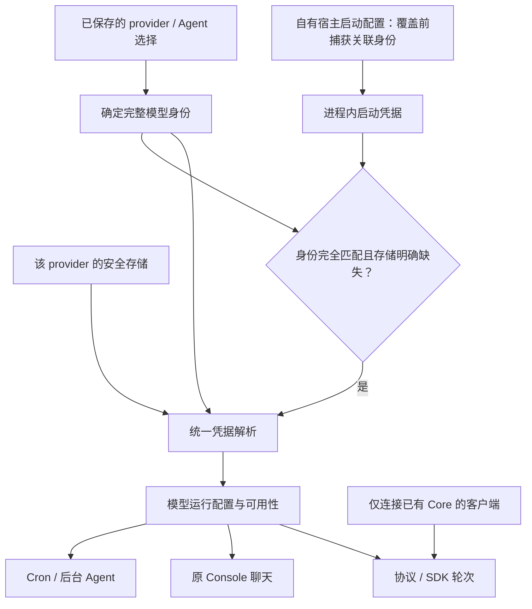

# Workspace 模型凭据：启动与重开的修复方案

日期：2026-09-14。状态：**待确认的具体策略，尚未实现**。
承接主计划 §14.2.24.53 和 [已复现的重启问题](../testing/workspace-model-precedence-diagnostic.md)。
本文不授权修改默认宿主生命周期，不迁移数据，不改变原 Console 组件。

## 成功标准

同一 provider 的首次启动、重启、SDK 轮次、原页面聊天和 Cron 使用一致的
凭据来源。一个 provider 的 key 不得因为地址、协议或 Agent 选择改变而被
发往另一个目标。连接已有宿主的客户端不参与宿主凭据初始化。

## 本轮新增的源码核对

- `qwenpaw-core/src/runtime.rs::from_store` 先用 SQLite 覆盖启动配置的
  base URL/model，保留启动 key。因此初始化后的 `backup_model_config()`
  不能证明 key 原本属于这个地址。
- 同文件 `write_config` 改地址时保留当前 key，仅重置请求选项。修复必须
  覆盖显式改地址后的请求，不能只比较进程启动时的地址。
- `desktop_models.rs::initialize` 仅在 registry 已存在时读 provider key；
  首次创建不读取，重开读取失败被转换为 `None`。
- `runtime_for_agent_config` 再次从凭据存储取 key，被 Console 聊天、协议
  Agent 轮次和 Cron 调用。只给初始化加 fallback，不会修复这些路径。
- 原 Python provider 将连接设置和加密字段作为同一 provider 快照持久化
  （`src/qwenpaw/providers/provider_manager_persistence.py`、
  `provider_persistence.py`）。Rust 不复制 Python 后端，但需保持这个关联。
- 原 Console 模型页通过 `api_key` 的掩码和 `require_api_key` 判断可选模型。
  只改 Core 的布尔值而不核对 provider 响应，可能让模型在界面仍不可选。

以上是源码事实；本轮没有新增模型请求实测。先前十次本地请求只证明诊断
文档中的构造器矩阵，不能当作 Console/Cron 或改地址泄露的动态测试结果。

## 建议采用的策略

### 1. 先选择身份，再解析凭据

身份包含 provider ID、规范化后的完整 API base URL、请求协议及认证方式。
保留路径、端口和 HTTP/HTTPS 区别；不能只比较 hostname，也不通过解析 DNS
或发起网络请求推断两个地址等价。Ollama 的 `/v1` 转换沿用现有 provider
规则，不能自行把所有 provider 路径互相归一化。

宿主必须在 `Core::persistent` 覆盖配置之前捕获启动凭据的关联身份。
没有明确 provider 的现有 env 配置仅对应默认 OpenAI-compatible 启动身份，
不能自动匹配任意自定义 provider。原始 key 仅保留在宿主内存中，不写
SQLite、registry、发现记录、日志或普通配置 API，不新增传输 key 的连接握手。

### 2. 首次与重开使用同一优先级

| 情况 | 建议结果 |
| --- | --- |
| 仅连接已有宿主 | 不读取客户端 key，不覆盖宿主模型配置 |
| provider 安全存储有 key | 使用该 provider 的存储 key；首次和重开一致 |
| 存储明确返回缺失，启动身份完全匹配 | 使用本进程启动 key；不自动持久化 |
| 存储缺失，启动身份不匹配 | 不使用启动 key；按该 provider 无凭据状态处理 |
| 存储读取失败 | 不视为缺失、不 fallback；相关模型操作明确报告凭据不可用 |
| 无需 key 的模型，存储缺失且未提供 key | 允许无认证请求，保留本地模型能力 |
| 用户清除 provider key | 立即失效该身份的进程内 fallback，不让旧 env key 再次出现 |
| 用户更换 provider 地址/协议/认证方式 | 旧绑定失效；新凭据与新身份须一起明确配置 |
| 同 provider 只改模型名或 Thread.model | 不改全局凭据，不把单会话选择写成全局默认值 |

这是对现状的显式修正，不是“保持当前 env 优先”：目前首次不读存储、重开
才读。推荐统一为 **provider 存储优先，严格绑定的启动 key 仅补缺失**。
自有 stdio 保留启动/关闭和独立数据目录语义，不偷偷改为连接共享宿主；
但跨 endpoint 复用 key 的旧行为不能作为兼容要求保留。

### 3. 凭据失败不能锁死设置页

推荐保留管理 API 和原设置页可用，失败的 provider 不发起模型请求，沿用
原错误展示通道报告可修复的“凭据存储不可用”，不泄露底层错误中的秘密。
其他可用 provider 和显式无 key 配置仍可使用。保存修复后的配置可恢复模型
操作，不要求重启整个桌面。

这需要把模型可用性与宿主存活分开，不能用“整个构造器报错”替代，也不能
继续吞掉读取异常后伪装成成功初始化。具体错误契约先做原页面回归再确定，
不预先假设添加一个 HTTP 状态码就能保持交互。

## 实施顺序与 Checklist

- [x] 核对启动、持久化覆盖、动态改地址及 Agent/Console/Cron 二次取 key。
- [x] 写明推荐优先级、秘密边界、原页面修复入口及待确认选择。
- [ ] 用户确认本页策略；共享宿主退出规则另见
  [共享接入方案](shared-host-client-attachment.md#待确认的产品决策谁负责退出宿主)。
- [ ] 先写失败回归：首次/重开、同身份与不同身份、缺失与读取错误、清除后
  不复活、只改模型与改地址。两个 loopback 模型分别核对完整请求和假 key；
  错误分支明确断言模型请求数为零。
- [ ] 实现身份绑定和统一解析；覆盖初始化、Agent 轮次和模型设置操作，避免
  不同调用点各自实现 fallback。配置/凭据写失败时不提交半份运行配置。
- [ ] 实测原页面配置/清除/切换/修复、聊天、Cron、三语言自有 SDK 首次与
  重启，以及已连接客户端不注入配置。核对 Thread 模型、Agent 归属和用量。
- [ ] 核对普通持久化文件和协议响应中不存在假 key；不读取真实 keychain。
  回归备份恢复的专用授权流程，不把备份可携带秘密误当作普通 API 可公开。
- [ ] 完整 Rust、原前端和客户端测试通过后再接默认 Workspace；共享发现、
  唯一调度和退出语义各自验收，不能凭凭据测试通过就关闭共享接入父项。
- [ ] 有生产改动后重建受影响制品并逐项验收；本轮仅文档变更，不重复打包。

测试只使用隔离临时目录和假凭据，兼顾 Windows/Linux/macOS 路径语义。
本页不扩展为系统服务安装、日常数据修改、包内 Core 重试或提交发布授权。
